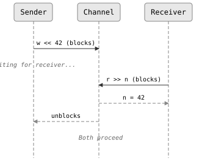
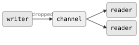
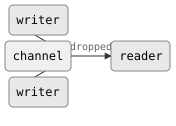

# Channels

Channels are the backbone of CSP. Every interaction between imps flows
through a channel -- there is no shared mutable state, no locking, and no
condition variables. If an imp needs to communicate, it sends or
receives on a channel.

A channel is a typed, synchronous, unbuffered conduit. It carries values of a
single type `T` and transfers them directly from sender to receiver with no
intermediate storage.

## Creating a channel

A channel is created by constructing a `chan<T>`:

```cpp
#include "csp.h"

auto ch = csp::chan<int>{};
```

The `chan<T>` struct holds two endpoints -- a `writer<T>` and a `reader<T>` --
accessible as public members `w` and `r`. The most common pattern uses
structured bindings:

```cpp
auto [w, r] = csp::chan<int>{};
```

After this line, `w` is a `writer<int>` and `r` is a `reader<int>`. The
channel exists as long as at least one endpoint (or a copy of one) is alive.

## Endpoints are move-only

`writer<T>` and `reader<T>` cannot be copied with `=` or copy construction.
They can only be moved:

```cpp
auto [w, r] = csp::chan<int>{};

auto w2 = std::move(w);   // OK: w is moved into w2, w is now empty
// auto w3 = w2;           // compile error: copy deleted
```

This is deliberate. Each endpoint is a counted reference to the underlying
channel. Moving an endpoint transfers ownership -- the channel knows exactly how
many live writers and readers exist and uses this count to detect when one side
has shut down. If endpoints could be freely copied, it would be too easy to keep
a channel alive by accident, hiding bugs where a stream never terminates.

## Shared ownership with .copy()

When you do need multiple references to the same endpoint, call `.copy()`:

```cpp
auto [w, r] = csp::chan<int>{};

auto w2 = w.copy();   // w and w2 both refer to the same channel
auto r2 = r.copy();   // r and r2 both refer to the same channel
```

Each `.copy()` increments the reference count. The channel's write side stays
alive until *all* writer copies are dropped, and likewise for the read side.
This is the typical pattern for passing an endpoint into a spawned imp
while keeping a copy for later use:

```cpp
auto [w, r] = csp::chan<int>{};

csp::spawn([out = w.copy()] {
    out << 1;
    out << 2;
    out << 3;
});

// w is still valid here; we can pass it somewhere else
// or drop it to signal that no more values will be sent from this side
```

The requirement to call `.copy()` explicitly makes shared ownership visible at
the call site. When you see `.copy()` in code, you know the channel's lifetime
is being extended.

## Synchronous rendezvous

Channels are *synchronous* and *unbuffered*. A send blocks until a receiver is
ready, and a receive blocks until a sender is ready. The value is transferred
directly from the sender's stack to the receiver's variable -- there is no
internal queue.

<!-- csp-seq
S "Sender" | Ch "Channel" | R "Receiver"
S ->> Ch : w << 42 (blocks)
note S : waiting for receiver...
R ->> Ch : r >> n (blocks)
Ch -->> R : n = 42
Ch -->> S : unblocks
note S,R : Both proceed
-->


This design forces the sender and receiver to synchronize on every value. The
sender cannot outrun the receiver, because there is nowhere to buffer values.
The receiver cannot miss values, because the sender waits for delivery.

This is different from Go, where channels are buffered by default (`make(chan
int, N)`). In CSP, if you want buffering, create a buffered channel with
`chan<T>(n)`:

```cpp
auto [w, r] = csp::chan<int>(16);  // buffered channel with capacity 16
```

This spawns an internal buffer imp. See [Combinators](05-combinators.md)
for more details.

## Sending and receiving

The primary operators for channel I/O are `<<` (send) and `>>` (receive):

```cpp
auto [w, r] = csp::chan<int>{};

// In a sender imp:
w << 42;              // send 42, block until received

// In a receiver imp:
int n;
r >> n;               // receive into n, block until sent
```

Both operators return a `chan_op<T>` object. When used as a statement (as
above), the `chan_op` destructor automatically performs a blocking `prialt`,
which makes `w << 42;` a complete send-and-wait operation.

### Checking for success

The `chan_op<T>` converts to `bool` -- `true` if the transfer succeeded,
`false` if the other side of the channel is dead:

```cpp
// Send loop: stop when all readers are gone
while (w << value) {
    ++value;
}

// Receive loop: stop when all writers are gone
int n;
while (r >> n) {
    process(n);
}
```

### Reading with return value

`reader<T>` also provides a `.read()` method that blocks and returns the
received value directly:

```cpp
int n = r.read();   // blocks, returns value
                    // throws csp::error if channel is dead
```

This is convenient when you know the channel is alive and want a one-liner. It
throws `csp::error` if the channel has no writers.

### Range-based for

A `reader<T>` supports range-based for loops. The loop reads values until the
channel is exhausted (all writers dropped):

```cpp
for (int n : r) {
    std::cout << n << "\n";
}
// Loop ends when all writers are gone
```

This is the idiomatic way to drain a channel.

## Channel death

Channels have independent reference counts for each side. Either side can shut
down independently, and the other side can observe this.

### Writer death (EOF)

When all `writer<T>` copies for a channel are destroyed, the channel's write
side dies. Any blocked receiver unblocks, and subsequent receives return
`false`:

<!-- csp-flow
                              -> reader
writer -"dropped"-> (channel)
                              -> reader
-->


```cpp
auto [w, r] = csp::chan<int>{};

csp::spawn([w = std::move(w)] {
    w << 1;
    w << 2;
    // w destroyed here -- channel write side dies
});

int n;
while (r >> n) {
    // processes 1, then 2
}
// loop exits: all writers gone, channel exhausted
```

### Reader death (broken pipe)

When all `reader<T>` copies are destroyed, the channel's read side dies. Any
blocked sender unblocks, and subsequent sends return `false`:

<!-- csp-flow
writer ->
         (channel) -"dropped"-> reader
writer ->
-->


```cpp
auto [w, r] = csp::chan<int>{};

csp::spawn([r = std::move(r)] {
    r.read();   // read one value
    // r destroyed here -- channel read side dies
});

for (int i = 1; w << i; ++i) {
    // sends 1 successfully, then w << 2 returns false
}
// loop exits: all readers gone
```

### Bidirectional lifecycle observability

Each endpoint's death is independently observable by the other side via
`alt`/`prialt`. This property -- **bidirectional lifecycle observability** --
is what allows cleanup to cascade through a channel topology: when a writer
dies, readers detect it and can exit, which kills their own writers on other
channels, and so on. Contrast this with Go, where only a writer can close a
channel (`close(ch)`); a dead reader is invisible to the writer, which will
panic if it sends on a closed channel or silently block forever if no reader
exists.

### Death as a first-class event

Channel death is observable in `alt` and `prialt` using the `~` operator on
an endpoint. The expression `~w` fires when the writer endpoint's channel has
lost all its *readers*, and `~r` fires when the reader endpoint's channel has
lost all its *writers*:

```cpp
auto [data_w, data_r] = csp::chan<int>{};
auto [quit_w, quit_r] = csp::chan<>{};

// Server loop: process data or shut down
int n;
for (;;) {
    switch (csp::alt(data_r >> n, ~quit_r)) {
    case 0:
        process(n);
        break;
    case ~1:
        // quit channel's writer was dropped -- time to exit
        return;
    }
}
```

Death-watch results are reported as bitwise-complemented indices: if the `k`-th
operation (0-indexed) is a death event, `alt`/`prialt` returns `~k`.

## Signal-only channels

Sometimes you need a channel that carries no data -- just the fact that
something happened. Use `chan<>` (equivalently, `chan<poke_t>`):

```cpp
auto [w, r] = csp::chan<>{};

// Signal:
w << csp::poke;

// Wait for signal:
r >> csp::poke;
```

`poke_t` is a sentinel type. It carries no information; the channel
communicates purely through the synchronization event. This is useful for
quit signals, keepalives, and triggers.

## Putting it together

Here is a complete example that demonstrates channel creation, sending,
receiving, and death detection:

```cpp
#include "csp.h"
#include <iostream>

int main() {
    auto [w, r] = csp::chan<int>{};

    // Producer: send squares of 1..5, then exit (dropping w)
    csp::spawn([w = std::move(w)] {
        for (int i = 1; i <= 5; ++i)
            w << i * i;
    });

    // Consumer: read until EOF
    csp::spawn([r = std::move(r)] {
        for (int n : r)
            std::cout << n << "\n";
    });

    csp::schedule();
}
```

Output:
```
1
4
9
16
25
```

The producer sends five values and exits. The consumer's range-for loop
receives all five, then terminates when the channel dies.
