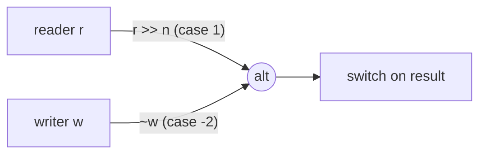
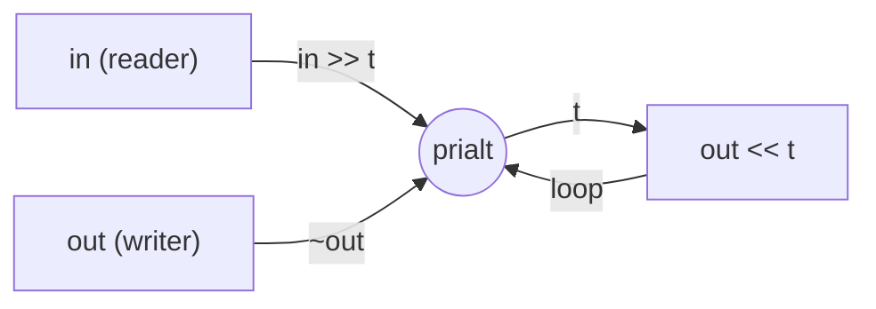
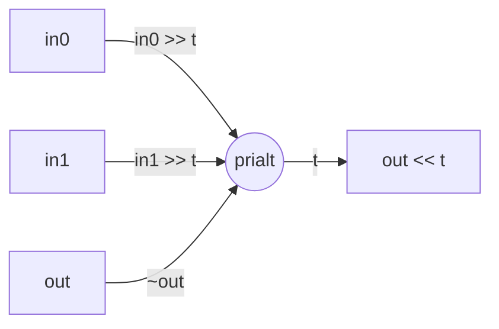

# Multiplexing with alt and prialt

A single channel operation blocks until both sides are ready. But real programs
need to wait on *multiple* channels at once -- reading from whichever source
has data, writing to whichever sink has capacity, or noticing when a peer has
gone away. CSP provides two multiplexing primitives for this:

- **`alt`** -- fair (randomized) selection
- **`prialt`** -- priority-ordered (left-to-right) selection

Both accept the same syntax and return the same kind of result. The only
difference is tie-breaking: `alt` shuffles the candidates so that no channel
is systematically starved, while `prialt` always picks the first match.

## Basic syntax

```cpp
#include <csp/csp.h>
using namespace csp;

int x, y;
switch (alt(r1 >> x, r2 >> y)) {
case 1: /* r1 delivered a value into x */ break;
case 2: /* r2 delivered a value into y */ break;
}
```

Each argument is a **channel operation** -- either a read (`r >> var`) or a
write (`w << val`). You can freely mix reads and writes:

```cpp
int n;
switch (alt(r >> n, w << 42)) {
case 1: /* read succeeded  */ break;
case 2: /* write succeeded */ break;
}
```

The call blocks until one of the operations can complete, performs the
transfer, and returns the **1-based index** of the matched operation.

## Return values

| Return value | Meaning |
|---|---|
| positive `i` | Data operation `i` matched (1-based) |
| negative `-i` | Death event for operation `i` (1-based) |

For example, with three operations, the possible returns are `1`, `2`, `3`,
`-1`, `-2`, `-3`.

## Vultures: detecting dead endpoints

A **vulture** watches for the death of a channel's peer endpoint. The syntax
is the tilde operator on an endpoint:

- `~w` -- fires when no readers remain on the channel (the writer has nobody
  to send to).
- `~r` -- fires when no writers remain on the channel (the reader will never
  receive again).

Vultures return **negative** indices:

```cpp
int n;
switch (alt(r >> n, ~w)) {
case  1: /* got data from r */ break;
case -2: /* w's reader died */ break;
}
```

This is the mechanism behind channel lifecycle awareness. Instead of polling
or checking flags, you multiplex death-watches alongside data operations and
the scheduler tells you what happened.



## alt vs prialt

Use **`alt`** when all channels are equally important and you want fairness:

```cpp
// Merge two input streams. Neither source is favoured.
int n;
while (alt(a >> n, b >> n) > 0) {
    out << n;
}
```

Use **`prialt`** when some operations should be checked first. A common
pattern is checking for shutdown before doing work:

```cpp
int n;
for (;;) {
    switch (prialt(~quit, in >> n)) {
    case -1: return;          // quit channel died -- exit
    case  2: process(n); break;
    }
}
```

Because `prialt` scans left to right, `~quit` is always tested before `in`.
If both are ready simultaneously, the quit signal wins.

## The canonical forwarding loop

Many CSP programs need to forward data from one channel to another while
respecting endpoint lifecycle. The idiomatic pattern is:

```cpp
for (T t; prialt(~out, in >> t) > 0 && out << t;) { }
```

This is dense, so here is what each piece does:

1. **`prialt(~out, in >> t)`** -- first check whether `out`'s reader has
   died (`~out`, index -1). If it has, `prialt` returns `-1` which is `<= 0`,
   the loop condition is false, and we stop. Otherwise, read from `in` into
   `t` (index 2, which is `> 0`).

2. **`> 0`** -- if the return is positive, a data operation matched and `t`
   holds a value. If negative (vulture) or if `in` has no more writers (the
   read would never fire, so `prialt` returns `0` -- though in practice the
   `~out` vulture or input exhaustion handles this), the loop exits.

3. **`&& out << t`** -- forward the value. The `<<` operator on a writer
   returns a `chan_op` that converts to `bool`: `true` if the write
   succeeded, `false` if the reader died. If the reader is gone, the loop
   exits.

This pattern is so common that `reader<T>` has a built-in helper:

```cpp
spawn(in.stream_to(std::move(out)));
```

which expands to exactly the loop above.



## Non-blocking poll with skip

Sometimes you want to check whether a channel has data without blocking. CSP
provides `skip` -- a global `reader<>` whose writer is permanently dead.
Since `~skip` fires immediately (the writer is already gone), combining it
with `prialt` gives you a non-blocking poll:

```cpp
int n;
switch (prialt(r >> n, ~skip)) {
case  1: /* r had data ready -- n is set */ break;
case -2: /* no data available right now  */ break;
}
```

Because `prialt` checks left to right, it tries `r >> n` first. If a writer
is waiting on `r`, the read completes. If not, `~skip` fires immediately
(since skip's writer is dead), and the call returns without blocking.

This is useful for draining a channel, trying speculative work, or
implementing try-send patterns:

```cpp
// Try to send without blocking.
switch (prialt(w << value, ~skip)) {
case  1: /* sent successfully */ break;
case -2: /* receiver not ready */ break;
}
```

## Timeout patterns

Timers in CSP are channels (see [`04-timers.md`](04-timers.md)). This means
timeouts compose naturally with `alt` and `prialt` -- no special timeout API,
no callback registration, just another channel in the multiplex set.

```cpp
#include <csp/timer.h>
using namespace std::chrono_literals;

// Wait for data, but give up after 100ms.
auto deadline = after(100ms);
poke_t p;
int n;
switch (prialt(r >> n, deadline >> p)) {
case 1: /* got data in time  */ break;
case 2: /* timed out         */ break;
}
```

`after(duration)` returns a `reader<>` that fires once after the given
duration. Since it is a reader, it slots into `alt`/`prialt` like any other
channel operation.

For periodic work, use `tick`:

```cpp
auto heartbeat = tick(1s);
int n;
clock::time_point t;
for (;;) {
    switch (alt(work >> n, heartbeat >> t)) {
    case  1: process(n); break;
    case -1: return;  // work channel closed
    case  2: send_heartbeat(); break;
    }
}
```

## Vector overloads

When the number of channels is not known at compile time, `alt` and `prialt`
accept a `std::vector<chan_op<T>>`:

```cpp
std::vector<chan_op<int>> ops;
for (auto& r : readers)
    ops.push_back(r >> n);

int which = alt(ops);
```

All operations in the vector must share the same channel type `T`. This is
not a practical limitation: dynamic-count alt arises when fanning out to or
in from a runtime-determined set of channels, and those channels are always
the same type.

The return value follows the same convention (1-based index, negative for
vultures).

## Disabling operations at runtime

You can disable individual slots in a vector by assigning a default-
constructed `chan_op<T>{}` (inactive operation). The alt skips inactive slots:

```cpp
std::vector<chan_op<int>> ops;
ops.push_back(w << 42);
ops.emplace_back();       // slot 1: inactive (skipped)
ops.push_back(r >> n);

switch (alt(ops)) {
case 1: /* write matched */ break;
case 3: /* read matched  */ break;
// case 2 can never fire -- slot is inactive
}
```

This is useful for building dynamic multiplexers where channels come and go
at runtime without rebuilding the vector.

## Putting it together: a fan-in merger

Here is a complete example that merges two input channels into one output
channel, stopping when the output reader dies:

```cpp
spawn([out = std::move(out), in0 = std::move(in0), in1 = std::move(in1)] {
    int t;
    for (;;) {
        switch (prialt(~out, in0 >> t, in1 >> t)) {
        case -1: return;             // output reader died
        case  2: out << t; break;    // forward from in0
        case  3: out << t; break;    // forward from in1
        case -2:                     // in0 writer died
        case -3: return;             // in1 writer died
        }
    }
});
```



## Comparison with Go's select

If you know Go, CSP's `alt` and `prialt` correspond to Go's `select`
statement, with a few differences:

| Feature | Go `select` | CSP `alt` / `prialt` |
|---|---|---|
| Fair selection | yes (random among ready cases) | `alt` = fair, `prialt` = priority |
| Channel death detection | requires `ok` idiom: `v, ok := <-ch` | vultures: `~ch` as a first-class operation |
| Non-blocking | `default:` case | `prialt(op, ~skip)` |
| Timeout | `case <-time.After(d):` | `prialt(op, after(d) >> p)` |
| Dynamic channel count | reflect.Select | `std::vector<chan_op<T>>` |
| Return value | executes case body directly | returns 1-based index |
| Nil channel | nil channel disables case | default-constructed `chan_op<T>{}` disables slot |
| Write + read in one select | yes | yes |

The biggest conceptual difference is vultures. In Go, you detect a closed
channel by checking the second return value (`ok`) after a receive. In CSP,
channel death is a distinct event you can multiplex alongside data operations.
This avoids the "receive zero value on closed channel" problem entirely --
vultures fire *instead of* delivering data, and they report *which* endpoint
died.

## Next steps

- [`04-timers.md`](04-timers.md) -- timer primitives and advanced timeout
  patterns
- [`05-combinators.md`](05-combinators.md) -- composable stream transformers
  that build on alt/prialt internally
