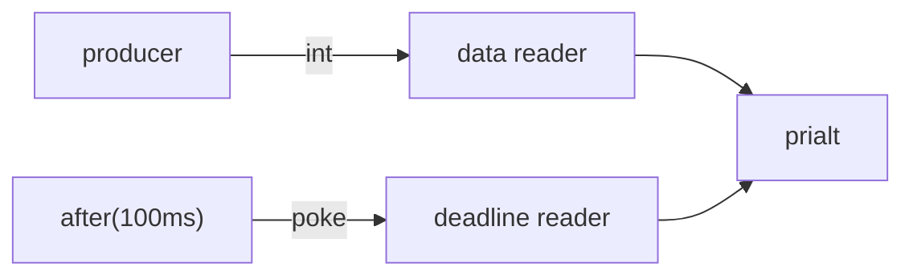
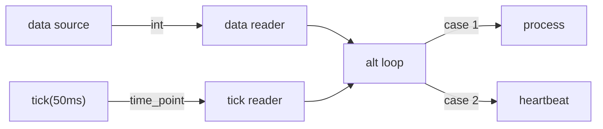
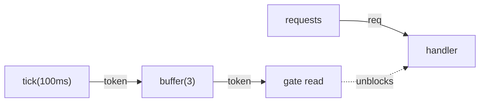

# Timers

CSP timers are channels. A timer does not fire a callback or set a flag --
it sends a value on a channel. Because timers speak the same protocol as
every other channel, they compose naturally with `alt`, `prialt`, pipelines,
and the full combinator library. No special cancellation API is needed:
dropping the reader endpoint cancels the timer, just like any other channel.

```
#include "csp.h"
```

## sleep / sleep_until

`sleep` and `sleep_until` suspend the calling microthread for a duration or
until an absolute deadline. They are cooperative -- the OS thread is free to
run other microthreads while the caller sleeps.

```cpp
using namespace std::chrono_literals;

csp::spawn([] {
    csp::sleep(100ms);                  // relative
    csp::sleep_until(clock::now() + 1s); // absolute
});
```

`csp::clock` is an alias for `std::chrono::steady_clock`.

## after -- one-shot timer

`after(duration)` returns a `reader<>` (shorthand for `reader<poke_t>`) that
delivers a single `poke` value after the given duration, then closes.

```cpp
auto timeout = csp::after(500ms);
timeout.read();   // blocks until 500ms have elapsed
// timeout is now closed -- subsequent reads return false
```

Because `after` returns an ordinary reader, it slots directly into `alt` and
`prialt`:

```cpp
auto deadline = csp::after(100ms);
int val;
switch (csp::prialt(data_reader >> val, deadline >> poke)) {
case 0: /* data arrived in time  */ break;
case 1: /* 100ms elapsed first   */ break;
}
```

## tick -- periodic timer

`tick(interval)` returns a `reader<clock::time_point>` that fires
repeatedly. Each read delivers the actual fire time. The implementation uses
absolute deadlines internally, so intervals do not drift even when reads are
slightly delayed.

```cpp
auto heartbeat = csp::tick(1s);
for (auto tp : heartbeat) {
    printf("tick at %lld\n", tp.time_since_epoch().count());
}
```

## Controlled timers (csp::part::timer)

For dynamic intervals, `csp::part::timer` accepts a control channel that
supplies either durations or absolute time points. Each value read from the
control channel becomes the next sleep. When the control channel closes, the
timer stops.

```cpp
#include "csp.h"

csp::chan<csp::clock::duration> ctl;
auto t = csp::part::timer(std::move(ctl.r));

csp::spawn([w = std::move(ctl.w)]() mutable {
    w << 10ms;   // first fire after 10ms
    w << 50ms;   // second fire after 50ms
});

for (csp::clock::time_point tp; t >> tp;) {
    // two fires, then the control channel closes and the loop ends
}
```

An absolute-deadline overload accepts `reader<clock::time_point>`:

```cpp
csp::chan<csp::clock::time_point> ctl;
auto t = csp::part::timer(std::move(ctl.r));

auto now = csp::clock::now();
csp::spawn([w = std::move(ctl.w), now]() mutable {
    w << now + 100ms;
    w << now + 500ms;
});
```

## Composition patterns

### Operation timeout

The most common pattern: race a data channel against a deadline.

```cpp
auto [w, r] = csp::chan<int>{};
csp::spawn([w = std::move(w)] {
    csp::sleep(200ms);
    w << 42;
});

auto deadline = csp::after(100ms);
int val;
switch (csp::prialt(r >> val, deadline >> poke)) {
case 0: handle(val);          break;
case 1: handle_timeout();     break;
}
```



### Periodic heartbeat interleaved with work

Use `tick` as one arm of an `alt` loop to interleave periodic events with
data processing.

```cpp
auto data = get_data_reader();
auto heartbeat = csp::tick(50ms);

for (;;) {
    int n;
    csp::clock::time_point t;
    switch (csp::alt(data >> n, heartbeat >> t)) {
    case  0: process(n);      break;
    case ~0: goto done;       // data channel closed
    case  1: send_heartbeat(); break;
    }
}
done:;
```



### Racing multiple timers

`alt` and `prialt` accept any number of channel operations, so you can race
timers against each other.

```cpp
auto slow = csp::after(100ms);
auto fast = csp::after(10ms);
int which = csp::alt(slow >> poke, fast >> poke);
// which == 2 (fast wins)
```

### Rate limiting with tick + buffer

A token-bucket rate limiter in three lines of CSP plumbing:

```cpp
#include "csp.h"

// 10 tokens/sec, burst capacity of 3
auto tokens = csp::tick(100ms);
auto bucket = csp::part::buffer<csp::clock::time_point>(3)
                  .spawn(std::move(tokens));

csp::clock::time_point token;
for (int req; requests >> req;) {
    bucket >> token;     // wait for a token
    handle(req);
}
```

`tick` generates tokens at a fixed rate. `buffer(3)` accumulates up to three
tokens, absorbing bursts. Each request consumes one token by reading from the
bucket.



### Timeout-guarded pipeline

Kill an entire pipeline after a duration using `killswitch`:

```cpp
#include "csp.h"

auto source = csp::spawn_producer<int>([](csp::writer<int> w) {
    for (int i = 1; w << i; ++i)
        csp::sleep(20ms);
});

// keepalive writer -- dies after 100ms, killing the pipeline
auto [kw, kr] = csp::chan<>{};
csp::spawn([w = std::move(kw)] { csp::sleep(100ms); });
auto guarded = csp::part::killswitch<int>(std::move(kr))
                   .spawn(std::move(source));

for (int n; guarded >> n;) {
    process(n);
}
// pipeline torn down after ~100ms
```

## Timer cancellation

Timers follow the same endpoint lifecycle as every other channel: dropping
the reader cancels the timer. The microthread backing the timer sees a failed
write and exits.

```cpp
{
    auto ticker = csp::tick(10ms);
    ticker.read();   // one tick
    ticker = {};     // assigns empty reader, closing the endpoint
    // the tick microthread exits; no leak, no background work
}
```

This works because `tick` (and `after`) are implemented with
`spawn_producer`, which moves a `writer<T>` into a microthread. When the
reader is destroyed, the writer's next `<<` returns false, and the
microthread returns normally.

## API summary

| Function | Header | Returns | Fires |
|---|---|---|---|
| `csp::sleep(duration)` | `<csp/timer.h>` | `void` | -- (blocks caller) |
| `csp::sleep_until(time_point)` | `<csp/timer.h>` | `void` | -- (blocks caller) |
| `csp::after(duration)` | `<csp/timer.h>` | `reader<>` | Once |
| `csp::tick(interval)` | `<csp/timer.h>` | `reader<clock::time_point>` | Repeatedly |
| `csp::part::timer(control)` | `<csp/part/timer.h>` | `reader<clock::time_point>` | Per control value |

## Next steps

- [`05-combinators.md`](05-combinators.md) -- composable stream transformers
  (`map`, `where`, `buffer`, `killswitch`, ...)
- The [`examples/`](../../examples/) directory includes `timeout_patterns.cc`
  and `rate_limiter.cc` with complete, runnable programs.
