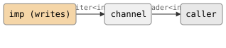
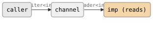
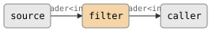
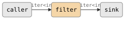
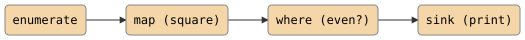
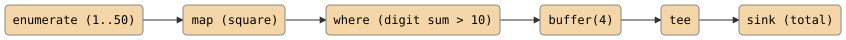

# Combinators (The Parts System)

CSP ships with a library of composable stream-processing building blocks in
`namespace csp::part`. Each part is a self-contained unit -- a producer, a
consumer, or a filter -- that spawns its own imp and communicates
through channels. You snap parts together to build pipelines without writing
any scheduling or lifecycle code yourself.

```cpp
#include "csp.h"
```

## The three part types

Every combinator is one of three wrapper types defined in
`csp.h`:

| Type | Wraps | `spawn()` returns |
|------|-------|-------------------|
| `producer<T, F>` | `F(writer<T>)` | `reader<T>` |
| `consumer<T, F>` | `F(reader<T>)` | `writer<T>` |
| `filter<In, Out, F>` | `F(reader<In>, writer<Out>)` | depends on overload |

A **producer** generates values and writes them to a channel. A **consumer**
reads values from a channel and does something with them. A **filter** reads
from one channel and writes to another, transforming the stream.

### Creating parts with factory functions

You rarely spell out the wrapper types directly. Instead, use the factory
functions, which deduce the callable type `F` automatically:

```cpp
// A producer that emits 1..10
auto source = make_producer<int>([](writer<int> out) {
    for (int i = 1; i <= 10; ++i)
        out << i;
});

// A consumer that prints each value
auto printer = make_consumer<int>([](reader<int> in) {
    for (int n : in)
        printf("%d\n", n);
});

// A filter that doubles each value
auto doubler = make_filter<int>([](reader<int> in, writer<int> out) {
    for (int n; csp::alt(in >> n, ~out) == 0;) {
        if (!(out << n * 2)) return;
    }
});
```

For type-changing filters, specify both input and output types:

```cpp
// int -> string
auto to_string = make_filter<int, std::string>(
    [](reader<int> in, writer<std::string> out) {
        for (int n; csp::alt(in >> n, ~out) == 0;) {
            if (!(out << std::to_string(n))) return;
        }
    });
```

## Spawning parts

Calling `.spawn()` on a part creates a channel, launches an imp, and
returns the endpoint you need to connect to the rest of your pipeline.

### producer::spawn()

Creates a channel, spawns an imp that calls the body with the writer,
and returns the reader:

```cpp
auto nums = count<int>(0, 100, 1).spawn();
// nums is a reader<int> — the producer is already running
```

<!-- csp-flow
{imp (writes)} -"writer<int>"-> (channel) -"reader<int>"-> caller
-->


### consumer::spawn()

Creates a channel, spawns an imp that calls the body with the reader,
and returns the writer:

```cpp
auto dest = blackhole<int>.spawn();
// dest is a writer<int> — feed values into it
dest << 42;
```

<!-- csp-flow
caller -"writer<int>"-> (channel) -"reader<int>"-> {imp (reads)}
-->


### filter::spawn(reader)

Binds the filter's input, creates a new output channel, and returns the
output reader:

```cpp
auto nums = count<int>(0, 10, 1).spawn();
auto doubled = map<int>([](int n) { return n * 2; }).spawn(std::move(nums));
// doubled is a reader<int>
```

<!-- csp-flow
source -"reader<int>"-> {filter} -"reader<int>"-> caller
-->


### filter::spawn(writer)

Binds the filter's output, creates a new input channel, and returns the
input writer:

```cpp
auto dest = blackhole<int>.spawn();
auto input = map<int>([](int n) { return n * 2; }).spawn(std::move(dest));
// input is a writer<int> — write raw values, the filter doubles them
```

<!-- csp-flow
caller -"writer<int>"-> {filter} -"writer<int>"-> sink
-->


### filter::spawn() (no arguments, same-type only)

When `In == Out`, calling `spawn()` with no arguments creates both channels
and returns a `chan<T>` with the input writer and output reader:

```cpp
auto [w, r] = chan<int>(16);
// w is writer<int> (feed values in)
// r is reader<int> (read buffered values out)
```

Note: `chan<T>(n)` is the preferred way to create buffered channels. It
uses a channel-owned ring buffer of the given capacity (no middleman imp).

## Building pipelines

Chain `.spawn()` calls to wire parts together. Each call launches a
imp and connects it to the next stage:

```cpp
// Source → map → where → sink
auto source = enumerate<int>({1, 2, 3, 4, 5, 6, 7, 8, 9, 10}).spawn();

auto squared = map<int>([](int n) { return n * n; })
    .spawn(std::move(source));

auto evens = where<int>([](int n) { return n % 2 == 0; })
    .spawn(std::move(squared));

sink<int>([](int n) { printf("%d\n", n); })(std::move(evens));
```

Each stage is an independent imp with its own stack. Data flows
through synchronous channels -- no shared memory, no locks.

<!-- csp-flow
{enumerate} -> {map (square)} -> {where (even?)} -> {sink (print)}
-->


## Pipe composition with `|`

The `part.h` header overloads `operator|` to compose parts without
calling `.spawn()` explicitly. The result type depends on the operands:

| Left | Right | Result |
|------|-------|--------|
| `filter` | `filter` | `filter` (composed) |
| `producer` | `filter` | `producer` (fused) |
| `filter` | `consumer` | `consumer` (fused) |
| `producer` | `consumer` | callable (ready to run) |
| `reader<T>` | `filter` | `reader<Out>` (spawns immediately) |
| `reader<T>` | `consumer` | callable (ready to run) |
| `filter` | `writer<T>` | `writer<In>` (spawns immediately) |
| `producer` | `writer<T>` | callable (ready to run) |

The `|` operator also works at the channel level: `w | r` (where `w` is a
`writer<T>&` and `r` is a `reader<T>&`) fuses the two endpoints, equivalent to
calling `fuse(w, r)`. See [Channels Reference](../reference/channels.md) for
details.

### Composing parts (deferred)

When you pipe two parts together, no imp is spawned yet. The result
is a new part that captures both stages:

```cpp
// Compose two filters into one — nothing runs yet
auto process = map<int>([](int n) { return n * n; })
             | where<int>([](int n) { return n > 10; });

// Now spawn the composed filter
auto nums = count<int>(1, 100, 1).spawn();
auto result = process.spawn(std::move(nums));
```

### Connecting to live endpoints (immediate)

When you pipe a `reader` or `writer` into a part, the imp spawns
immediately:

```cpp
auto nums = count<int>(1, 100, 1).spawn();

// Each | spawns a filter imp immediately
auto result = std::move(nums)
    | map<int>([](int n) { return n * n; })
    | where<int>([](int n) { return n > 10; });
// result is a reader<int>, two filter MTs are already running
```

## The canonical filter loop

Almost every filter follows the same pattern -- the *death-aware forwarding
loop*:

```cpp
for (T t; prialt(~out, in >> t) >= 0 && out << t;) { }
```

This single line handles three concerns:

1. **Read from input**: `in >> t` receives the next value.
2. **Detect output death**: `~out` (the death guard) fires if the downstream
   consumer has closed its reader. `prialt` gives it priority so the filter
   exits immediately rather than reading a value it cannot deliver.
3. **Write to output**: `out << t` forwards the value. If the write fails
   (output closed between the `prialt` and the write), the loop exits.

Some filters use `alt` instead of `prialt` when priority does not matter,
and some check `== 0` instead of `>= 0` for clarity:

```cpp
// Equivalent — alt returns the 0-based index of the matched arm
for (T t; csp::alt(in >> t, ~out) == 0;) {
    if (!(out << std::move(t))) return;
}
```

The key insight: every filter must watch for death on *both* sides. Reading
from a dead input simply returns 0/false. Writing to a dead output does
the same. The `~out` guard in `prialt`/`alt` ensures you stop reading
before the output dies, avoiding wasted work.

## Const variable templates

Some combinators take no parameters -- their behaviour is fixed. These are
defined as `inline auto const` variable templates rather than functions:

```cpp
// In blackhole.h
template <typename T>
inline auto const blackhole = make_consumer<T>([](reader<T> in) {
    for (T _; in >> _;) { }
});

// In latch.h
template <typename T>
inline auto const latch = make_filter<T>([](reader<T> in, writer<T> out) {
    // ...
});
```

Use them by naming the template with a type argument:

```cpp
auto drain = blackhole<int>.spawn();   // writer<int>
auto hold  = latch<int>.spawn(input);  // reader<int>
```

Other const variable templates include `deaf<T>` (a writer that never
accepts values) and `mute<T>` (a reader that never produces values). These
are useful as placeholders or defaults in `alt`/`prialt` expressions.

## Writing a custom combinator

To create your own combinator, write a function that returns a part via one
of the factory functions. Here is a complete example -- a `clamp` filter
that restricts values to a range:

```cpp
#pragma once

#include "csp.h"
#include <algorithm>

namespace csp::part {

template <typename T>
auto clamp(T lo, T hi) {
    return make_filter<T>(
        [lo, hi](reader<T> in, writer<T> out) {
            internal::descr("clamp");
            for (T t; csp::alt(in >> t, ~out) == 0;) {
                if (!(out << std::clamp(t, lo, hi))) return;
            }
        });
}

}
```

The steps are always the same:

1. **Choose the part type** -- producer, consumer, or filter.
2. **Call the factory** -- `make_producer<T>`, `make_consumer<T>`, or
   `make_filter<In, Out>`.
3. **Write the body** -- a lambda that receives the channel endpoint(s).
   Use the canonical loop for filters.
4. **Call `internal::descr()`** at the top of the body to name the
   imp for debugging.

Your custom combinator is now fully composable with every other part in the
library -- it works with `.spawn()`, `|` composition, and `.bind()`.

## A complete example

This pipeline generates integers, squares them, keeps those with a digit
sum above 10, buffers the results, taps them to a side channel, and
collects a final total:

```cpp
#include "csp.h"

using namespace csp;
using namespace csp::part;

int main() {
    spawn([] {
        // Build the pipeline
        std::vector<int> nums(50);
        for (int i = 0; i < 50; ++i) nums[i] = i + 1;

        auto source = enumerate<int>(std::move(nums)).spawn();
        auto squared = map<int>([](int n) { return n * n; })
            .spawn(std::move(source));
        auto filtered = where<int>([](int n) {
            int sum = 0;
            for (int v = n; v > 0; v /= 10) sum += v % 10;
            return sum > 10;
        }).spawn(std::move(squared));
        auto buf = chan<int>(4);
        spawn([in = std::move(filtered), out = std::move(buf.w)] {
            for (int v : in) out << v;
        });
        auto buffered = std::move(buf.r);

        // Tap the stream
        auto [tap_w, tap_r] = chan<int>{};
        spawn([r = std::move(tap_r)] {
            for (int n : r) printf("[tap] %d\n", n);
        });
        auto teed = tee<int>(std::move(tap_w))
            .spawn(std::move(buffered));

        // Collect results
        int total = 0;
        sink<int>([&](int n) { total += n; })(std::move(teed));
        printf("sum = %d\n", total);
    });

    await_completion();
}
```

<!-- csp-flow
{enumerate (1..50)} -> {map (square)} -> {where (digit sum > 10)} -> {buffer(4)} -> {tee} -> {sink (total)}
-->


## Next steps

- [`docs/reference/parts.md`](../reference/parts.md) -- full catalog of
  every built-in combinator
- [`06-io.md`](06-io.md) -- I/O combinators for files and byte streams
- [`03-multiplexing.md`](03-multiplexing.md) -- `alt` and `prialt`, the
  foundation that combinators are built on
