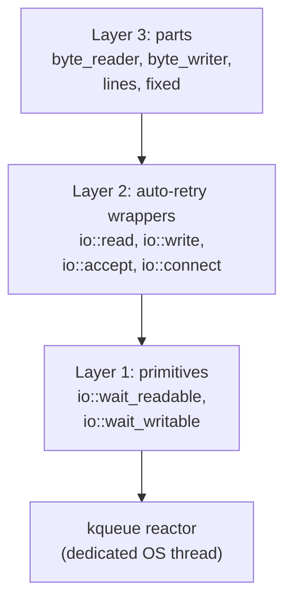

# I/O

CSP turns file descriptors into channels. Microthreads suspend cooperatively
while waiting for I/O readiness, keeping processors free to run other work.
The I/O subsystem is organized in three layers, each built on the one below.



## Prerequisites

I/O requires the M:N runtime. Call `init_runtime()` before any I/O
operations -- the reactor uses the global scheduler queue to reschedule
microthreads across worker threads.

```cpp
#include <csp/csp.h>
#include <csp/io.h>
#include <csp/part/io.h>

int main() {
    csp::init_runtime(4);   // 4 worker threads
    // ... spawn I/O microthreads ...
    csp::schedule();
    csp::shutdown_runtime();
}
```

## Layer 1: readiness primitives

The lowest layer suspends the calling microthread until a file descriptor is
ready for reading or writing.

```cpp
namespace csp::io {
    void wait_readable(int fd);
    void wait_writable(int fd);
}
```

These follow the same suspension protocol as timers: the microthread sets
`suspending_ = true`, registers with the reactor, then detaches from its
processor. When the fd becomes ready, the reactor calls `mt->schedule()` to
push the microthread back onto the global run queue.

```cpp
csp::spawn([fd] {
    io::wait_readable(fd);
    char buf[256];
    ssize_t n = ::read(fd, buf, sizeof(buf));
    // ...
});
```

### The kqueue reactor

The reactor is a singleton (`detail::Reactor::instance()`) that manages a
dedicated OS thread running a `kevent` loop. Key properties:

- **Lazy start** -- the reactor thread is created on the first call to
  `wait_readable` or `wait_writable`, not at `init_runtime` time.
- **EV_ONESHOT semantics** -- each registration fires at most once. To wait
  again on the same fd, register again.
- **EVFILT_USER for shutdown** -- `Reactor::shutdown()` triggers an
  `EVFILT_USER` event (ident 0) to unblock `kevent` and join the thread.
- **Not a processor** -- the reactor thread never runs microthreads. It only
  calls `mt->schedule()` to enqueue them for worker threads.

## Layer 2: auto-retry wrappers

Layer 2 wraps POSIX syscalls to automatically retry on `EAGAIN`/`EWOULDBLOCK`
(by suspending the microthread until the fd is ready) and on `EINTR`. The fd
must be in non-blocking mode.

| Function | Behavior |
|---|---|
| `io::read(fd, buf, len)` | Returns bytes read, 0 on EOF, -1 on error. Retries on EAGAIN. |
| `io::write(fd, buf, len)` | Writes **all** of `buf`. Handles partial writes automatically. Returns total bytes written, or -1 on error. |
| `io::accept(listen_fd, addr, addrlen)` | Returns new fd, or -1 on error. Retries on EAGAIN. |
| `io::connect(fd, addr, addrlen)` | Non-blocking connect. The fd must already be non-blocking. Handles `EINPROGRESS` by waiting for write-readiness then checking `SO_ERROR`. Returns 0 on success, -1 on error. |

```cpp
csp::spawn([rfd, wfd] {
    char buf[4096];
    for (;;) {
        ssize_t n = io::read(rfd, buf, sizeof(buf));
        if (n <= 0) break;
        io::write(wfd, buf, n);
    }
});
```

### DNS resolution

`io::resolve()` wraps `getaddrinfo` but offloads it to the blocking thread
pool (via `csp::blocking`) so the calling microthread suspends cooperatively
instead of stalling its processor.

```cpp
csp::spawn([] {
    struct addrinfo hints{};
    hints.ai_family = AF_INET;
    hints.ai_socktype = SOCK_STREAM;

    auto result = io::resolve("example.com", "443", &hints);
    if (result.error) {
        // result.error_string() returns gai_strerror text
        return;
    }
    // result.info is a std::unique_ptr<addrinfo> (auto-freed)
    int fd = socket(result.info->ai_family,
                    result.info->ai_socktype,
                    result.info->ai_protocol);
    io::set_nonblock(fd);
    io::connect(fd, result.info->ai_addr, result.info->ai_addrlen);
    // ...
});
```

### Utility

`io::set_nonblock(fd)` sets `O_NONBLOCK` via `fcntl`. Returns 0 on success, -1
on error. Layer 3 parts call this automatically; Layer 1 and 2 callers must set
non-blocking mode themselves.

## Layer 3: channel-based parts

Layer 3 provides composable parts (see [05-combinators.md](05-combinators.md))
that turn file descriptors into typed channel pipelines.

### byte_reader

Reads from a non-blocking fd in chunks and produces `vector<uint8_t>` messages.
Each message contains as much data as was available from a single `io::read`
call. Owns the fd and closes it on exit.

```cpp
#include <csp/part/io.h>

// Default 4096-byte chunks
auto r = csp::part::byte_reader(fd).spawn();

// Custom chunk size
auto r = csp::part::byte_reader(fd, 65536).spawn();
```

`byte_reader` calls `io::set_nonblock(fd)` internally, so there is no need to
set it beforehand.

### byte_writer

Consumes `vector<uint8_t>` messages and writes them to an fd. Owns the fd and
closes it on exit.

```cpp
auto w = csp::part::byte_writer(fd).spawn();

std::string msg = "Hello";
std::vector<uint8_t> chunk(msg.begin(), msg.end());
w << std::move(chunk);
```

### lines

A pure channel transform (no I/O knowledge) that splits a byte stream into
LF-delimited strings. Flushes any partial trailing line (without a trailing
newline) when the input closes.

```cpp
// Standalone — testable with synthetic data
auto [w, r] = csp::chan<std::vector<uint8_t>>{};
auto lr = csp::part::lines().spawn(std::move(r));
```

### fixed

A pure channel transform that splits a byte stream into fixed-size frames.
Discards any partial trailing frame when the input closes.

```cpp
auto fr = csp::part::fixed(512).spawn(std::move(r));
```

## Composed pipelines

Parts compose naturally through `spawn()` chaining. Each `spawn()` creates a
channel and a microthread, connecting stages into a pipeline.


```cpp
// End-to-end: fd → byte chunks → lines → application reader
auto lr = csp::part::lines().spawn(
              csp::part::byte_reader(fd).spawn());

for (std::string line; lr >> line;) {
    process(line);
}
```

Or equivalently using the `|` operator:

```cpp
auto pipeline = csp::part::byte_reader(fd) | csp::part::lines();
auto lr = pipeline.spawn();
```

A write pipeline works the same way:

```cpp
auto w = csp::part::byte_writer(fd).spawn();
// Write binary chunks to the fd
std::vector<uint8_t> data = /* ... */;
w << std::move(data);
// Dropping w closes the writer, which closes the fd
```

## fd ownership

`byte_reader` and `byte_writer` take ownership of the file descriptor. They
call `close(fd)` when they exit (on EOF, error, or channel close). Do not close
the fd yourself after passing it to a part.

## Backpressure

Because CSP channels are synchronous, backpressure is built in. When the
consumer is slow, the `byte_reader` microthread blocks on `out << chunk`,
which means it stops calling `io::read`. The kernel buffers incoming data until
the consumer catches up. No explicit flow-control logic is needed -- the
synchronous channel *is* the flow control.

## Complete example

A two-pipe transform that reads lines from one pipe, uppercases them, and
writes the result to another:

```cpp
#include <csp/csp.h>
#include <csp/io.h>
#include <csp/part/io.h>

#include <algorithm>
#include <cctype>

int main() {
    csp::init_runtime(2);

    int in_pipe[2], out_pipe[2];
    pipe(in_pipe);
    pipe(out_pipe);

    // Read side: input pipe → bytes → lines
    auto lines_in = csp::part::lines().spawn(
                        csp::part::byte_reader(in_pipe[0]).spawn());

    // Write side: → bytes → output pipe
    auto bytes_out = csp::part::byte_writer(out_pipe[1]).spawn();

    // Producer: send some lines to the input pipe
    csp::spawn([wfd = in_pipe[1]] {
        const char* data = "hello\nworld\n";
        ::write(wfd, data, strlen(data));
        ::close(wfd);
    });

    // Transform: uppercase each line, write to output pipe
    csp::spawn([lr = std::move(lines_in), bw = std::move(bytes_out)] {
        for (std::string line; lr >> line;) {
            std::transform(line.begin(), line.end(), line.begin(),
                           [](unsigned char c) { return std::toupper(c); });
            line += '\n';
            std::vector<uint8_t> out(line.begin(), line.end());
            if (!(bw << std::move(out))) break;
        }
    });

    // Consumer: read transformed output
    csp::spawn([rfd = out_pipe[0]] {
        char buf[256];
        ssize_t n;
        while ((n = ::read(rfd, buf, sizeof(buf))) > 0)
            ::write(STDOUT_FILENO, buf, n);
        ::close(rfd);
    });

    csp::schedule();
    csp::shutdown_runtime();
}
```

## Next steps

- [`07-blocking.md`](07-blocking.md) -- offloading blocking OS calls to a
  thread pool with `csp::blocking`
- [`08-signals.md`](08-signals.md) -- Unix signal handling as channels
