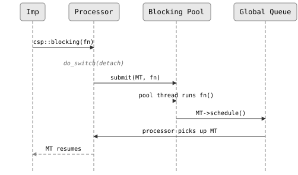

# Blocking Calls

CSP imps run cooperatively on a small pool of OS threads. When a
imp makes a blocking syscall -- `getaddrinfo`, file I/O, a database
query -- it stalls the underlying OS thread and starves every other imp
scheduled on the same processor. The `csp::blocking` function solves this by
offloading the work to a dedicated thread pool.

## The problem

Consider an imp that resolves a hostname:

```cpp
csp::spawn([] {
    struct addrinfo* raw;
    getaddrinfo("example.com", "443", nullptr, &raw);  // blocks!
    // ...
});
```

`getaddrinfo` can take hundreds of milliseconds. During that time the OS thread
is stuck in the kernel, unable to run any other imp. With a 4-thread
runtime, one DNS lookup blocks 25% of the scheduler's capacity.

## `csp::blocking`

`csp::blocking(fn)` runs `fn` on a separate OS thread pool while the calling
imp suspends cooperatively, keeping its processor free for other work.

```cpp
#include "csp.h"

csp::spawn([] {
    int result = csp::blocking([] {
        // Runs on a pool thread -- the imp's processor is free.
        return expensive_syscall();
    });
    // Back on a normal processor, result is available.
    use(result);
});
```

The function returns whatever `fn` returns. Void functions work too:

```cpp
csp::blocking([] {
    sync_to_disk();  // void return
});
```

### How it works

<!-- csp-seq
MT "Imp" | P "Processor" | BP "Blocking Pool" | GQ "Global Queue"
MT ->> P : csp::blocking(fn)
note P : do_switch(detach)
P ->> BP : submit(MT, fn)
BP ->> BP : pool thread runs fn()
BP ->> GQ : MT->schedule()
GQ ->> P : processor picks up MT
P -->> MT : MT resumes
-->


Key properties:

- **The processor is never blocked.** The imp detaches before the pool
  thread starts `fn`, so the processor immediately picks up other work.
- **The imp migrates.** After `fn` completes, the imp is pushed
  to the global queue and may resume on any processor -- not necessarily the
  one it started on.
- **The pool is lazily initialized.** Worker threads are created on the first
  call to `csp::blocking`. The pool size is `max(4, hardware_concurrency)`.
- **Pool threads are cheap to over-provision.** They spend most of their time
  blocked in the kernel, not burning CPU.

## DNS resolution

DNS lookups are the most common blocking syscall in network programs.
`csp::io::resolve` wraps `getaddrinfo` with `csp::blocking` so you never have
to think about it:

```cpp
#include "csp.h"

csp::spawn([] {
    struct addrinfo hints{};
    hints.ai_family = AF_INET;
    hints.ai_socktype = SOCK_STREAM;

    auto result = csp::io::resolve("example.com", "443", &hints);
    if (result.error) {
        log_error(result.error_string());
        return;
    }

    // result.info is a std::unique_ptr<addrinfo> -- freed automatically.
    int fd = socket(result.info->ai_family,
                    result.info->ai_socktype,
                    result.info->ai_protocol);
    csp::io::set_nonblock(fd);
    csp::io::connect(fd, result.info->ai_addr, result.info->ai_addrlen);
    // ...
});
```

`resolve` returns a `resolve_result` containing:

| Field            | Type                          | Description                        |
|------------------|-------------------------------|------------------------------------|
| `error`          | `int`                         | 0 on success, `EAI_*` on failure   |
| `info`           | `unique_ptr<addrinfo>`        | Linked list of results (RAII)      |
| `error_string()` | `const char*`                 | Human-readable error message       |

## When to use what

CSP provides three mechanisms for operations that would otherwise block:

| Mechanism               | Best for                                      | How it suspends               |
|-------------------------|-----------------------------------------------|-------------------------------|
| `csp::io::read/write`  | Socket and pipe I/O on file descriptors       | Reactor (epoll/kqueue)        |
| `csp::blocking(fn)`    | Syscalls with no non-blocking alternative     | Blocking thread pool          |
| Raw syscalls            | Guaranteed-fast operations (e.g., `/proc`)    | Does not suspend -- use care  |

Rules of thumb:

- **File descriptors** -- use `csp::io::read()`, `csp::io::write()`,
  `csp::io::connect()`, and `csp::io::accept()`. These use the reactor for
  non-blocking I/O with zero extra threads.
- **DNS** -- use `csp::io::resolve()`. It calls `csp::blocking` internally.
- **File I/O, database calls, third-party libraries** -- wrap them in
  `csp::blocking()`. Regular file descriptors do not support non-blocking mode
  on most platforms, so `io::read` on a disk file will block.
- **Trivially fast operations** -- reading `/proc/self/status` or calling
  `gettimeofday` completes in microseconds. Offloading these to the pool adds
  unnecessary overhead.

## Example: blocking file read

```cpp
#include "csp.h"
#include <fstream>
#include <string>

csp::spawn([] {
    std::string contents = csp::blocking([] {
        std::ifstream f("/etc/hosts");
        return std::string(std::istreambuf_iterator<char>(f),
                           std::istreambuf_iterator<char>());
    });
    // contents is available, processor was free during the read.
});
```

## Next steps

- [`06-io.md`](06-io.md) -- reactor-based I/O with `io::read` and `io::write`
- [`09-concurrency.md`](09-concurrency.md) -- configuring the M:N runtime and
  processor count
