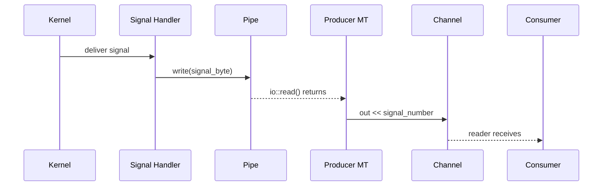

# Signals

Unix signals are inherently asynchronous interrupts -- they can fire at any
point during execution, and the set of operations safe to perform inside a
signal handler is extremely limited. CSP bridges this gap by converting
signals into channel reads, letting you handle `SIGINT`, `SIGTERM`, and
friends with the same `alt`/`prialt` patterns you already use for data flow.

## Basic usage

`csp::signal::notify` installs handlers for the listed signals and returns a
`reader<int>` that emits the signal number each time one is delivered:

```cpp
#include <csp/signal.h>

auto sig = csp::signal::notify({SIGINT, SIGTERM});

int s;
sig >> s;   // blocks until SIGINT or SIGTERM arrives
// s == SIGINT or s == SIGTERM
```

The returned reader behaves like any other CSP reader -- you can iterate it,
pass it to `alt`/`prialt`, compose it with combinators, or drop it to stop
delivery.

## Graceful shutdown

The most common pattern is multiplexing a signal reader alongside your main
work loop:

```cpp
auto sig = csp::signal::notify({SIGINT, SIGTERM});

int n;
for (;;) {
    switch (prialt(data >> n, sig >> n)) {
    case  1: process(n); break;
    case  2: shutdown(n); return;  // n is the signal number
    }
}
```

Because `prialt` checks arms left to right, you can give the signal priority
by listing it first:

```cpp
int s, n;
for (;;) {
    switch (prialt(sig >> s, data >> n)) {
    case  1: shutdown(s); return;  // signal takes priority
    case  2: process(n); break;
    }
}
```

## Multiple signals

A single `notify` call can watch for multiple signal types. The signal number
is delivered as the channel value, so you can distinguish them:

```cpp
auto sig = csp::signal::notify({SIGINT, SIGTERM, SIGUSR1});

int s;
sig >> s;
switch (s) {
case SIGINT:  /* Ctrl-C */        break;
case SIGTERM: /* kill <pid> */    break;
case SIGUSR1: /* reload config */ break;
}
```

You can also create separate readers for different signals if you want to
route them to different handlers:

```cpp
auto interrupt = csp::signal::notify({SIGINT, SIGTERM});
auto reload    = csp::signal::notify({SIGUSR1});

int s;
switch (csp::prialt(interrupt >> s, reload >> s)) {
case 0: shutdown(s);     break;
case 1: reload_config(); break;
}
```

## Cleanup on reader drop

When you drop (destroy) the returned reader, delivery stops and the
underlying resources are cleaned up automatically:

```cpp
{
    auto sig = csp::signal::notify({SIGUSR1});
    // ... use sig ...
}
// sig destroyed here -- pipe closed, microthreads exit.
// Future SIGUSR1 deliveries are silently ignored.
```

Signal handlers remain installed after the reader is dropped. This is
harmless -- the handler checks a per-pipe bitmask before writing, and a
cleared mask means the write is skipped entirely.

## How it works: the self-pipe trick

Signal handlers in Unix can only call a handful of
[async-signal-safe][posix-async] functions. In particular, they cannot
allocate memory, acquire mutexes, or interact with CSP channels. The
`signal::notify` implementation uses the classic **self-pipe trick** to
bridge from the signal handler into the cooperative world of microthreads:



1. **`notify()` creates a pipe** and registers it in a global table along
   with a bitmask of the requested signal numbers.

2. **Signal handlers write a byte** (the signal number) to every registered
   pipe whose mask includes that signal. The handler only calls `write()` and
   performs atomic loads -- both async-signal-safe.

3. **A producer microthread** loops on `io::read()` from the pipe's read end,
   forwarding each byte as an `int` to the output channel.

4. **A sentinel microthread** watches for consumer death. It uses
   `prialt(~out_copy, ~kill_r)` -- if the output reader is dropped
   (`~out_copy` fires) or the producer exits (`~kill_r` fires because the
   producer's `kill_w` is destroyed), the sentinel clears the pipe's signal
   mask and closes the write end of the pipe. This causes the producer's
   `io::read()` to return EOF, breaking its loop.

[posix-async]: https://pubs.opengroup.org/onlinepubs/9699919799/functions/V2_chap02.html#tag_15_04_03

### Memory ordering

The signal handler runs asynchronously, potentially on any thread. To ensure
correctness without mutexes:

- The **pipe count** is stored with `memory_order_release` when a new pipe is
  registered, and loaded with `memory_order_acquire` in the handler. This
  guarantees the handler sees the `write_fd` and `sig_mask` that were stored
  before the count was incremented.

- The **signal mask** is cleared with `memory_order_release` during cleanup.
  The handler loads it with `memory_order_acquire`, ensuring it never writes
  to a pipe whose write fd has been (or is about to be) closed.

### SIGPIPE suppression

On macOS, the write end of the pipe is configured with `F_SETNOSIGPIPE` to
prevent a `SIGPIPE` if the read end is closed before the handler runs. On
Linux, `SIGPIPE` for pipes is typically handled at the process level (e.g.,
`signal(SIGPIPE, SIG_IGN)`).

## Requirements

- Requires `init_runtime()` since the implementation uses
  the I/O reactor internally for non-blocking pipe reads.
- Signal numbers must be in the range 1--63.

## Next steps

- [`09-concurrency.md`](09-concurrency.md) -- M:N threading, `init_runtime`,
  and the work-stealing scheduler
