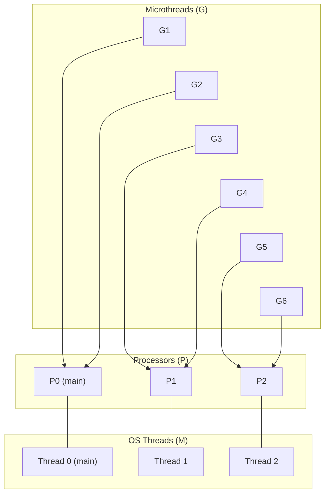
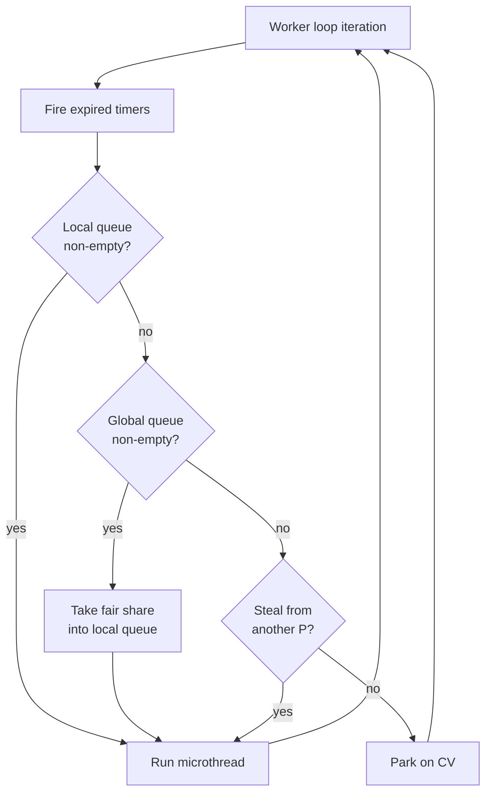

# Concurrency

By default, CSP runs all microthreads on a single OS thread using cooperative
scheduling. This is simple, deterministic, and sufficient for many programs. When
you need true parallelism -- CPU-bound work across cores, concurrent I/O, or a
blocking thread pool -- the M:N runtime spreads microthreads across multiple OS
threads with no changes to your channel code.

## Default mode: single-threaded

Without calling `init_runtime()`, all microthreads run cooperatively on the main
thread:

```cpp
csp::spawn([] { /* ... */ });
csp::schedule();   // runs all microthreads cooperatively
```

Context switches happen at channel operations, `yield()`, `sleep()`, and other
blocking points. Between those points, the running microthread has exclusive
access to the thread -- no preemption, no data races with other microthreads.

This mode is a good default. Use it unless you have a specific reason to go
multi-threaded.

## M:N mode

`csp::init_runtime(n)` creates **n processors** backed by **n-1 worker threads**
plus the main thread. Microthreads are multiplexed across these processors via a
global run queue and work stealing:

```cpp
csp::init_runtime(4);    // 4 processors on 4 OS threads
```

Pass `0` to auto-detect the number of hardware threads:

```cpp
csp::init_runtime(0);    // one processor per hardware thread
```



Each processor has its own local run queue. Newly spawned and woken microthreads
go to a shared global queue, and idle processors pull work from it.

### When to use M:N mode

- **CPU parallelism**: distribute compute-heavy microthreads across cores.
- **Concurrent I/O**: the reactor and blocking pool need the global queue to
  dispatch completions back to microthreads.
- **Avoiding starvation**: a microthread that does a long computation without
  yielding only blocks one processor; others keep running.

## How it works

### Scheduling

When a new microthread is spawned or a blocked microthread is woken (by a
channel peer or timer), it is pushed to the **global run queue**. Each worker
thread loops through a priority list of work sources:

1. **Fire expired timers** on the local processor.
2. **Local run queue** -- pick the next microthread from the processor's
   circular doubly-linked list.
3. **Global run queue** -- pull a fair share (total / num_processors, at least
   1) into the local queue.
4. **Work stealing** -- steal a microthread from another processor's local
   queue.
5. **Park** -- sleep on a condition variable until work arrives or a timer
   expires.



### Work stealing

When a processor's local queue is empty and the global queue is also empty, the
worker attempts to steal from another processor. It locks the victim's run queue
and takes a microthread from the tail (the opposite end from where the victim
picks work), then pushes it to the global queue so any worker can pick it up.

Three kinds of microthreads are never stolen:

- The **sentinel** node that anchors the doubly-linked list.
- The **head** of the queue (about to be picked by the victim).
- The **currently running** microthread (its context hasn't been saved yet).

### Parking and unparking

When there is no work anywhere, the worker parks on a condition variable. It is
woken when:

- A microthread is pushed to the global queue (spawn, channel wakeup).
- Work is stolen and deposited in the global queue.
- A timer expires.
- The runtime is shutting down.

If the processor has pending timers, the park uses `wait_until` with the
earliest deadline so timers fire on time even during idle periods.

### Watchdog

In M:N mode, a watchdog thread monitors processor heartbeats. If a processor
appears stalled (heartbeat counter unchanged between checks), the watchdog:

1. Fires any expired timers on the stalled processor.
2. Adds a new surplus processor so work stealing can drain the stalled
   processor's queue.

Surplus processors wind down automatically after 5 seconds of idle time.

## Thread safety

Channels are fully thread-safe. A writer on one processor and a reader on
another processor synchronize through the channel's internal lock -- no
user-visible locking is needed. The same channel can be shared across any number
of processors:

```cpp
csp::init_runtime(4);

csp::chan<int> ch;

// 10 producers on potentially different OS threads.
for (int p = 0; p < 10; ++p) {
    csp::spawn([w = ch.w.copy()] {
        for (int i = 0; i < 100; ++i)
            w << i;
    });
}

// 10 consumers on potentially different OS threads.
for (int c = 0; c < 10; ++c) {
    csp::spawn([r = ch.r.copy()] {
        for (int v; r >> v;) {
            // process v
        }
    });
}
ch.release();

csp::schedule();
csp::shutdown_runtime();
```

Microthreads may migrate between OS threads during their lifetime. A microthread
that blocks on a channel on one thread may resume on a different thread after
being stolen. This is transparent -- `std::this_thread::get_id()` may return
different values before and after a blocking operation.

## Runtime lifecycle

The M:N runtime is managed with three free functions:

```cpp
csp::init_runtime(4);        // create processors and worker threads

csp::spawn([&] { /* ... */ });

csp::schedule();             // blocks until all microthreads finish

csp::shutdown_runtime();     // stops workers, joins threads, restores
                             // single-threaded scheduler
```

`shutdown_runtime()` must be called after `schedule()` returns. It stops the
blocking pool, the I/O reactor, and all worker threads, then restores the
default single-threaded scheduler.

## Example: fan-out/fan-in

A common M:N pattern distributes work across multiple microthreads and collects
results:

```cpp
csp::init_runtime(4);

csp::chan<int> work;
csp::chan<int64_t> results;

// Producer
csp::spawn([w = std::move(work.w)] {
    for (int i = 0; i < 10'000; ++i)
        w << i;
});

// 4 workers -- each reads from the shared work channel
for (int i = 0; i < 4; ++i) {
    csp::spawn([r = work.r.copy(), w = results.w.copy()] {
        for (int v; r >> v;)
            w << static_cast<int64_t>(v) * v;
    });
}
work.release();

// Collector
int64_t total = 0;
csp::spawn([&total, r = std::move(results.r)] {
    for (int64_t v; r >> v;)
        total += v;
});
results.release();

csp::schedule();
csp::shutdown_runtime();
// total == sum of squares 0..9999
```

The synchronous channel semantics provide natural load balancing: a fast worker
immediately picks up the next item, while a slow worker's send blocks until the
collector is ready.

## Summary

| | Single-threaded | M:N |
|---|---|---|
| **Init** | (none needed) | `init_runtime(n)` or `init_runtime(0)` |
| **OS threads** | 1 (main) | n (main + n-1 workers) |
| **Scheduling** | Cooperative round-robin | Work stealing across processors |
| **Channel safety** | Trivially safe (single thread) | Thread-safe (internal locks) |
| **Best for** | Simple pipelines, prototyping | CPU parallelism, I/O, large fan-out |
