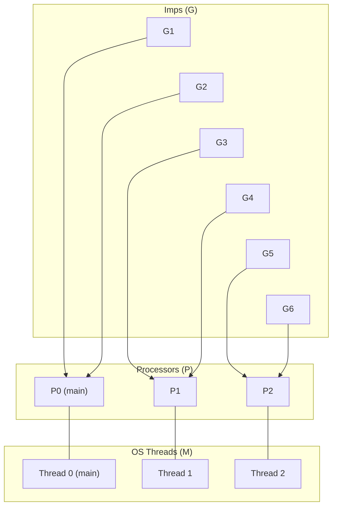
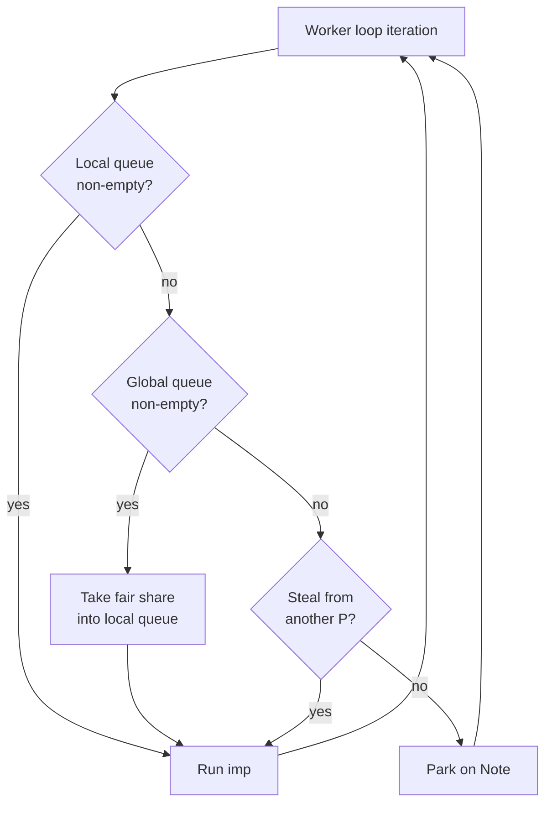

# Concurrency

CSP defaults to M:N threading: on first use, the runtime auto-initializes with
one processor per hardware thread. Imps are multiplexed across OS threads via a
work-stealing scheduler, with no changes to your channel code.

## Default mode: M:N threading

Without any configuration, the runtime creates **N processors** (one per
hardware thread) on first `spawn()` or `schedule()` call:

```cpp
csp::spawn([] { /* ... */ });
csp::schedule();   // runs imps across all cores
```

Override the processor count with `set_maxprocs(n)` or the `CSP_MAXPROCS`
environment variable (like Go's `GOMAXPROCS`).

## Single-threaded mode

For simple programs or deterministic testing, restrict to one processor:

```cpp
csp::set_maxprocs(1);   // or CSP_MAXPROCS=1
csp::spawn([] { /* ... */ });
csp::schedule();   // cooperative single-threaded scheduling
```

Context switches happen at channel operations, `yield()`, `sleep()`, and other
blocking points. Between those points, the running imp has exclusive
access to the thread -- no preemption, no data races with other imps.

## M:N configuration

`csp::set_maxprocs(n)` sets the processor count before the runtime initializes.
Each processor is backed by an OS thread. With **n processors**, there are
**n-1 worker threads** plus the main thread:

```cpp
csp::set_maxprocs(4);    // 4 processors on 4 OS threads
```

Pass `0` (the default) to use hardware concurrency:

```cpp
csp::set_maxprocs(0);    // one processor per hardware thread
```



Each processor has its own local run queue. Spawns and overload spills go
to a shared global queue; channel wakes prefer the waker's local queue
(wake-to-local) when it has no waiting work.

### When to use M:N mode

- **CPU parallelism**: distribute compute-heavy imps across cores.
- **Concurrent I/O**: the reactor and blocking pool need the global queue to
  dispatch completions back to imps.
- **Avoiding starvation**: an imp that does a long computation without
  yielding only blocks one processor; others keep running.

## How it works

### Scheduling

When a new imp is spawned it is pushed to the **global run queue**. Channel
wakeups prefer the **waker's local queue** (wake-to-local) when that queue
has no other waiting work; otherwise they spill to global. Each worker
thread loops through a priority list of work sources:

1. **Local run queue** — pick the next imp from the processor's
   circular doubly-linked list.
2. **Global run queue** — pull a fair share (total / num_processors, at least
   1) into the local queue.
3. **Work stealing** — steal an imp from another processor's local
   queue onto this worker's local queue.
4. **Park** — sleep on a per-worker Note (futex) until `unpark_one` wakes
   this worker.



### Work stealing

When a processor's local queue is empty and the global queue is also empty, the
worker attempts to steal from another processor. It locks the victim's run queue
and takes an imp from the tail (the opposite end from where the victim
picks work), then places it on the **thief's local queue** (steal-to-local;
no global bounce).

Three kinds of imps are never stolen:

- The **sentinel** node that anchors the doubly-linked list.
- The **head** of the queue (about to be picked by the victim).
- The **currently running** imp (its context hasn't been saved yet).

### Parking and unparking

When there is no work anywhere, the worker parks on its per-worker Note.
It is woken by `unpark_one` when:

- An imp is pushed to the global queue (spawn, channel spill).
- The watchdog redirects work to a parked P.
- The runtime is shutting down.

Completion/quiescence watchers (`main_loop`, `run`) wait on a separate
gated `park_cv`, not on worker Notes.

### Watchdog

In M:N mode, a watchdog thread monitors processor heartbeats. If a processor
appears stalled (heartbeat counter unchanged between checks), the watchdog:

1. Fires any expired timers on the stalled processor.
2. Adds a new surplus processor so work stealing can drain the stalled
   processor's queue.

Surplus processors wind down automatically after 5 seconds of idle time.

## Thread safety

Channels are fully thread-safe. A writer on one processor and a reader on
another processor synchronize through the channel's internal lock -- no
user-visible locking is needed. The same channel can be shared across any number
of processors:

```cpp
csp::set_maxprocs(4);

csp::chan<int> ch;

// 10 producers on potentially different OS threads.
for (int p = 0; p < 10; ++p) {
    csp::spawn([w = ch.w.copy()] {
        for (int i = 0; i < 100; ++i)
            w << i;
    });
}

// 10 consumers on potentially different OS threads.
for (int c = 0; c < 10; ++c) {
    csp::spawn([r = ch.r.copy()] {
        for (int v; r >> v;) {
            // process v
        }
    });
}
ch.release();

csp::schedule();
csp::shutdown_runtime();
```

Imps may migrate between OS threads during their lifetime. A imp
that blocks on a channel on one thread may resume on a different thread after
being stolen. This is transparent -- `std::this_thread::get_id()` may return
different values before and after a blocking operation.

## Runtime lifecycle

The M:N runtime lifecycle:

```cpp
csp::set_maxprocs(4);        // optional: override processor count

csp::spawn([&] { /* ... */ });  // runtime auto-initializes here

csp::schedule();             // blocks until all imps finish

csp::shutdown_runtime();     // stops workers, joins threads
```

`shutdown_runtime()` must be called after `schedule()` returns. It stops the
blocking pool, the I/O reactor, and all worker threads, then restores the
default single-threaded scheduler.

## Example: fan-out/fan-in

A common M:N pattern distributes work across multiple imps and collects
results:

```cpp
csp::set_maxprocs(4);

csp::chan<int> work;
csp::chan<int64_t> results;

// Producer
csp::spawn([w = std::move(work.w)] {
    for (int i = 0; i < 10'000; ++i)
        w << i;
});

// 4 workers -- each reads from the shared work channel
for (int i = 0; i < 4; ++i) {
    csp::spawn([r = work.r.copy(), w = results.w.copy()] {
        for (int v; r >> v;)
            w << static_cast<int64_t>(v) * v;
    });
}
work.release();

// Collector
int64_t total = 0;
csp::spawn([&total, r = std::move(results.r)] {
    for (int64_t v; r >> v;)
        total += v;
});
results.release();

csp::schedule();
csp::shutdown_runtime();
// total == sum of squares 0..9999
```

The synchronous channel semantics provide natural load balancing: a fast worker
immediately picks up the next item, while a slow worker's send blocks until the
collector is ready.

## Summary

| | Single-threaded | M:N |
|---|---|---|
| **Init** | `set_maxprocs(1)` or `CSP_MAXPROCS=1` | (none needed -- auto-initializes) |
| **OS threads** | 1 (main) | n (main + n-1 workers) |
| **Scheduling** | Cooperative round-robin | Work stealing across processors |
| **Channel safety** | Trivially safe (single thread) | Thread-safe (internal locks) |
| **Best for** | Simple pipelines, prototyping | CPU parallelism, I/O, large fan-out |
