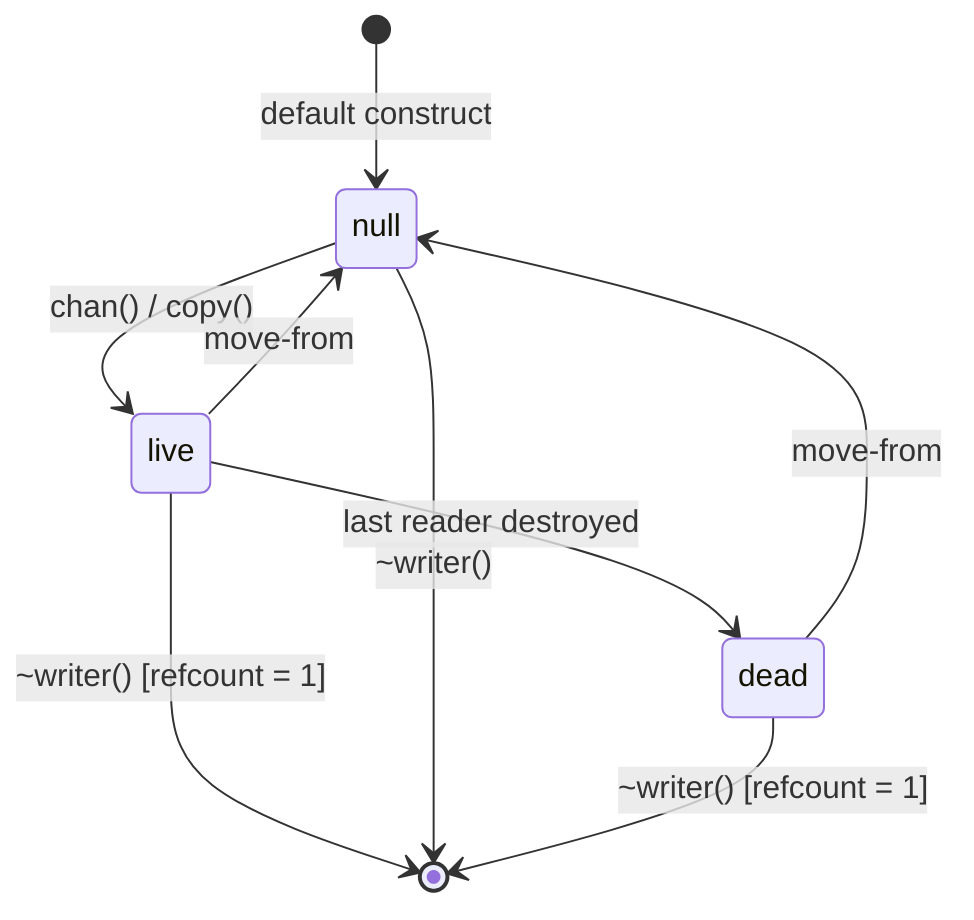
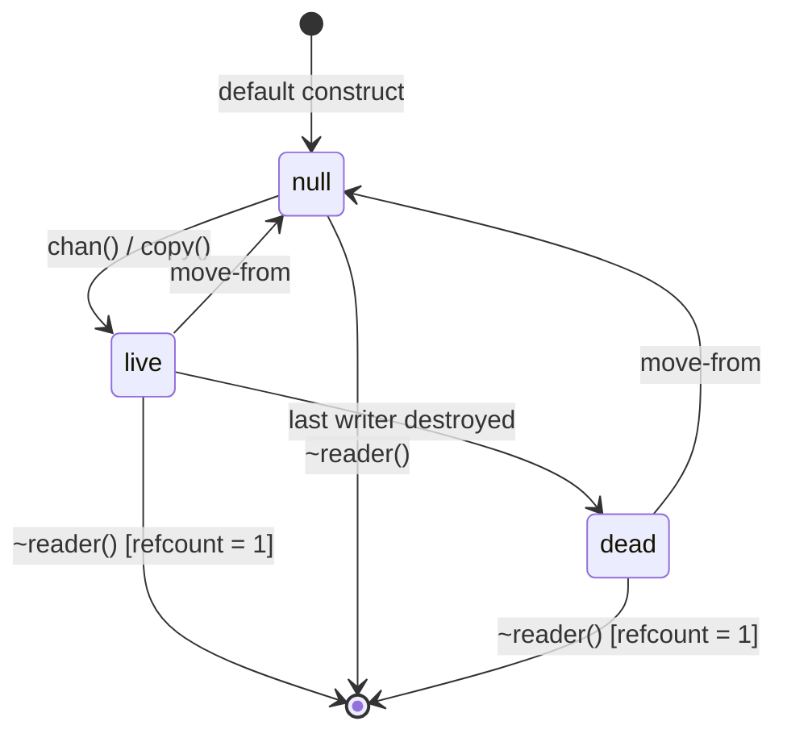
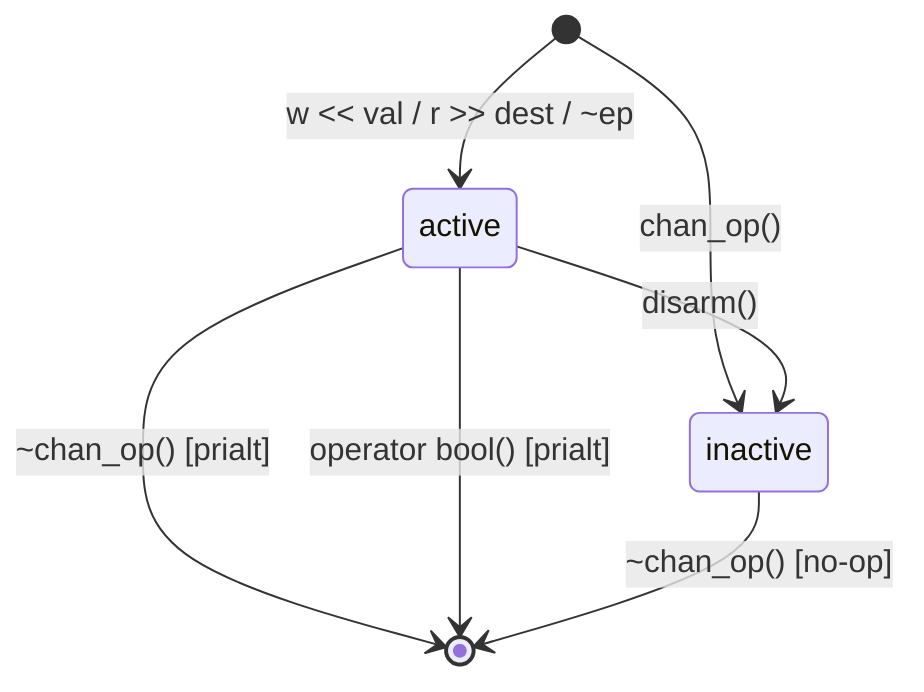

# Channels Reference

Channels are the core communication primitive in CSP. They provide typed,
unbuffered, synchronous message passing between imps. A channel
connects exactly one write endpoint to one read endpoint; the value is
transferred directly from writer to reader with no intermediate storage.

All types live in `namespace csp`. Header: `#include "csp.h"`.

---

## Table of Contents

1. [chan\<T\>](#chant) -- channel factory
2. [writer\<T\>](#writert) -- write endpoint
3. [reader\<T\>](#readert) -- read endpoint
4. [chan_op\<T\>](#chan_opt) -- deferred channel operation
5. [poke_t](#poke_t) -- empty signal type
6. [Rendezvous](#rendezvous) -- how writes and reads meet

---

## chan\<T\>

An unbuffered synchronous channel, owning one write endpoint and one read
endpoint.

### Signature

```cpp
template <typename T = poke_t>
struct chan {
    writer<T> w;
    reader<T> r;

    chan();                                  // create a new channel
    chan(writer<T> w, reader<T> r);          // adopt existing endpoints
    chan(chan&&) = default;
    chan& operator=(chan&&) = default;

    void release();                         // close both endpoints
};
```

### Description

Constructing a `chan<T>` allocates an internal channel object and produces a
paired `writer<T>` and `reader<T>`. The endpoints are exposed as public
members `w` and `r`; structured bindings work naturally:

```cpp
auto [w, r] = chan<int>{};
```

The default type parameter is `poke_t`, so `chan<>` creates a signal-only
channel that carries no data.

`release()` default-assigns both `w` and `r`, closing both endpoints of the
channel.

Move-only: copy construction and copy assignment are deleted because the
endpoints are move-only.

### Example

```cpp
#include "csp.h"

csp::spawn([] {
    auto [w, r] = csp::chan<int>{};

    csp::spawn([w = std::move(w)] {
        w << 42;
    });

    int val;
    r >> val;
    assert(val == 42);
});
csp::schedule();
```

---

## writer\<T\>

The write endpoint of a channel. Sending a value through a writer suspends the
current imp until a reader is ready to receive it.

### Signature

```cpp
template <typename T = poke_t>
class writer {
public:
    static writer dead();

    writer() = default;                              // null writer
    writer(writer&&);
    ~writer();

    writer& operator=(writer&&);

    explicit operator bool() const;                  // non-null test

    chan_op<T> operator<<(T const& t) const;          // write (copy)
    chan_op<T> operator<<(T&& t) const;               // write (move)

    chan_op<T> operator~() const;                     // death-watch

    writer copy() const;                             // shared ownership

    void descr(const char* d) const;                 // debug description

    bool operator==(const writer&) const;
    bool operator!=(const writer&) const;

    internal::WriterRef internal_writer() const;     // internal ref
};
```

### States



```
null ──➤ live ──➤ dead
```

| State | Meaning |
|-------|---------|
| null  | Default-constructed or moved-from. Not connected to any channel. |
| live  | Connected to a channel. The read-end may or may not still exist. |
| dead  | All readers for this channel have been destroyed. Writes will fail. |

`operator bool()` returns `true` for both live and dead states (any non-null
writer). It does **not** distinguish live from dead.

### Transition rules ([syntax](transition-rules.md))

```
live.operator<<(v)  ─┤reader ready├──➤ move(v, reader.dest); true
live.operator<<(v)  ─┤no readers├────➤ false
live.operator<<(v)  ─┤waiting├───────➤ suspend until reader ready v no readers
live.operator~()    ─────────────────➤ chan_op that matches when all readers die
live.copy()         ─────────────────➤ new writer sharing same channel; refcount++
live.~writer()      ─┤refcount > 1├──➤ refcount--
live.~writer()      ─┤refcount = 1├──➤ write-end dies; unblock waiting readers → false
null.~writer()      ─────────────────➤ (no-op)
```

### Description

**Writing.** The `<<` operator returns a `chan_op<T>` whose destructor
executes the actual transfer. As a statement, `w << val;` blocks until a
reader is ready or all readers have been destroyed. When used inside
`alt`/`prialt`, the `chan_op` participates as one arm of the select.

**Death-watch.** `~w` produces a `chan_op` that matches when all readers for
the channel have been destroyed. This is used in `alt`/`prialt` to detect
when a downstream consumer has gone away.

**Shared ownership.** `copy()` returns a new `writer` that shares the same
underlying channel. The channel's write-end remains alive until the last
shared writer is destroyed.

**Static factory.** `writer<T>::dead()` returns a writer whose channel has
no reader -- it is immediately in the dead state. Useful as a sentinel or
for non-blocking `alt` arms.

### Example

```cpp
#include "csp.h"

csp::spawn([] {
    auto [w, r] = csp::chan<std::string>{};

    csp::spawn([w = std::move(w)] {
        w << std::string("hello");
        w << std::string("world");
        // w destroyed here; read-end sees channel close
    });

    for (auto& msg : r) {
        // "hello", then "world"
    }
});
csp::schedule();
```

---

## reader\<T\>

The read endpoint of a channel. Reading from a reader suspends the current
imp until a writer provides a value.

### Signature

```cpp
template <typename T = poke_t>
class reader {
public:
    static reader dead();

    reader() = default;                              // null reader
    reader(reader&&);
    ~reader();

    reader& operator=(reader&&);

    explicit operator bool() const;                  // non-null test

    template <typename U>
    chan_op<T> operator>>(U& dest) const;             // read into dest
    chan_op<T> operator>>(void* dest) const;          // type-erased read

    T read() const;                                  // blocking read
    T single() const;                                // read exactly one

    chan_op<T> operator~() const;                     // death-watch

    reader copy() const;                             // shared ownership

    iterator begin() const;                          // input iterator
    iterator end() const;

    template <typename U>
    auto stream_to(writer<U> out) const;             // connect to writer

    void descr(const char* d);                       // debug description

    bool operator==(const reader&) const;
    bool operator!=(const reader&) const;

    internal::ReaderRef internal_reader() const;     // internal ref
};
```

### States



```
null ──➤ live ──➤ dead
```

| State | Meaning |
|-------|---------|
| null  | Default-constructed or moved-from. Not connected to any channel. |
| live  | Connected to a channel. The write-end may or may not still exist. |
| dead  | All writers for this channel have been destroyed. Reads will fail. |

`operator bool()` returns `true` for both live and dead states (any non-null
reader). It does **not** distinguish live from dead.

### Transition rules ([syntax](transition-rules.md))

```
live.operator>>(dest)  ─┤writer ready├──➤ move(writer.val, dest); true
live.operator>>(dest)  ─┤no writers├────➤ false
live.operator>>(dest)  ─┤waiting├───────➤ suspend until writer ready v no writers
live.read()            ─┤writer ready├──➤ move(writer.val, local); return local
live.read()            ─┤no writers├────➤ throw csp::error("reader exhausted")
live.read()            ─┤waiting├───────➤ suspend until writer ready v no writers
live.single()          ─────────────────➤ read one value; assert no more follow
live.operator~()       ─────────────────➤ chan_op that matches when all writers die
live.copy()            ─────────────────➤ new reader sharing same channel; refcount++
live.~reader()         ─┤refcount > 1├──➤ refcount--
live.~reader()         ─┤refcount = 1├──➤ read-end dies; unblock waiting writers → false
null.~reader()         ─────────────────➤ (no-op)
```

### Description

**Reading.** The `>>` operator returns a `chan_op<T>` whose destructor
executes the actual transfer. As a statement, `r >> val;` blocks until a
writer is ready or all writers have been destroyed. The `bool` conversion on
the resulting `chan_op` returns `true` if a value was received, `false` if the
channel is exhausted.

**Blocking read.** `read()` is a convenience that reads one value and returns
it directly. If the channel is exhausted (all writers destroyed, no pending
value), it throws `csp::error`.

**Single.** `single()` reads exactly one value, then asserts that no more
values follow. Useful for one-shot reply channels.

**Death-watch.** `~r` produces a `chan_op` that matches when all writers for
the channel have been destroyed. This detects upstream completion in
`alt`/`prialt`.

**Range-for.** `begin()` and `end()` provide an input iterator that reads
values until the channel is exhausted. This allows idiomatic range-for loops:

```cpp
for (auto& val : r) { ... }
```

**Stream forwarding.** `stream_to(out)` returns a callable that, when
invoked, reads values from this reader and writes them to `out` until either
endpoint closes. The callable monitors `~out` to stop if the downstream
writer's readers all die.

**Shared ownership.** `copy()` returns a new `reader` that shares the same
underlying channel. The channel's read-end remains alive until the last
shared reader is destroyed.

**Static factory.** `reader<T>::dead()` returns a reader whose channel has
no writer -- it is immediately in the dead state. The global constant
`csp::skip` is a `reader<>` in the dead state, useful for non-blocking
`alt`/`prialt` arms.

**Type-erased read.** The `operator>>(void* dest)` overload writes the value
to an arbitrary memory location. Used internally by combinators that operate
on type-erased buffers.

### Example

```cpp
#include "csp.h"

csp::spawn([] {
    auto [w, r] = csp::chan<int>{};

    csp::spawn([w = std::move(w)] {
        for (int i = 0; i < 5; ++i)
            w << i;
    });

    // Range-for reads until writer closes
    int sum = 0;
    for (int n : r)
        sum += n;
    assert(sum == 10);  // 0+1+2+3+4
});
csp::schedule();
```

---

## chan_op\<T\>

A deferred channel operation. Returned by `writer::operator<<`,
`reader::operator>>`, and the death-watch operators. The operation executes
when the `chan_op` is destroyed or explicitly converted to `bool`.

### Signature

```cpp
template <typename T>
class chan_op {
public:
    chan_op();                                // inactive (no-op on destruction)

    chan_op(chan_op&&);
    chan_op& operator=(chan_op&&);
    ~chan_op();                               // executes the operation via prialt

    explicit operator bool() const;          // execute and return success

    void disarm() const;                     // prevent execution on destruction
    internal::ChanOp chanop() const;         // internal descriptor

    static void transfer(void* src, void* dst);  // typed move
};
```

### Description

`chan_op` implements the two-phase channel protocol through RAII. When a
`chan_op` is created by `w << val` or `r >> dest`, it captures the channel
endpoint, the message buffer, and whether this is a write or read. The
actual rendezvous happens at one of two points:

1. **Destructor** -- if the `chan_op` is still active when destroyed, the
   destructor calls `prialt` with this single operation, blocking until the
   transfer completes or the peer endpoint dies.

2. **`operator bool()`** -- explicitly executes the operation, returns `true`
   if a value was transferred, `false` if the peer endpoint is dead. Also
   disarms the destructor.

This design means that `w << val;` as a statement blocks (the temporary
`chan_op` is destroyed at the semicolon), while `if (w << val)` tests
whether the write succeeded.

**Move semantics.** Moving a `chan_op` transfers ownership of the operation.
The moved-from `chan_op` becomes inactive and its destructor is a no-op.
This is how `chan_op` values are passed into `alt`/`prialt` as operands.

**`disarm()`** prevents the destructor from executing the operation. Used
internally by `alt`/`prialt` after they have already executed the selected
operation.

Copy construction and copy assignment are deleted.

### States



### Transition rules ([syntax](transition-rules.md))

```
active.~chan_op()           ─────────────────➤ prialt({this_op}); transfer if matched
active.operator bool()     ─────────────────➤ prialt({this_op}); return result >= 0
active.disarm()            ─────────────────➤ active → inactive
inactive.~chan_op()        ─────────────────➤ (no-op)
```

### Example

```cpp
#include "csp.h"

csp::spawn([] {
    auto [w, r] = csp::chan<int>{};

    csp::spawn([w = std::move(w)] {
        w << 1;           // blocks (chan_op destroyed at semicolon)
        if (w << 2) {     // tests success (operator bool)
            // write succeeded
        }
    });

    int a, b;
    r >> a;               // blocks
    if (r >> b) {         // tests success
        assert(a == 1 && b == 2);
    }
});
csp::schedule();
```

---

## poke_t

An empty struct used as the default type parameter for channels. Carries no
data; used purely for signaling.

### Signature

```cpp
struct poke_t {
    explicit operator bool() const;   // always returns false
};

extern poke_t poke;                   // global instance
```

### Description

`poke_t` is a zero-size type that serves as the default `T` for `chan<T>`,
`writer<T>`, and `reader<T>`. A `chan<>` (equivalently `chan<poke_t>`)
creates a pure synchronization channel: the write and read rendezvous, but
no meaningful data is transferred.

The global instance `csp::poke` can be used as the value to send:

```cpp
w << csp::poke;
```

The `operator bool()` always returns `false`. This has no semantic
significance for channel operations; it exists so that `poke_t` satisfies
interfaces that test values for truthiness.

### Example

```cpp
#include "csp.h"

csp::spawn([] {
    csp::chan<> done;   // chan<poke_t>

    csp::spawn([w = std::move(done.w)] {
        // ... do work ...
        w << csp::poke;   // signal completion
    });

    done.r >> csp::poke;  // wait for signal
});
csp::schedule();
```

---

## Rendezvous

CSP channels are unbuffered and synchronous. There is no storage inside the
channel; a value is moved directly from the writer's buffer to the reader's
destination. Both sides must be ready simultaneously for the transfer to
occur.

### Protocol

A rendezvous proceeds in two phases:

1. **Match** (`prialt_begin` / `alt_begin`). The scheduler scans the set of
   channel operations. If a peer is already suspended and waiting on the
   opposite endpoint, a match is found. If no peer is ready, the current
   imp suspends until one becomes available or all peer endpoints die.

2. **Transfer** (`alt_end`). The value is moved from the writer's message
   buffer to the reader's destination using `chan_op<T>::transfer` (a typed
   `std::move` assignment). Both imps are then made runnable.

### Rules

```
writer.suspend ─┤reader arrives├──➤ move(writer.buf, reader.dest); unblock both
reader.suspend ─┤writer arrives├──➤ move(writer.buf, reader.dest); unblock both
writer.suspend ─┤last reader dies├─➤ unblock writer; result = false
reader.suspend ─┤last writer dies├─➤ unblock reader; result = false
```

### Implications

- **No buffering.** A write blocks until a reader is ready, and vice versa.
  There is no queue or ring buffer inside the channel.

- **Direct transfer.** The value is never copied to intermediate storage. It
  is moved once, from source to destination.

- **Symmetric blocking.** Writers and readers are treated symmetrically. Either
  side may arrive first; the first to arrive suspends until the other is ready.

- **Death notification.** When all endpoints on one side are destroyed, any
  imps suspended on the opposite side are unblocked with a failure
  result. This allows loops to terminate naturally:

  ```cpp
  for (int n : r) { ... }   // exits when all writers close
  ```

- **No priority.** When multiple peers are waiting, the channel selects one.
  The selection order is not specified. Use `prialt` (not the channel itself)
  when priority among multiple channels matters.

---

## Topology Operations

Free functions that rewire channel connectivity at runtime. All operate
through the slot indirection layer: every endpoint handle points to a
shared *slot*, and the slot points to the channel. Swapping slots
transparently redirects all copies of an endpoint.

### swap

```cpp
template <typename T> void swap(writer<T>& a, writer<T>& b);
template <typename T> void swap(reader<T>& a, reader<T>& b);
```

Atomically exchange which channels two same-side endpoint groups target.
If `a` targeted Channel X and `b` targeted Channel Y, afterward `a`
targets Y and `b` targets X. All copies of each endpoint (made via
`.copy()`) follow the redirection through the shared slot.

### swap (4-argument)

```cpp
template <typename T>
void swap(writer<T>& w1, reader<T> r1, writer<T> w2, reader<T>& r2);
```

Exchange which channels two (writer, reader) pairs target. The middle
parameters (`r1`, `w2`) are taken by value; their destruction on return
triggers endpoint death on the channels they were swapped onto.

Two calling patterns:

- **Fuse mode** (`r1` and `w2` are empty): a temporary channel is
  created as a bridge. `w1` and `r2` are redirected onto it; the
  orphaned sides of their original channels see clean endpoint death.
- **Split mode** (`r1` and `w2` are valid): two 2-arg swaps execute,
  then the consumed middle endpoints die on return, killing the
  original channel.

### fuse

```cpp
template <typename T> void fuse(writer<T>& w, reader<T>& r);
```

Redirect `w` and `r` onto a shared temporary channel. Equivalent to
`swap(w, {}, {}, r)`. The orphaned writer side of `w`'s original
channel and the orphaned reader side of `r`'s original channel observe
endpoint death.

```
Before fuse(a.w, b.r):
  a.w ──→ [Channel A] ──→ a.r
  b.w ──→ [Channel B] ──→ b.r

After fuse(a.w, b.r):
  a.w ──→ [Temp] ──→ b.r
          ╳ Channel A (a.r sees writer death)
          ╳ Channel B (b.w sees reader death)
```

### tap

```cpp
template <typename T> struct tap_handle;
template <typename T> tap_handle<T> tap(writer<T>& w, reader<T>& r);
```

Splice a pass-through observer into the channel between `w` and `r`.
Returns a `tap_handle` whose `output` reader receives a copy of every
value flowing from `w` to `r`.

Internally, `tap` splits the original channel and spawns a forwarding
imp that reads from `w`'s channel, writes to the tap channel, then
forwards to `r`'s channel. If the tap reader dies (or the handle is
destroyed), the forwarder stops tapping but continues forwarding until
the pipeline terminates.

Destroying the `tap_handle` fuses `w` and `r` back together, removing
the forwarding imp from the data path. This works because the handle
holds `.copy()` references that share the original slots.

```cpp
csp::chan<int> ch;

// Attach a tap.
auto h = csp::tap(ch.w, ch.r);

// h.output is a reader<int> that sees every value.
csp::spawn([r = h.output.copy()] {
    for (int v : r) { log(v); }
});

// ... later, remove the tap (auto-fuses w and r back together).
h = {};
```

**Important:** both the tap reader and the original reader must be
consumed for the pipeline to make progress. The forwarding imp writes
to the tap channel first, then forwards to the original reader. If
either side stalls, the entire pipeline stalls.
