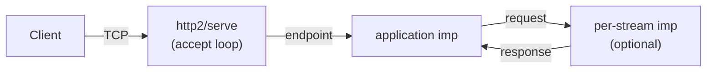
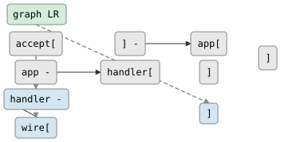

# HTTP/2 Server

`csp::http2` provides an HTTP/2 server with per-stream channel pairs, built on
[nghttp2](https://nghttp2.org/) for session management. Each HTTP/2 stream is
delivered as an `http::request` (with an embedded `writer<http::response>`),
exactly matching the HTTP/1.1 server interface.

## Headers

```cpp
#include <csp/http2.h>   // http2::serve, http2::serve_tls, endpoint, server
#include <csp/http.h>    // http::request, http::response, http::method
```

`http2.h` is not included in the amalgamated `csp.h`. Users must compile
`src/http2.cc` and `vendor/github.com/nghttp2/nghttp2/lib/*.c` separately.

## Types

### `http2::endpoint`

```cpp
namespace csp::http2 {
struct endpoint {
    reader<http::request> streams;  // one per HTTP/2 stream on this connection
    std::string remote_addr;        // e.g. "[::1]:54321"
};
}
```

### `http2::server`

```cpp
namespace csp::http2 {
struct server {
    reader<endpoint> endpoints;  // one per accepted TCP connection
    uint16_t port;               // actual bound port (useful when port=0)
    std::string local_addr;
};
}
```

### `http2::serve_options`

```cpp
namespace csp::http2 {
struct serve_options {
    net::listen_options listen = {};  // backlog, reuse_addr, dual_stack
    size_t read_chunk_size = 16384;
};
}
```

## Functions

### `http2::serve` — cleartext (h2c)

```cpp
http2::server http2::serve(uint16_t port, serve_options opts = {});
http2::server http2::serve(const std::string& addr, uint16_t port,
                           serve_options opts = {});
```

Starts an HTTP/2 cleartext server (h2c) on `port`. Pass `port = 0` to let the
OS assign a free port — read `server.port` for the actual value.

Dropping `server.endpoints` stops accepting new connections. Active connections
complete naturally.

### `http2::serve_tls` — TLS (requires `CSP_TLS=1`)

```cpp
http2::server http2::serve_tls(
    uint16_t port,
    const char* cert_pem, const char* key_pem,
    serve_options opts = {});
http2::server http2::serve_tls(
    const std::string& addr, uint16_t port,
    const char* cert_pem, const char* key_pem,
    serve_options opts = {});
```

Performs TLS 1.3 handshake (via PicoTLS/minicrypto) then runs HTTP/2 over
the encrypted connection. `cert_pem` and `key_pem` are filesystem paths to
PEM-encoded certificate and private key files.

**ALPN**: full ALPN negotiation (`h2` vs `http/1.1`) requires deeper PicoTLS
`handshake_properties` integration that is not yet exposed through
`csp::tls::conn`. `serve_tls` currently always speaks HTTP/2 regardless of the
client's ALPN offer. Tracked as a future improvement.

## Request/response types

`http2::serve` reuses `csp::http::request` and `csp::http::response` directly:

```cpp
namespace csp::http {
struct request {
    http::method method;
    std::string url;              // :path pseudo-header
    uint8_t version_major = 2;   // always 2 for HTTP/2 streams
    uint8_t version_minor = 0;
    std::vector<std::pair<std::string,std::string>> headers;  // regular headers
    bytes body;                   // complete request body
    bool keep_alive = true;
    writer<response> respond;     // write exactly one response
};

struct response {
    int status = 200;
    std::vector<std::pair<std::string,std::string>> headers;
    bytes body;
};
}
```

Header names in requests are lowercase (as delivered by nghttp2's HPACK
decompressor). Response header names are lowercased automatically before
transmission.

## Example

```cpp
#include <csp/csp.h>
#include <csp/http2.h>

using namespace csp;

int main() {
    spawn([] {
        auto srv = http2::serve(8080);

        for (;;) {
            http2::endpoint ep;
            if (!(srv.endpoints >> ep)) break;

            // Each endpoint is one TCP connection; each stream is one request.
            csp::spawn([ep = std::move(ep)]() mutable {
                http::request req;
                while (ep.streams >> req) {
                    std::string body = "Hello from HTTP/2!";
                    req.respond << http::response{
                        200,
                        {{"content-type", "text/plain"}},
                        bytes(body.begin(), body.end())
                    };
                }
            });
        }
    });

    await_completion();
}
```

## Topology



<!-- csp-flow
graph LR
  accept["http2/serve\n(accept loop)"] -->|"endpoint"| app["application"]
  app -->|"request"| handler["handler"]
  handler -->|"response"| wire["→ client"]
-->


## Flow control and backpressure

nghttp2 maintains per-stream and per-connection window sizes (HTTP/2 flow
control). The CSP server reads at up to `serve_options::read_chunk_size` bytes
per I/O call; `io::read` blocks cooperatively until data arrives. Backpressure
on the application side (slow handler) naturally throttles the read loop since
`dispatch_stream` waits synchronously for the response before processing the
next frame.

## HPACK header compression

nghttp2 handles HPACK encoding/decoding transparently. Request headers arrive
already decoded; response headers are encoded before transmission. No
application-level work is needed.

## Server push

Server push is not yet implemented in this initial release. The API placeholder
(`http2::push`) is defined for future use. Tracked as a future enhancement.

## Distribution

`src/http2.cc` is **excluded** from the dist amalgamation (like `src/http.cc`)
because it depends on vendored nghttp2. Users who need HTTP/2 must:

1. Add `src/http2.cc` to their build.
2. Compile all `vendor/github.com/nghttp2/nghttp2/lib/*.c` sources with
   `-I vendor/github.com/nghttp2/nghttp2/lib/includes -DBUILDING_NGHTTP2`.
3. Link the resulting objects.

## See Also

- [nghttp2 library](https://nghttp2.org/)
- `include/csp/http.h` — shared `http::request` and `http::response` types
- `include/csp/tls.h` — TLS 1.3 via PicoTLS (used by `serve_tls`)
- `include/csp/net.h` — TCP networking primitives
