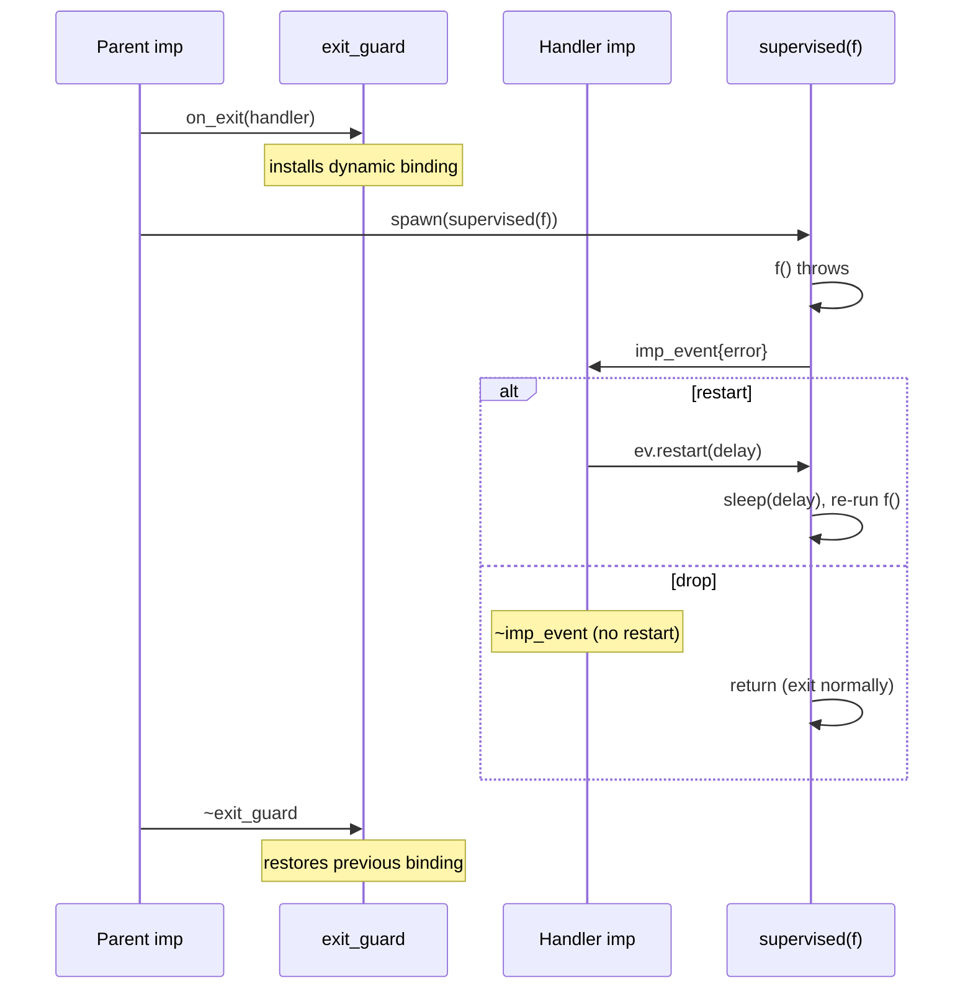

# Imp Exit Reference

Intercept imp exit events (normal return or exception) with custom handlers
or automatic restart policies. This is the building block for supervision
strategies.

All types live in `namespace csp`. Header: `#include "csp.h"`.

---

## Table of Contents

1. [Overview](#overview)
2. [csp::supervised / csp::supervised\_fn](#cspsupervised-cspsupervised_fn) -- wrap a callable for exit interception
3. [csp::on\_exit (handler)](#cspon_exit-handler) -- custom exit handler
4. [csp::on\_exit (restart\_policy)](#cspon_exit-restart_policy) -- automatic restart
5. [csp::exit\_guard](#cspexit_guard) -- RAII scope for exit interception
6. [csp::imp\_event](#cspimp_event) -- exit event delivered to handlers
7. [csp::restart\_policy](#csprestart_policy) -- restart limits and backoff
8. [csp::max\_restarts\_exceeded](#cspmax_restarts_exceeded) -- escalation exception

---

## Overview

Imp exit interception has two orthogonal parts:

1. **`supervised(f)`** wraps a callable so that when it exits (normally or via
   exception), it reports the event to the active exit handler and waits for a
   restart decision.

2. **`on_exit(handler)`** or **`on_exit(policy)`** installs an exit handler via
   dynamic scoping. Supervised imps spawned within this scope (including in
   child imps) send their exit events to the handler.

Regular `spawn(f)` is unaffected -- only `spawn(supervised(f))` participates
in exit interception. This keeps the default fail-fast behavior intact.



---

## csp::supervised / csp::supervised\_fn

Wrap a callable in a supervision retry loop. The returned `supervised_fn`
checks the dynamic exit binding on each exit and either restarts or
propagates the result.

### Signature

```cpp
// Wrap any callable (including move-only).
template <typename F>
supervised_fn supervised(F&& f);

// Returned wrapper (callable, stores std::function<void()>).
class supervised_fn {
public:
    explicit supervised_fn(std::function<void()> f);
    void operator()();
};
```

### Description

`supervised(f)` captures `f` in a `shared_ptr` (to support move-only
callables) and returns a `supervised_fn`. When invoked:

1. Run `f()`.
2. If no exit handler is active (`on_exit` not in scope), propagate normally:
   rethrow on exception, return on success.
3. If an exit handler is active, send an `imp_event` to it and wait for a
   response:
   - `ev.restart(delay)` -- sleep for `delay`, then go to step 1.
   - Event dropped (handler doesn't call `restart()`) -- return normally.
   - Handler channel dead -- propagate normally (rethrow or return).

### Usage

Always combine with `spawn`:

```cpp
spawn(supervised([]() {
    // work that may throw
}));
```

`supervised` without an active `on_exit` scope has no effect -- the callable
runs once and exits normally.

---

## csp::on\_exit (handler)

Install a custom exit handler. Returns an `exit_guard` that scopes the
binding.

### Signature

```cpp
exit_guard on_exit(std::function<void(imp_event)> handler);
```

### Description

Creates an internal channel and spawns a handler imp that reads `imp_event`
values from it. The channel's writer is bound to the current imp's dynamic
scope, so all `supervised` imps spawned within this scope (and their
children) send exit events to this handler.

The handler receives each event and decides:
- Call `ev.restart()` or `ev.restart(delay)` to restart the imp.
- Let `ev` be destroyed without calling `restart()` to let the imp exit.

The handler imp runs until the `exit_guard` is destroyed (closing the
channel).

### Example

```cpp
auto guard = on_exit([](imp_event ev) {
    if (!ev.error) {
        // Normal exit: restart unconditionally.
        ev.restart();
    }
    // Exception: let the imp die (don't call restart).
});

spawn(supervised([]() {
    do_work();
}));
```

---

## csp::on\_exit (restart\_policy)

Install a policy-based exit handler with sliding-window restart limiting.

### Signature

```cpp
exit_guard on_exit(restart_policy policy);
```

### Description

Spawns a handler imp that implements the following logic:

- **Normal exit**: the imp is not restarted (event dropped).
- **Exception exit**: check the sliding window. If the restart count within
  `policy.window` is below `policy.max_restarts`, restart with
  `policy.backoff` delay. Otherwise, drop the event (the supervised imp
  exits normally, and the original exception is not rethrown).

### Example

```cpp
auto guard = on_exit(restart_policy{
    .max_restarts = 5,
    .window = std::chrono::seconds(60),
    .backoff = std::chrono::seconds(1),
});

spawn(supervised([]() {
    connect_and_serve();  // restarts up to 5 times per minute
}));
```

---

## csp::exit\_guard

RAII guard that scopes an exit handler binding. When destroyed, the dynamic
binding is restored and the handler imp's channel is closed.

### Signature

```cpp
class exit_guard {
public:
    exit_guard(exit_guard&&) noexcept;
    exit_guard& operator=(exit_guard&&) noexcept;
    ~exit_guard();

    exit_guard(const exit_guard&) = delete;
    exit_guard& operator=(const exit_guard&) = delete;
};
```

### Description

`exit_guard` is move-only and opaque. It is returned by `on_exit()` and must
be kept alive for the duration of the exit scope. Nested guards are supported
-- the innermost active guard handles events from supervised imps in its
scope.

---

## csp::imp\_event

An exit event delivered to a custom handler. Contains the exception (if any)
and a one-shot restart channel.

### Signature

```cpp
struct imp_event {
    std::exception_ptr error;  // nullptr on normal exit

    void restart(duration d = duration::zero());

    imp_event();
    imp_event(imp_event&&) noexcept;
    imp_event& operator=(imp_event&&) noexcept;
    ~imp_event();

    imp_event(const imp_event&) = delete;
    imp_event& operator=(const imp_event&) = delete;
};
```

### Description

`error` is `nullptr` for normal exits and holds the exception for exception
exits. The handler inspects `error` to decide whether to restart.

`restart(d)` sends the delay `d` back to the supervised imp, which sleeps
for `d` then re-runs the callable. `restart()` with no argument restarts
immediately.

If the handler does not call `restart()` before the `imp_event` is
destroyed, the supervised imp exits normally (the response channel closes).

`imp_event` is move-only. Each event must be handled exactly once.

---

## csp::restart\_policy

Configuration for the policy-based exit handler.

```cpp
struct restart_policy {
    int max_restarts = 3;
    duration window = std::chrono::seconds(5);
    duration backoff = duration::zero();
};
```

| Field | Default | Description |
|---|---|---|
| `max_restarts` | `3` | Maximum restarts within `window` before giving up. |
| `window` | `5s` | Sliding time window for counting restarts. |
| `backoff` | `0s` | Constant delay before each restart. |

Restart timestamps older than `now - window` are pruned before each check.
This allows a service that crashes infrequently to restart indefinitely, while
one in a crash loop is stopped.

---

## csp::max\_restarts\_exceeded

Exception type available for custom handlers that want to escalate when
restarts are exhausted.

```cpp
struct max_restarts_exceeded : csp::error {
    std::exception_ptr cause;
    max_restarts_exceeded(std::exception_ptr ex);
};
```

**Note**: The built-in `on_exit(restart_policy)` does not throw this
exception. When the policy's restart limit is reached, it simply drops the
event (the supervised imp exits normally). Custom handlers can throw
`max_restarts_exceeded` explicitly if escalation semantics are desired.

`worker_max_restarts_exceeded` (in `csp.h`) is the
`worker_group`-specific variant that includes a `worker_name` field.

---

## Design notes

### Dynamic scoping

Exit handlers use `dynamic<shared_ptr<imp_exit_state>>` internally. This
means:

- Handlers are inherited by child imps automatically.
- Nested `on_exit` scopes shadow outer ones (innermost wins).
- The handler reverts when the `exit_guard` is destroyed.

### Channels survive restart

When a supervised imp is restarted, it re-runs the original callable from
the top. Any channels captured by the callable (via `.copy()` or closure)
remain live across restarts. This allows sibling imps to continue
communicating with the restarted imp without reconnection.

### Regular spawn is unaffected

Only `spawn(supervised(f))` participates in exit interception. Regular
`spawn(f)` always uses fail-fast semantics regardless of any active
`on_exit` scope.

---

## See Also

- [Supervision](supervisor.md) -- `worker_group` (deprecated higher-level API)
- [Dynamic Scoping](dynamic.md) -- how dynamic bindings propagate to child imps
- [Scheduling](scheduling.md) -- `spawn`, `await_completion`, lifecycle
