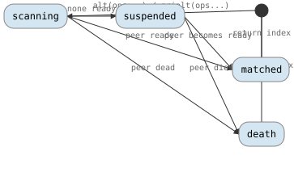

# Multiplexing Reference

CSP provides two multiplexing primitives, `alt` and `prialt`, that select
among multiple channel operations. Both use the same two-phase protocol
internally; they differ only in scan order.

## Operation Flow

<!-- csp-state
[*] -> scanning : alt(ops...) / prialt(ops...)
scanning -> matched : peer ready
scanning -> death : peer dead
scanning -> suspended : none ready
suspended -> matched : peer becomes ready
suspended -> death : peer dies
matched -> [*] : return index
death -> [*] : return ~index
-->


---

## Table of Contents

1. [csp::alt](#cspalt) -- fair (randomized) select
2. [csp::prialt](#cspprialt) -- priority (declaration-order) select
3. [Death-watch](#death-watch) -- `~reader` / `~writer`
4. [csp::closer\<EP\>](#cspcloserep) -- vulture-only endpoint wrapper
5. [csp::chan_op\<T\>](#cspchan_opt) -- channel operation descriptors
6. [chan_op RAII](#chan_op-raii) -- standalone blocking via destructor
7. [csp::none](#cspnone) -- non-blocking guard (preferred)
8. [csp::skip](#cspskip) -- non-blocking guard (legacy)
9. [Interactions](#interactions)

---

## csp::alt

Fair multiplexing across channel operations.

### Signature

```cpp
// Variadic: heterogeneous channel types, compile-time dispatch.
template <typename... Ops>
int alt(Ops&&... ops);

// Vector: homogeneous channel type, runtime-sized.
template <typename T>
int alt(std::vector<chan_op<T>> const & ops);
```

**Header:** `#include "csp.h"`

### Description

`alt` takes one or more channel operations and waits until one of them can
proceed. It scans the operations in **random order** (shuffled on every call)
so that no operation is systematically starved when multiple are ready
simultaneously.

When a match is found, the data transfer happens inline and `alt` returns the
0-based index of the matched operation. If the match is a death-watch (see
below), `alt` returns `~index` (bitwise complement), which is always negative.

If no operation is immediately ready, the calling imp suspends until a
peer becomes available or an endpoint dies.

### Transition rules ([syntax](transition-rules.md))

```
alt(ops...) ─┤peer ready at index i├──➤ transfer data; i
alt(ops...) ─┤peer dead at index i├───➤ ~i
alt(ops...) ─┤no peer ready├──────────➤ suspend; (woken) → transfer or ~i
```

### Example

```cpp
csp::chan<int> a, b;

// ...spawn writers on a.w and b.w...

int n;
switch (csp::alt(a.r >> n, b.r >> n)) {
case 0:  /* received from a */ break;
case 1:  /* received from b */ break;
}
```

---

## csp::prialt

Priority multiplexing across channel operations.

### Signature

```cpp
// Variadic: heterogeneous channel types, compile-time dispatch.
template <typename... Ops>
int prialt(Ops&&... ops);

// Vector: homogeneous channel type, runtime-sized.
template <typename T>
int prialt(std::vector<chan_op<T>> const & ops);
```

**Header:** `#include "csp.h"`

### Description

`prialt` is identical to `alt` except that it scans operations in
**declaration order** (left to right, index 0 first). The first listed
operation has the highest priority: if multiple peers are simultaneously
ready, the lowest-indexed match always wins.

Use `prialt` when one channel should be preferred over another --- for
example, checking a shutdown signal before reading data.

### Transition rules ([syntax](transition-rules.md))

```
prialt(ops...) ─┤peer ready at index i├──➤ transfer data; i  (lowest i wins)
prialt(ops...) ─┤peer dead at index i├───➤ ~i                (lowest i wins)
prialt(ops...) ─┤no peer ready├──────────➤ suspend; (woken) → transfer or ~i
```

### Example

```cpp
csp::chan<int> data;
csp::chan<>    quit;

// ...spawn producers...

int n;
for (;;) {
    switch (csp::prialt(~quit.r, data.r >> n)) {
    case ~0: return;        // quit signalled (highest priority)
    case 1:  process(n); break;
    }
}
```

---

## Death-watch

Detect when the peer side of a channel has been destroyed.

### Signature

```cpp
// On writer: matches when all readers are destroyed.
chan_op<T> operator~(writer<T> const &);

// On reader: matches when all writers are destroyed.
chan_op<T> operator~(reader<T> const &);
```

**Header:** `#include "csp.h"`

### Description

Applying `operator~` to a reader or writer creates a **death-watch**
operation. This operation carries no data; it fires when the peer endpoint
ceases to exist.

- `~reader<T>`: matches when every `writer<T>` on that channel has been
  destroyed. This signals "no more data will ever arrive."
- `~writer<T>`: matches when every `reader<T>` on that channel has been
  destroyed. This signals "no one is listening."

When a death-watch matches inside `alt` or `prialt`, the return value is the
bitwise complement of the operation's index (`~i`), which is always negative.
This distinguishes death from a successful data transfer at the same index.

If the peer is already dead at the time `alt`/`prialt` is called, the
death-watch matches immediately without suspending.

### Transition rules ([syntax](transition-rules.md))

```
~reader ─┤all writers dead├──➤ match; ~i
~reader ─┤writers alive├─────➤ suspend until last writer destroyed; ~i

~writer ─┤all readers dead├──➤ match; ~i
~writer ─┤readers alive├─────➤ suspend until last reader destroyed; ~i
```

### Example

```cpp
csp::chan<int> ch;

// Producer: write until no readers remain.
csp::spawn([w = std::move(ch.w)] {
    for (int i = 0; ~w << i; ++i) { }
    // Loop exits when w << i returns false (reader dead).
});

// Consumer: read until no writers remain.
csp::spawn([r = std::move(ch.r)] {
    int n;
    for (;;) {
        switch (csp::prialt(~r, r >> n)) {
        case ~0: return;            // all writers gone
        case 1:  process(n); break;
        }
    }
});
```

---

## csp::closer\<EP\>

A vulture-only endpoint wrapper: keeps an endpoint alive for death-watching
but hides its data interface.

### Signature

```cpp
template <typename EP>
class closer {
public:
    closer() = default;
    explicit closer(EP ep);

    explicit operator bool() const;       // alive?
    auto operator~() const;               // death-watch chan_op

    closer& operator=(std::nullptr_t);    // drop the endpoint

    EP&       endpoint() &;               // escape hatch
    EP const& endpoint() const &;
    EP&&      endpoint() &&;
};

// CTAD: closer(reader<T>) -> closer<reader<T>>.
template <typename EP> closer(EP) -> closer<EP>;
```

**Header:** `#include "csp.h"`

### Description

Some endpoints exist purely as lifecycle handles -- the value carried on
the channel is meaningless and should never be read or written. The
prototypical example is the `reader<exception_ptr>` returned by `spawn()`:
holding it keeps the imp's death observable, but the exception_ptr
delivered on imp exit is consumed by the supervisor, not the holder.
Wrapping such a handle in `closer` enforces vulture-only access at the
type level: the wrapped endpoint can be death-watched (`~handle`) and
checked for liveness (`bool(handle)`), but cannot be read from or written
to.

`closer` is opt-in. The caller chooses to restrict the interface; the
underlying APIs continue to return raw `reader<T>` / `writer<T>` so that
legitimate consumers (like the supervisor) can still access the data.

Dropping a `closer` drops the wrapped endpoint, which signals the peer
the same as dropping the endpoint directly.

The `endpoint()` accessor exposes the underlying endpoint as an escape
hatch -- use sparingly, since it defeats the wrapper's purpose.

### Example

```cpp
// Wrap a spawn handle for lifecycle-only observation.
csp::closer handle(csp::spawn([] { do_work(); }));

// Death-watch: matches when the imp finishes.
auto k = csp::prialt(~handle);
assert(k == ~0);

// Liveness check.
if (handle) {
    // imp still running
}
```

```cpp
// Force vulture-only access at an API boundary.
csp::closer<csp::reader<int>> watch_only(std::move(some_reader));
// watch_only >> n;  // ill-formed -- no operator>>
csp::prialt(~watch_only);     // OK -- death-watch only
```

---

## csp::chan_op\<T\>

A channel operation descriptor that participates in `alt` and `prialt`.

### Signature

```cpp
template <typename T>
class chan_op {
public:
    chan_op();                                       // empty (disabled slot)
    chan_op(internal::WriterRef w, T const & t);     // write (copy)
    chan_op(internal::WriterRef w, T && t);          // write (move)
    chan_op(internal::ReaderRef r, U & dest);        // read
    explicit chan_op(internal::ChanOp op);           // death-watch

    explicit operator bool() const;                 // try operation (blocking)
    void disarm() const;                            // prevent RAII trigger
};
```

**Header:** `#include "csp.h"`

### Description

`chan_op<T>` objects are normally created through operator overloads on
`writer<T>` and `reader<T>`:

| Expression   | Operation    | Description                              |
|-------------|-------------|------------------------------------------|
| `w << val`  | write        | Create a write operation carrying `val`  |
| `r >> dest` | read         | Create a read operation targeting `dest` |
| `~w`        | death-watch  | Fires when all readers die               |
| `~r`        | death-watch  | Fires when all writers die               |
| `chan_op<T>{}` | disabled  | Placeholder; ignored by alt/prialt       |

A default-constructed `chan_op<T>{}` is an inactive slot. This is useful in
`std::vector<chan_op<T>>` where some positions should be disabled at runtime.

When `chan_op<T>` holds a write value, the value is stored in an inline
aligned buffer (no heap allocation). Move semantics are used for both
construction and transfer.

### Transition rules ([syntax](transition-rules.md))

```
writer << val ─────────➤ chan_op<T>{write, val}
reader >> dest ────────➤ chan_op<T>{read, &dest}
~writer ───────────────➤ chan_op<T>{death-watch}
~reader ───────────────➤ chan_op<T>{death-watch}
chan_op<T>{} ───────────➤ disabled (nil channel, skipped by alt/prialt)
```

### Example

```cpp
csp::chan<int> ch;
int n;

// Variadic alt with mixed operation types.
switch (csp::alt(ch.w << 42, ch.r >> n, ~ch.r)) {
case 0:   /* wrote 42 */          break;
case 1:   /* read into n */       break;
case ~2:  /* writers all dead */   break;
}

// Vector alt with runtime-sized operation list.
std::vector<csp::chan_op<int>> ops;
ops.push_back(ch.w << 42);
ops.emplace_back();          // disabled slot at index 1
ops.push_back(ch.r >> n);
int result = csp::alt(ops);
```

---

## chan_op RAII

Standalone blocking through chan_op's destructor.

### Description

When a `chan_op<T>` is used as a **statement** (not passed to `alt` or
`prialt`), its destructor automatically calls `prialt` with a single
operation. This is how `w << val;` and `r >> dest;` block as standalone
expressions:

```cpp
w << 42;       // blocks until a reader is ready
r >> n;        // blocks until a writer is ready
```

The expression `w << 42` constructs a `chan_op<int>`. If the result is not
captured or passed to `alt`/`prialt`, the temporary's destructor fires at the
semicolon, executing a single-operation `prialt` that blocks until a peer
matches.

When a `chan_op<T>` **is** passed to `alt` or `prialt`, those functions call
`disarm()` on every operand, preventing the destructor from triggering a
redundant `prialt`.

### Transition rules ([syntax](transition-rules.md))

```
(chan_op destructor) ─┤active├──────➤ prialt(this_op); transfer if matched
(chan_op destructor) ─┤disarmed├────➤ no-op
```

### bool conversion

The expression `static_cast<bool>(chan_op)` (or an `if`-test) executes the
blocking operation and returns `true` if data was transferred, `false` if the
peer endpoint is dead:

```cpp
if (w << 42) {
    // write succeeded
} else {
    // all readers dead
}
```

---

## csp::none

A non-blocking guard for `alt` and `prialt`.

### Signature

```cpp
struct none_t {
    static constexpr int value = INT_MIN;
    constexpr operator int() const;
};
inline constexpr none_t none{};

// Vector overloads with none:
template <typename T>
int alt(std::vector<chan_op<T>> const & ops, none_t);
template <typename T>
int prialt(std::vector<chan_op<T>> const & ops, none_t);
```

**Header:** `#include "csp.h"`

### Description

`none` is an always-ready guard that fires when no other channel operation can
proceed, turning `alt`/`prialt` into non-blocking polls. When `none` fires,
the return value is `csp::none` (`INT_MIN`), which can be used directly as a
`case` label in switch statements.

`none` participates in both variadic and vector overloads. In the variadic
form, `none` appears alongside other channel operations. In the vector form,
`none` is passed as a second argument.

**Dead channels take priority over none.** If a channel's peer endpoint is
already dead, alt/prialt reports the death event (complemented index) rather
than `none`. This ensures that observable lifecycle events are never masked.

### Transition rules ([syntax](transition-rules.md))

```
alt/prialt(ops..., none)  ─┤peer ready├────➤ transfer; index
alt/prialt(ops..., none)  ─┤peer dead├─────➤ ~index
alt/prialt(ops..., none)  ─┤no peer ready├─➤ csp::none (INT_MIN)
```

### Example

```cpp
csp::chan<int> ch;
int n = -1;

// Non-blocking read with switch on result.
switch (csp::prialt(ch.r >> n, csp::none)) {
case 0:          /* read succeeded */           break;
case csp::none:  /* nothing ready, n unchanged */ break;
}

// Non-blocking try-send.
switch (csp::prialt(ch.w << 42, csp::none)) {
case 0:          /* sent successfully */  break;
case csp::none:  /* receiver not ready */ break;
}

// Vector overload.
std::vector<csp::chan_op<int>> ops;
ops.push_back(ch.r >> n);
if (csp::alt(ops, csp::none) == csp::none) {
    // nothing ready
}
```

---

## csp::skip

A pre-dead reader used as a non-blocking guard (legacy).

### Signature

```cpp
extern reader<> const skip;
```

**Header:** `#include "csp.h"`

### Description

`skip` is a `reader<>` whose writer was destroyed at program startup. Because
its peer is already dead, `~skip` always matches immediately in any
`alt`/`prialt`. This provides a non-blocking escape hatch: if no other
operation is ready, the death-watch on `skip` fires without suspending.

**Prefer `none`** for new code. `none` avoids the indirection of a death-watch,
returns a clean `constexpr` constant for switch statements, and works with both
variadic and vector overloads.

### Example

```cpp
csp::chan<int> ch;
int n = -1;

// Non-blocking read attempt: try to read, fall through if no writer ready.
switch (csp::prialt(ch.r >> n, ~csp::skip)) {
case 0:   /* read succeeded */     break;
case ~1:  /* nothing ready (skip matched) */ break;
}
```

---

## Interactions

### Two-phase protocol

Both `alt` and `prialt` use a two-phase internal protocol:

1. **Phase 1 (prialt_begin):** All channels involved in the operation set are
   locked in a consistent order (by channel ID, to prevent deadlock). The
   operations are scanned for a ready peer. If a match is found, locks are
   held and the match result is returned with `src`/`dst` pointers set up for
   data transfer.

2. **Phase 2 (alt_end):** After the caller performs the typed data transfer
   (move from `src` to `dst`), `alt_end` unlocks all channels and schedules
   the matched peer imp.

If no peer is ready in phase 1, the imp registers itself as a waiter
on all involved channels, releases the locks, and suspends. When a peer
arrives (or an endpoint dies), it claims the waiting imp via an atomic
CAS on the imp's `alt_state`, sets the signal, and schedules it. On
wakeup, the imp cleans up its registrations under locks.

### alt vs prialt scan order

`alt` applies a random offset to the scan index on each call (uniform
distribution over `[0, count)`). `prialt` always starts at index 0. In both
cases, the first match found during the scan wins.

### Death-watch priority in alt/prialt

When scanning operations, data operations (read/write) take priority over
dead-channel detection. If a data operation on channel A has a ready peer and
a data operation on channel B is dead, the ready peer on A is preferred. This
prevents spurious dead-channel returns when live channels still have data.

Vulture operations (`~reader`, `~writer`) are the exception: they fire
immediately when their channel is dead, since death is the expected signal.

### Interaction with M:N threading

The two-phase protocol is fully thread-safe. Channel locks use sorted
acquisition order to prevent deadlock across worker threads. The `suspending_`
/ `wake_pending_` mechanism prevents races between the suspend path and
concurrent `schedule()` calls from other OS threads.

### Vector alt with disabled slots

A default-constructed `chan_op<T>{}` in a vector is skipped during the scan.
This allows disabling individual operations at runtime (for example, after a
channel is consumed in a fan-in loop) without rebuilding the vector.
