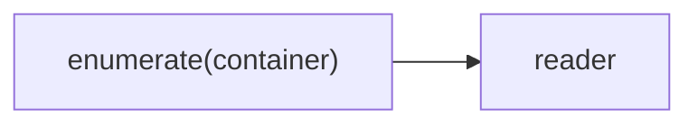
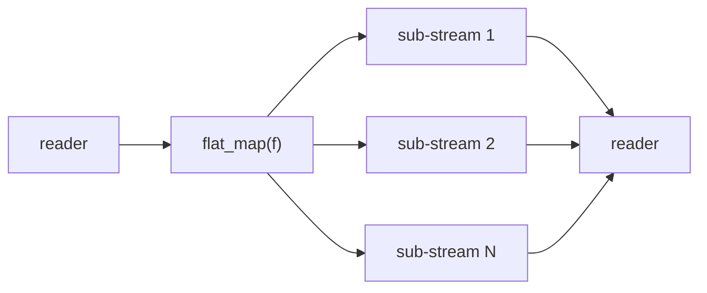
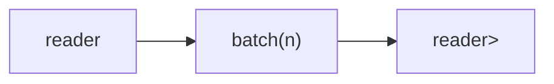
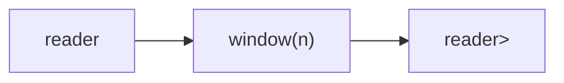
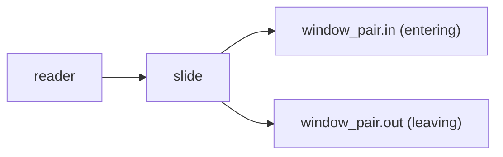
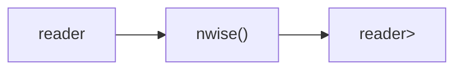
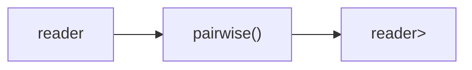
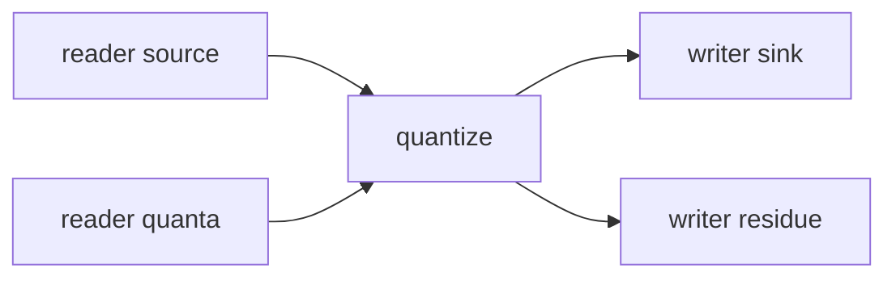

# Parts Reference

The **parts** system (`namespace csp::part`) provides composable building blocks for constructing channel pipelines. Each part is a small, reusable unit with well-defined channel topology:

- **producer** -- takes no input; writes to an output channel (e.g. `count`, `enumerate`)
- **filter** -- reads from one channel, writes to another (e.g. `map`, `where`, `batch`)
- **consumer** -- reads from a channel; produces no channel output (e.g. `sink`, `blackhole`)

Parts compose via `.spawn()` chaining and the `|` pipe operator. For example:

```cpp
auto r = (count(1, 10) | map<int>([](int n) { return n * 2; }) | where<int>([](int n) { return n > 10; })).spawn();
```

Each entry below documents:
- **Signature** -- template parameters, return type, header
- **Topology** -- Mermaid diagram showing channel wiring
- **Semantics** -- backpressure, exit conditions, edge cases
- **Example** -- minimal working code

---

## Table of Contents

1. [Sources](#sources) -- count, enumerate
2. [Basic Transforms](#basic-transforms) -- map, where, scan, flat_map, flatten, reduce
3. [Windowing](#windowing) -- batch, window, slide, nwise, pairwise, quantize
4. [Filtering](#filtering) -- distinct, unique, take_while, skip_while, first/last/skip_first/skip_last, stride, default_if_empty
5. [Timing](#timing) -- delay, debounce, throttle, sample, timeout, gate, timer
6. [Fan-out / Fan-in](#fan-out-fan-in) -- tee, fanout, chain, merge, zip, unzip
7. [Routing](#routing) -- round_robin, interleave, partition, group_by
8. [Advanced](#advanced) -- share, first_wins, join, latch, killswitch, metrics
9. [Lifecycle](#lifecycle) -- buffer, sink, blackhole, deaf, mute
10. [I/O](#io) -- byte_reader, byte_writer, lines, fixed
11. [RPC](#rpc) -- rpc

---

## Sources

### count

Generate a sequence of arithmetic values as a stream. `count` produces a
bounded sequence; `count_forever` produces an unbounded one. Both are
producers: they take no input and write to a single output channel.

#### Signature

```cpp
// Bounded: [start, start+step, ...) while < stop.
template <typename T>
auto count(T start, T stop, T step = 1, bool cyclic = false);

// Unbounded: [start, start+step, ...) forever.
template <typename T>
auto count_forever(T start, T step = 1);
```

**Header:** `#include "csp.h"`

Both return a `producer<T>`.

#### Topology


No input channel. The producer spawns a microthread that writes values to its
output.

#### Semantics

- **Finite mode** (`count`): emits `start`, `start + step`, `start + 2*step`,
  ... for every value strictly less than `stop`, then the writer closes and the
  microthread exits.
- **Cyclic mode** (`count` with `cyclic = true`): after reaching `stop` the
  sequence wraps back to `start` and repeats indefinitely. The stream never
  closes on its own.
- **Infinite mode** (`count_forever`): emits `start`, `start + step`, ... with
  no upper bound. The stream closes only when the downstream reader is
  destroyed.
- **Backpressure**: every write blocks until a reader is ready (synchronous
  channel semantics). No buffering.
- **Exit**: the microthread exits when either the sequence is exhausted
  (finite, non-cyclic) or the downstream reader closes.
- `T` must support `<`, `+=`, and `-` (any arithmetic or iterator-like type).

#### Example

```cpp
#include "csp.h"

using namespace csp::part;

// 2, 9, 16, 23, ... up to (but not including) 12345
auto r = count(2, 12345, 7).spawn();
for (int n; r >> n; ) {
    // process n
}

// 0, 11, 22, 33, ... forever (until reader closes)
auto r = count_forever(2, 11).spawn();
for (int i = 0; i < 100; ++i) {
    int n = r.read();
}
```

#### See Also

- [enumerate](#enumerate) -- stream elements from a container
- [scan](#scan) -- running fold over a stream
- [map](#map) -- transform each element

---

### enumerate

Stream the elements of a container or initializer list as channel values.
`enumerate` produces a bounded stream (or cyclic if requested); `cycle` is a
convenience wrapper that repeats the container forever.

#### Signature

```cpp
// From a container (vector, array, ...).
template <typename T, typename C>
auto enumerate(C&& c, bool cyclic = false);

// From an initializer list.
template <typename T>
auto enumerate(std::initializer_list<T> c, bool cyclic = false);

// Repeat a container forever (shorthand for enumerate with cyclic=true).
template <typename T, typename C>
auto cycle(C&& c);

template <typename T>
auto cycle(std::initializer_list<T> c);
```

**Header:** `#include "csp.h"`

All overloads return a `producer<T>`.

#### Topology



No input channel. The producer spawns a microthread that writes each element
to its output.

#### Semantics

- **Finite mode** (default): iterates through the container once, writing each
  element, then the writer closes.
- **Cyclic mode** (`cyclic = true` or `cycle`): after the last element, wraps
  back to the first and repeats indefinitely.
- **Container ownership**: the container (or a copy of the initializer list
  contents) is captured by value into the producer. For the `C&&` overload,
  the container is forwarded (moved if an rvalue, copied if an lvalue).
  The initializer-list overload copies into a `std::vector<T>`.
- **Element copying**: elements are written to the channel via `const&`
  (copied, not moved). Each iteration through the container can therefore
  repeat without invalidating the source.
- **Backpressure**: every write blocks until a reader is ready (synchronous
  channel semantics). No buffering.
- **Exit**: the microthread exits when the container is exhausted (non-cyclic)
  or the downstream reader closes.

#### Example

```cpp
#include "csp.h"

using namespace csp::part;

// Stream a fixed set of values.
auto r = enumerate<int>({10, 20, 30}).spawn();
// r.read() returns 10, 20, 30, then the channel closes.

// Stream from an existing vector.
std::vector<std::string> names = {"alice", "bob", "carol"};
auto r2 = enumerate<std::string>(names).spawn();

// Repeat forever (useful with take, killswitch, etc.).
auto r3 = cycle<int>({1, 2, 3}).spawn();
// r3.read() returns 1, 2, 3, 1, 2, 3, ... until reader closes.
```

#### See Also

- [count](#count) -- generate arithmetic sequences
- [map](#map) -- transform each element

---

## Basic Transforms

### map

Transforms each element of a stream by applying a function. `map<A, B>(f)`
converts a `reader<A>` into a `reader<B>`. When the input and output types are
the same, the second template parameter can be omitted.

#### Signature

```cpp
template <typename A, typename B = A, typename F>
auto map(F&& f);
// Returns: filter<A, B, ...>
```

#### Topology


One internal microthread reads from the input, applies `f`, and writes the
result to the output.

#### Semantics

- Exits when the input is exhausted or the output reader is dropped.
- Backpressure: the microthread blocks on each output write, so a slow
  consumer throttles the entire pipeline.
- Each input value is passed by value to `f`. The result of `f` is written
  to the output channel.
- `f` is invoked exactly once per input element.

#### Example

```cpp
#include "csp.h"

using namespace csp;
using namespace csp::part;

// Same-type transform: increment each integer.
auto r = map<int>([](int n) { return n + 1; })
             .spawn(count(1, 4).spawn());
// Reads: 2, 3, 4

// Type-changing transform: string length.
auto r2 = map<std::string, size_t>([](auto&& s) { return s.length(); })
              .spawn(enumerate<std::string>({"hi", "hello"}).spawn());
// Reads: 2, 5
```

#### See Also

- [where](#where) -- filter elements by predicate
- [scan](#scan) -- running fold with intermediate results
- [flat_map](#flat_map) -- map each element to a sub-stream, then merge

---

### where

Filters a stream, forwarding only elements for which a predicate returns true.

#### Signature

```cpp
template <typename T, typename Pred>
auto where(Pred&& pred);
// Returns: filter<T, T, ...>
```

#### Topology


One internal microthread reads from the input, tests each value with `pred`,
and writes matching values to the output.

#### Semantics

- Exits when the input is exhausted or the output reader is dropped.
- Elements that fail the predicate are silently discarded. If the predicate
  rejects everything, the output channel closes once the input is exhausted.
- Backpressure: the microthread blocks on each output write, so the
  producer is only throttled when a matching element is being forwarded. The
  producer can run ahead while the filter is discarding elements.
- Values are moved into the output channel when the predicate passes.

#### Example

```cpp
#include "csp.h"

using namespace csp;
using namespace csp::part;

// Keep only multiples of 3.
auto r = where<int>([](int n) { return n % 3 == 0; })
             .spawn(count(0, 20).spawn());
// Reads: 0, 3, 6, 9, 12, 15, 18
```

#### See Also

- [map](#map) -- transform elements
- [take_while](#take_while) -- forward elements while predicate holds, then stop
- [skip_while](#skip_while) -- discard elements while predicate holds, then forward the rest

---

### scan

Running fold (accumulator). Starts with an initial value, applies
`acc = f(acc, value)` for each input element, and emits the new accumulator
after every step.

#### Signature

```cpp
template <typename T, typename S, typename F>
auto scan(S init, F&& f);
// Returns: filter<T, S, ...>
```

#### Topology


One internal microthread maintains the accumulator, reads each input, applies
`f`, and writes the updated accumulator to the output.

#### Semantics

- Exits when the input is exhausted or the output reader is dropped.
- Emits one output for every input element. The first output is
  `f(init, first_input)`.
- The accumulator and the input value are both moved into `f`.
- `T` and `S` can be different types, allowing type-changing accumulation
  (e.g. accumulating string lengths into an `int`).
- Backpressure: blocks on each output write before consuming the next input.

#### Example

```cpp
#include "csp.h"

using namespace csp;
using namespace csp::part;

// Running sum: 1, 3, 6, 10, 15
auto r = scan<int, int>(0, [](int acc, int v) { return acc + v; })
             .spawn(count(1, 6).spawn());

// Type-changing: accumulate string lengths into an int.
auto r2 = scan<std::string, int>(0,
              [](int acc, std::string s) { return acc + (int)s.size(); })
              .spawn(enumerate<std::string>({"ab", "cde", "f"}).spawn());
// Reads: 2, 5, 6
```

#### See Also

- [reduce](#reduce) -- fold to a single final value
- [map](#map) -- stateless element-wise transform

---

### flat_map

Maps each input element to a sub-stream via a function, then merges all
sub-streams into a single output. Sub-streams are read concurrently, so output
order is non-deterministic.

#### Signature

```cpp
template <typename A, typename B, typename F>
auto flat_map(F&& f);
// Returns: filter<A, B, ...>
// f signature: reader<B> f(A)
```

#### Topology



One internal microthread manages the main loop. For each input element, `f`
returns a `reader<B>` sub-stream. All active sub-streams are polled
concurrently via `alt`, and their values are forwarded to the single output.

#### Semantics

- `f` is called once per input element and must return a `reader<B>`.
- Sub-streams run concurrently. Output order depends on which sub-stream has
  data ready first -- it is **not** guaranteed to match input order.
- Exits when the input is exhausted **and** all sub-streams are drained, or
  when the output reader is dropped.
- Backpressure: the microthread blocks on each output write. While blocked,
  no new sub-stream data is consumed, but sub-stream producers may continue
  buffering internally.
- `A` and `B` can be different types.

#### Example

```cpp
#include "csp.h"

using namespace csp;
using namespace csp::part;

// Each int n produces a sub-stream [n*10, n*10+1, n*10+2].
auto r = flat_map<int, int>([](int n) {
             return count(n * 10, n * 10 + 3).spawn();
         })
             .spawn(count(1, 4).spawn());

// Reads (order may vary): 10, 11, 12, 20, 21, 22, 30, 31, 32
std::vector<int> got;
for (int n; r >> n;) got.push_back(n);
std::sort(got.begin(), got.end());
// got == {10, 11, 12, 20, 21, 22, 30, 31, 32}
```

#### See Also

- [flatten](#flatten) -- flatten a stream of containers into individual elements
- [map](#map) -- one-to-one element transform
- [merge](#merge) -- merge multiple readers into one (non-deterministic)

---

### flatten

Flattens a stream of containers into a stream of individual elements.
`reader<Container<T>>` becomes `reader<T>`.

#### Signature

```cpp
template <typename T, typename C = std::vector<T>>
auto flatten();
// Returns: filter<C, T, ...>
```

#### Topology


One internal microthread reads each container from the input, then iterates
over its elements and writes them individually to the output.

#### Semantics

- Exits when the input is exhausted or the output reader is dropped.
- Empty containers are silently skipped (no output for that input).
- Elements within each container are emitted in iteration order.
- Backpressure: the microthread blocks on each element write. If the output
  consumer is slow, the producer is stalled mid-container.
- Elements are moved out of the container via `std::move`.
- The container type `C` defaults to `std::vector<T>` but can be any type
  supporting range-based `for`.

#### Example

```cpp
#include "csp.h"

using namespace csp;
using namespace csp::part;

// batch produces vectors; flatten unpacks them back to individual ints.
auto r = flatten<int>().spawn(
             batch<int>(3).spawn(count(1, 8).spawn()));
// Reads: 1, 2, 3, 4, 5, 6, 7
```

#### See Also

- [flat_map](#flat_map) -- map each element to a sub-stream, then merge
- [batch](#batch) -- the inverse operation: group elements into vectors

---

### reduce

Folds a channel down to a single value. Consumes the entire input stream, then
emits the final accumulator as a single output element. Unlike `scan`, `reduce`
does not emit intermediate results.

#### Signature

```cpp
template <typename T, typename S, typename F>
auto reduce(S init, F&& f);  // returns filter<T, S>
```

#### Topology


A microthread is spawned to consume the input. The output reader produces
exactly one value (the final accumulator) when the input is exhausted.

#### Semantics

- Consumes the entire input stream, then emits a single value.
- Emits `init` unchanged if the input is empty.
- Applies `acc = f(std::move(acc), value)` for each input element.
- `T` (input type) and `S` (accumulator type) can be different.
- Composable via `|` since it is a `filter<T, S>`.
- Use `.spawn().single()` for terminal extraction of the result.

#### Example

```cpp
#include "csp.h"

using namespace csp;
using namespace csp::part;

// Sum 1..5 = 15
int total = (count(1, 6) | reduce<int, int>(0,
                [](int acc, int v) { return acc + v; })).spawn().single();

// Concatenate strings.
std::string s = (count(1, 4)
    | map<int, std::string>([](int n) { return std::to_string(n); })
    | reduce<std::string, std::string>("",
        [](std::string acc, const std::string& v) { return acc + v; })
).spawn().single();
// s == "123"
```

#### See Also

- [scan](#scan) -- running fold that emits every intermediate accumulator value
- [sink](#sink) -- consume elements with a side-effecting function (does not produce a result)

---

## Windowing

### batch

Collects elements into fixed-size vectors and emits each vector as a single
value. `batch<T>(n)` groups every `n` input elements into a
`std::vector<T>`. Any partial batch remaining when the input closes is
flushed as a shorter vector.

#### Signature

```cpp
template <typename T>
auto batch(size_t n);
// Returns: filter<T, std::vector<T>, ...>
```

#### Topology



One internal microthread accumulates up to `n` elements, then writes the
vector to the output channel.

#### Semantics

- Emits a full vector of `n` elements each time the buffer fills.
- When the input closes with a non-empty partial buffer, that buffer is
  flushed as a final, shorter vector.
- When the input closes on an exact batch boundary, no trailing empty
  vector is emitted.
- Exits when the input is exhausted (after flushing) or the output reader
  is dropped.
- Backpressure: the microthread blocks on each vector write, so a slow
  consumer throttles the pipeline.

#### Example

```cpp
#include "csp.h"

using namespace csp;
using namespace csp::part;

// 10 elements in batches of 3 -> [1,2,3], [4,5,6], [7,8,9], [10]
auto r = batch<int>(3).spawn(count(1, 11).spawn());

r.read(); // {1, 2, 3}
r.read(); // {4, 5, 6}
r.read(); // {7, 8, 9}
r.read(); // {10}        -- partial final batch
```

#### See Also

- [window](#window) -- sliding window emitting the full window each step
- [nwise](#nwise) -- sliding N-element window emitting tuples
- [flatten](#flatten) -- inverse of batch: expand vectors back to elements

---

### window

Sliding window that emits the full window contents as a vector after every
input element. `window<T>(n)` maintains a sliding window of at most `n`
elements and outputs a `std::vector<T>` snapshot on each step.

Partial (growing) windows are emitted during the initial fill phase, so the
first output has one element, the second has two, and so on up to `n`.

#### Signature

```cpp
template <typename T>
auto window(size_t n);
// Returns: filter<T, std::vector<T>, ...>
```

#### Topology



One internal microthread maintains a deque, copying it to a vector for each
output.

#### Semantics

- Emits one vector per input element. The vector contains the last
  `min(elements_seen, n)` elements.
- During the growth phase (fewer than `n` elements seen), shorter vectors
  are emitted.
- When the window is full, the oldest element is dropped before adding
  the new one.
- Exits when the input is exhausted or the output reader is dropped.
- Backpressure: the microthread blocks on each vector write, so a slow
  consumer throttles the pipeline.

#### Example

```cpp
#include "csp.h"

using namespace csp;
using namespace csp::part;

// Window of 3 over 1..6.
auto r = window<int>(3).spawn(count(1, 7).spawn());

r.read(); // {1}
r.read(); // {1, 2}
r.read(); // {1, 2, 3}
r.read(); // {2, 3, 4}
r.read(); // {3, 4, 5}
r.read(); // {4, 5, 6}
```

#### See Also

- [batch](#batch) -- non-overlapping fixed-size grouping
- [slide](#slide) -- two-channel window with separate enter/leave streams
- [nwise](#nwise) -- sliding window emitting fixed-size tuples

---

### slide

Two-channel sliding window. Instead of emitting the full window contents,
`slide` provides two separate readers: one for elements entering the window
and one for elements leaving it. This is useful when downstream logic needs
to react to individual enter/leave events rather than snapshot the whole
window.

Two overloads are provided: a fixed-size window (`size_t n`) and a
predicate-based window where a callback decides when older elements expire.

#### Signature

```cpp
template <typename T>
struct window_pair {
    reader<T> in;   // elements entering the window
    reader<T> out;  // elements leaving the window
};

// Fixed-size window: expires oldest when window exceeds n elements.
template <typename T>
window_pair<T> slide(reader<T> src, size_t n, bool slide_in = true);

// Predicate window: expired(older, current) returns true when older
// should leave the window.
template <typename T, typename Pred>
window_pair<T> slide(reader<T> src, Pred expired, bool slide_in = true);
```

#### Topology



One internal microthread reads from the source, manages the deque, and
writes to both output channels.

#### Semantics

- **Fixed-size**: when a new element arrives and the window already holds
  `n` elements, the oldest is sent on the `out` channel before the new
  element is sent on `in`.
- **Predicate**: for each new element, all front elements where
  `expired(front, current)` is true are sent on `out` before the new
  element is sent on `in`.
- **`slide_in` parameter**: when `true` (default), elements are emitted on
  the `in` channel during the initial growth phase (before any expiry
  occurs). When `false`, both channels are silent until the first expiry
  event.
- Both output channels must be drained concurrently; if only one is read
  the microthread will block.
- Exits when the source is exhausted or either output reader is dropped.

#### Example

```cpp
#include "csp.h"

using namespace csp;
using namespace csp::part;

// Fixed-size window of 3 over 1..6.
auto [in, out] = slide<int>(count(1, 7).spawn(), size_t(3));

// Must drain both concurrently (e.g. in separate microthreads).
// in reads:  1, 2, 3, 4, 5, 6
// out reads: 1, 2, 3

// Predicate: expire when older <= current - 3.
auto [in2, out2] = slide<int>(count(1, 9).spawn(),
    [](const int& older, const int& current) {
        return older <= current - 3;
    });
// in2 reads:  1, 2, 3, 4, 5, 6, 7, 8
// out2 reads: 1, 2, 3, 4, 5
```

#### See Also

- [window](#window) -- snapshot-based sliding window (single output)
- [batch](#batch) -- non-overlapping fixed-size grouping
- [nwise](#nwise) -- sliding window emitting fixed-size tuples

---

### nwise

Sliding N-element window that emits tuples. `nwise<N, T>()` collects a
window of exactly `N` consecutive elements and emits each window as a
`std::tuple<T, T, ..., T>` (N copies of `T`). The window slides by one
element per step.

If the input stream has fewer than `N` elements, no output is produced.

#### Signature

```cpp
template <size_t N, typename T>
auto nwise();
// Returns: filter<T, std::tuple<T, T, ..., T>, ...>
// Requires: N >= 2
```

#### Topology



One internal microthread maintains a fixed-size array that slides through
the input.

#### Semantics

- Waits for the first `N` elements before emitting anything.
- After the initial fill, emits one tuple per input element by shifting the
  window left and reading into the last slot.
- If the input has fewer than `N` elements, the output closes immediately
  with no values.
- Exits when the input is exhausted or the output reader is dropped.
- Backpressure: the microthread blocks on each tuple write, so a slow
  consumer throttles the pipeline.

#### Example

```cpp
#include "csp.h"

using namespace csp;
using namespace csp::part;

// Sliding triples over 1..6.
auto r = nwise<3, int>().spawn(count(1, 7).spawn());

r.read(); // tuple(1, 2, 3)
r.read(); // tuple(2, 3, 4)
r.read(); // tuple(3, 4, 5)
r.read(); // tuple(4, 5, 6)
```

#### See Also

- [pairwise](#pairwise) -- specialized `nwise<2>` returning `std::pair`
- [window](#window) -- sliding window emitting variable-size vectors
- [batch](#batch) -- non-overlapping fixed-size grouping

---

### pairwise

Emits consecutive pairs from a stream. `pairwise<T>()` produces a
`std::pair<T, T>` for each pair of adjacent elements: `(a,b)`, `(b,c)`,
`(c,d)`, and so on. This is the specialized two-element case of `nwise`.

If the input has fewer than two elements, no output is produced.

#### Signature

```cpp
template <typename T>
auto pairwise();
// Returns: filter<T, std::pair<T, T>, ...>
```

#### Topology



One internal microthread reads pairs of adjacent elements and writes each
pair to the output.

#### Semantics

- Reads the first element, then for each subsequent element emits a pair
  of `(previous, current)`.
- An input stream of `n` elements produces `n - 1` pairs (`0` if
  `n < 2`).
- Exits when the input is exhausted or the output reader is dropped.
- Backpressure: the microthread blocks on each pair write, so a slow
  consumer throttles the pipeline.

#### Example

```cpp
#include "csp.h"

using namespace csp;
using namespace csp::part;

// Consecutive pairs from 1..5.
auto r = pairwise<int>().spawn(count(1, 6).spawn());

r.read(); // {1, 2}
r.read(); // {2, 3}
r.read(); // {3, 4}
r.read(); // {4, 5}
```

#### See Also

- [nwise](#nwise) -- generalized N-element sliding window as tuples
- [window](#window) -- sliding window emitting variable-size vectors
- [scan](#scan) -- running fold (when you need to combine adjacent values)

---

### quantize

Batches an incoming stream of additive values into variable-size quanta.
Accumulates values from a source until enough has been collected to fill the
next quantum, then emits it. Any residue left after the source or quanta
stream closes is reported on a separate channel.

Two variants are provided: a **dynamic-quantum** form where quanta are read
from a channel, and a **fixed-quantum** form where every emitted value
equals a constant.

#### Signature

```cpp
// Dynamic quanta: each quantum is read from a channel.
template <typename T>
auto quantize(reader<T> source,
              reader<T> quanta,
              writer<T> sink,
              writer<T> residue = writer<T>::dead());
// Returns: callable (not a filter -- wired directly)

// Fixed quantum: every emitted value equals `quantum`.
template <typename T>
auto quantize(reader<T> source,
              T quantum,
              writer<T> sink,
              writer<T> residue = writer<T>::dead());
// Returns: callable

// Spawn helpers (create channels automatically):
template <typename T>
writer<T> spawn_quantize(reader<T> quanta, writer<T> sink,
                         writer<T> residue = writer<T>::dead());

template <typename T>
reader<T> spawn_quantize(reader<T> source, T quantum,
                         writer<T> residue = writer<T>::dead());

template <typename T>
writer<double> spawn_quantize(T quantum, writer<T> sink,
                              writer<T> residue = writer<T>::dead());
```

#### Topology



One microthread manages all four channels using `alt` to multiplex reads
and writes.

#### Semantics

- **Accumulation**: values read from `source` are summed into an
  accumulator (`acc += t`).
- **Emission**: when `acc >= quantum`, the quantum value is written to
  `sink` and subtracted from `acc`.
- **Dynamic quanta**: the next quantum is read from the `quanta` channel
  after each emission. A zero-quantum is delivered immediately without
  waiting for accumulation.
- **Residue**: when the callable returns (source or quanta exhausted, or
  sink dropped), the remaining accumulator value is written to `residue`.
  If no residue writer is provided, it defaults to a dead writer (value is
  discarded).
- **Conservation**: `source_total == delivered_total + residue` always
  holds.
- The dynamic variant handles source death gracefully: if enough has
  accumulated for the current quantum, it is delivered before exiting.
- The dynamic variant handles quanta death by draining the source until
  the current quantum can be delivered.
- `T` must support `+=`, `-=`, `<`, `<=`, comparison with zero, and
  default construction.

#### Example

```cpp
#include "csp.h"

using namespace csp;
using namespace csp::part;

// Fixed quantum: emit 7 at a time.
reader<int> residue;
auto r = spawn_quantize<int>(source_reader, 7, ++residue);
// Each r.read() returns 7.
// After source closes, residue.read() returns the leftover.

// Dynamic quanta: quantum sizes come from a channel.
writer<int> in, quanta;
reader<int> out, res;
spawn(quantize(--in, --quanta, ++out, ++res));

quanta << 5; quanta = {};  // request quantum of 5
in << 7;     in = {};      // supply 7
out.read();                // 5
res.read();                // 2 (residue)
```

#### See Also

- [batch](#batch) -- group elements by count (not by value sum)
- [scan](#scan) -- running accumulator without emission threshold

---

## Filtering

### distinct

Suppresses consecutive duplicate values from a stream. Non-adjacent duplicates
pass through. An optional equality comparator can be supplied (default:
`std::equal_to<T>`).

#### Signature

```cpp
template <typename T, typename Eq = std::equal_to<T>>
auto distinct(Eq eq = {});
// Returns: filter<T, T, ...>
```

#### Topology


One internal microthread reads from the input, compares each value with the
previously emitted value, and forwards it only when it differs.

#### Semantics

- Exits when the input is exhausted or the output reader is dropped.
- Tracks only the most recently emitted value; non-adjacent duplicates are
  *not* suppressed. For global deduplication, use `unique`.
- The first element is always emitted (there is no previous value to compare).
- Comparison uses `eq(prev, current)`. The default is `std::equal_to<T>`,
  which calls `operator==`.
- Values are moved into the output channel.

#### Example

```cpp
#include "csp.h"

using namespace csp;
using namespace csp::part;

auto d = distinct<int>().spawn();

// Writer sends: 1, 1, 2, 2, 3, 1, 1
// Reader gets:  1, 2, 3, 1
//   (non-adjacent duplicate 1 passes through)

// Custom case-insensitive string comparison:
auto ci_eq = [](const std::string& a, const std::string& b) {
    if (a.size() != b.size()) return false;
    for (size_t i = 0; i < a.size(); ++i)
        if (std::tolower(a[i]) != std::tolower(b[i])) return false;
    return true;
};
auto d2 = distinct<std::string>(ci_eq).spawn();
// "Foo", "foo", "Bar", "bar", "BAR" -> "Foo", "Bar"
```

#### See Also

- [unique](#unique) -- global deduplication with optional bounded memory
- [where](#where) -- filter by arbitrary predicate

---

### unique

Suppresses all-time duplicate values using a hash set. Each value is emitted at
most once (or once per eviction cycle when bounded). An optional
`max_remembered` parameter limits memory usage with FIFO eviction.

#### Signature

```cpp
template <typename T, typename Hash = std::hash<T>,
          typename Eq = std::equal_to<T>>
auto unique(size_t max_remembered = 0, Hash hash = {}, Eq eq = {});
// Returns: filter<T, T, ...>
```

#### Topology


One internal microthread reads from the input, checks a hash set, and forwards
values not previously seen.

#### Semantics

- Exits when the input is exhausted or the output reader is dropped.
- **Unbounded** (`max_remembered == 0`, default): every unique value ever seen
  is remembered. Memory grows with the number of distinct values.
- **Bounded** (`max_remembered > 0`): the set holds at most `max_remembered`
  values. When capacity is reached, the oldest remembered value is evicted
  (FIFO), allowing it to pass through again if it reappears later.
- Uses a flat hash set internally for O(1) average lookup and insertion.
- Values are moved into the output channel.

#### Example

```cpp
#include "csp.h"

using namespace csp;
using namespace csp::part;

// Unbounded: suppress all repeated values.
auto u = unique<int>().spawn();
// Input:  1, 2, 3, 2, 1, 4
// Output: 1, 2, 3, 4

// Bounded (max_remembered=2): FIFO eviction.
auto u2 = unique<int>(2).spawn();
// 1 -> emit, set={1}
// 2 -> emit, set={1,2}
// 3 -> evict 1, emit, set={2,3}
// 2 -> in set, suppress
// 1 -> not in set, evict 2, emit, set={3,1}
// Output: 1, 2, 3, 1
```

#### See Also

- [distinct](#distinct) -- suppress consecutive duplicates only
- [where](#where) -- filter by arbitrary predicate

---

### take_while

Forwards elements from the input while a predicate returns true. As soon as an
element fails the predicate, the output is closed and the microthread exits.
The failing element is not forwarded.

#### Signature

```cpp
template <typename T, typename Pred>
auto take_while(Pred&& pred);
// Returns: filter<T, T, ...>
```

#### Topology


One internal microthread reads from the input, tests each value with `pred`,
and writes it to the output. On the first failure, the output is closed.

#### Semantics

- Exits when the predicate returns false, the input is exhausted, or the
  output reader is dropped.
- The element that fails the predicate is consumed from the input but is
  *not* written to the output.
- If all elements pass the predicate, the output closes when the input is
  exhausted.
- If the predicate never passes (returns false for the first element), the
  output closes immediately with no values emitted.
- Values are moved into the output channel.

#### Example

```cpp
#include "csp.h"

using namespace csp;
using namespace csp::part;

auto r = take_while<int>([](int n) { return n < 4; })
             .spawn(count(1, 8).spawn());
// Reads: 1, 2, 3
// (4 fails the predicate; output closes)
```

#### See Also

- [skip_while](#skip_while) -- drop elements while predicate holds, then forward the rest
- [first](#first) -- take a fixed number of elements
- [where](#where) -- filter by predicate without stopping

---

### skip_while

Drops elements from the input while a predicate returns true. Once an element
fails the predicate, that element and all subsequent elements are forwarded.

#### Signature

```cpp
template <typename T, typename Pred>
auto skip_while(Pred&& pred);
// Returns: filter<T, T, ...>
```

#### Topology


One internal microthread reads from the input. While the predicate returns
true, elements are discarded. Once the predicate fails, the failing element
and all remaining elements are forwarded to the output.

#### Semantics

- Exits when the input is exhausted or the output reader is dropped.
- The transition from skipping to forwarding happens exactly once. After the
  first element fails the predicate, the predicate is never called again.
- If the predicate returns true for every element, the output closes with no
  values emitted.
- If the predicate returns false for the first element, all elements pass
  through (identity behavior).
- Values are moved into the output channel.

#### Example

```cpp
#include "csp.h"

using namespace csp;
using namespace csp::part;

auto r = skip_while<int>([](int n) { return n < 4; })
             .spawn(count(1, 8).spawn());
// Reads: 4, 5, 6, 7
// (1, 2, 3 are dropped; 4 fails the predicate and is forwarded)
```

#### See Also

- [take_while](#take_while) -- forward while predicate holds, then stop
- [skip_first](#skip_first) -- drop a fixed number of elements
- [where](#where) -- filter by predicate without stopping

---

### first / last / skip_first / skip_last

Four position-based filtering combinators for selecting or skipping elements at
the beginning or end of a stream. All are defined in `<csp/part/first_last.h>`.

#### first

Emits the first *n* elements, then closes the output.

```cpp
template <typename T>
auto first(size_t n);
// Returns: filter<T, T, ...>
```


- Reads and forwards up to *n* elements, then exits (closing the output).
- If the input has fewer than *n* elements, all are forwarded and the output
  closes when the input is exhausted.

```cpp
auto r = first<int>(3).spawn(count(1, 11).spawn());
// Reads: 1, 2, 3
```

#### last

Emits the last *n* elements of the stream. The entire input must be consumed
before any output is produced, because the final elements are not known until
the input closes.

```cpp
template <typename T>
auto last(size_t n);
// Returns: filter<T, T, ...>
```


- Buffers up to *n* elements in a ring buffer. When input closes, the
  buffered elements are emitted in order.
- If the input has fewer than *n* elements, all are emitted.
- The output is delayed until the input is fully exhausted.

```cpp
auto r = last<int>(3).spawn(count(1, 11).spawn());
// Reads: 8, 9, 10
```

#### skip_first

Drops the first *n* elements, then forwards the rest.

```cpp
template <typename T>
auto skip_first(size_t n);
// Returns: filter<T, T, ...>
```

```mermaid
graph LR
    A[reader<T>] --> B["skip_first(n)"] --> C[reader<T>]
```

- Reads and discards the first *n* elements, then forwards all remaining elements.
- If the input has fewer than *n* elements, no output is produced.

```cpp
auto r = skip_first<int>(3).spawn(count(1, 11).spawn());
// Reads: 4, 5, 6, 7, 8, 9, 10
```

#### skip_last

Emits all but the last *n* elements. Output is delayed by *n* elements.

```cpp
template <typename T>
auto skip_last(size_t n);
// Returns: filter<T, T, ...>
```

```mermaid
graph LR
    A[reader<T>] --> B["skip_last(n)"] --> C[reader<T>]
```

- Buffers *n* elements in a ring buffer. Once the buffer is full, each new
  input value pushes the oldest buffered value to the output.
- If *n* is 0, behaves as identity (all values pass through).
- If the input has *n* or fewer elements, no output is produced.

```cpp
auto r = skip_last<int>(3).spawn(count(1, 11).spawn());
// Reads: 1, 2, 3, 4, 5, 6, 7
// (8, 9, 10 are the last 3 and are discarded)
```

#### See Also

- [take_while](#take_while) -- take elements by predicate
- [skip_while](#skip_while) -- skip elements by predicate
- [stride](#stride) -- take every Nth element

---

### stride

Takes every Nth element from a stream (0-indexed: emits elements at indices
0, N, 2N, ...). `stride(1)` is the identity; `stride(2)` emits every other
element starting with the first.

#### Signature

```cpp
template <typename T>
auto stride(size_t n);
// Returns: filter<T, T, ...>
```

#### Topology

```mermaid
graph LR
    A[reader<T>] --> B["stride(n)"] --> C[reader<T>]
```

One internal microthread reads from the input, emits every Nth value, and
discards the rest.

#### Semantics

- Exits when the input is exhausted or the output reader is dropped.
- The first element (index 0) is always emitted, then every Nth element
  thereafter.
- Elements at non-stride positions are consumed and discarded.
- `stride(1)` passes all elements through unchanged.
- Values are moved into the output channel.

#### Example

```cpp
#include "csp.h"

using namespace csp;
using namespace csp::part;

auto r = stride<int>(3).spawn(count(1, 11).spawn());
// Reads: 1, 4, 7, 10
// (indices 0, 3, 6, 9 of the input stream)

auto r2 = stride<int>(2).spawn(count(1, 8).spawn());
// Reads: 1, 3, 5, 7
```

#### See Also

- [first](#first) -- take the first N elements
- [where](#where) -- filter by arbitrary predicate
- [take_while](#take_while) -- take elements while predicate holds

---

### default_if_empty

Passes all input values through unchanged. If the input closes without
producing any value, emits a single default value before closing the output.

#### Signature

```cpp
template <typename T>
auto default_if_empty(T def);
// Returns: filter<T, T, ...>
```

#### Topology

```mermaid
graph LR
    A[reader<T>] --> B["default_if_empty(def)"] --> C[reader<T>]
```

One internal microthread reads from the input and forwards values. When the
input closes, if no values were seen, the default value is written to the
output.

#### Semantics

- Exits when the input is exhausted and any default has been emitted, or
  when the output reader is dropped.
- If the input produces at least one value, all values pass through and the
  default is never used.
- If the input produces zero values, a single copy of `def` is emitted.
- The default value is captured by move at construction time and emitted by
  copy (it is not consumed).
- Values from the input are moved into the output channel.

#### Example

```cpp
#include "csp.h"

using namespace csp;
using namespace csp::part;

// Non-empty input: default is ignored.
auto r = default_if_empty<int>(99)
             .spawn(count(1, 4).spawn());
// Reads: 1, 2, 3

// Empty input: default is emitted.
auto r2 = default_if_empty<int>(99)
              .spawn(merge(std::vector<reader<int>>{}).spawn());
// Reads: 99
```

#### See Also

- [where](#where) -- filter elements (may produce empty output)
- [first](#first) -- take the first N elements

---

## Timing

### delay

Delay each value by a fixed duration. Values are queued with absolute deadlines
and emitted in order. Multiple in-flight values are delayed independently (not
serialized).

**Header:** `<csp/part/delay.h>`

#### Signature

```cpp
template <typename T>
auto delay(csp::clock::duration d);
```

Returns a `filter<T, T>`.

#### Topology

```mermaid
graph LR
    in["reader<T>"] --> D["delay(d)"]
    D --> out["reader<T>"]
```

#### Semantics

- Each incoming value is enqueued with a deadline of `now() + d`.
- When the oldest deadline expires, the corresponding value is emitted.
- If multiple values arrive within one delay window, they queue up and are
  emitted one by one as their deadlines fire. No values are dropped.
- Values arrive slower than `d`: each value waits its full delay, then emits.
- On input close, remaining queued values are drained with their original
  delays preserved.
- On output close, the filter returns immediately.

#### Example

```cpp
#include "csp.h"

using namespace csp::part;
using namespace std::chrono_literals;

auto r = delay<int>(50ms).spawn(count(1, 4).spawn());

auto start = csp::clock::now();
while (int v; r >> v) {
    // Each value arrives ~50ms after it was sent.
}
auto elapsed = csp::clock::now() - start;
// elapsed >= 50ms
```

#### See Also

- [debounce](#debounce) -- suppress rapid values until a quiet period
- [throttle](#throttle) -- rate-limit by dropping excess values
- [timeout](#timeout) -- close if no value arrives in time

---

### debounce

Suppress rapid values; emit only after a quiet period elapses. Each incoming
value restarts the timer. Only the most recent value survives a burst.

**Header:** `<csp/part/debounce.h>`

#### Signature

```cpp
template <typename T>
auto debounce(csp::clock::duration d);
```

Returns a `filter<T, T>`.

#### Topology

```mermaid
graph LR
    in["reader<T>"] --> D["debounce(d)"]
    D --> out["reader<T>"]
```

#### Timing

```
in:  --1--2--3----------------4--------------
         <d>  <----d---->         <---d--->
out: -----------------3----------------4---
```

#### Semantics

- When a value arrives and no timer is running, the value is latched and a
  timer of duration `d` is started.
- When a value arrives while a timer is running, the pending value is replaced
  and the timer is restarted.
- When the timer fires without interruption, the pending value is emitted.
- Values arrive faster than `d`: only the last value in the burst is emitted.
- Values arrive slower than `d`: every value is emitted.
- On input close with a pending value, the pending value is emitted
  immediately (no further wait).
- On output close, the filter returns immediately.

#### Example

```cpp
#include "csp.h"

using namespace csp::part;
using namespace std::chrono_literals;

// count sends 1-5 instantly. Each replaces pending and restarts timer.
// Input closes -> pending (5) emitted immediately.
auto r = debounce<int>(50ms).spawn(count(1, 6).spawn());

CHECK_EQ(5, r.read());  // Only the last value survives.
```

#### See Also

- [throttle](#throttle) -- rate-limit with a budget (drops excess, keeps first)
- [delay](#delay) -- delay every value by a fixed duration (no dropping)
- [timeout](#timeout) -- close if no value arrives in time

---

### throttle

Rate-limit a stream: forward up to `n` values per interval, dropping excess.
The budget starts at `n`, so the first `n` values pass immediately.

**Header:** `<csp/part/throttle.h>`

#### Signature

```cpp
template <typename T>
auto throttle(csp::clock::duration d, size_t n = 1);
```

Returns a `filter<T, T>`.

#### Topology

```mermaid
graph LR
    in["reader<T>"] --> T["throttle(d, n)"]
    T --> out["reader<T>"]
    tick["tick(d)"] -.->|reset budget| T
```

#### Timing (n=2)

```
in:  --1--2--3--4----------5--6--7--
     |<-- interval -->|
out: --1--2------------5--6---------
              3,4 dropped     7 dropped
```

#### Semantics

- An internal `tick(d)` timer resets the remaining budget to `n` each interval.
- When a value arrives and `remaining > 0`, the value is forwarded and the
  budget is decremented.
- When a value arrives and `remaining == 0`, the value is silently dropped.
- On input close, the filter returns (no drain phase).
- On output or ticker death, the filter returns.

#### Example

```cpp
#include "csp.h"

using namespace csp::part;
using namespace std::chrono_literals;

// Budget=2, interval=100ms. First two pass, rest dropped within interval.
auto th = throttle<int>(100ms, 2).spawn();

csp::spawn([w = std::move(th.w)] {
    w << 1; w << 2; w << 3;       // 1,2 pass; 3 dropped
    csp::sleep(150ms);
    w << 4; w << 5; w << 6;       // 4,5 pass; 6 dropped
});

// Read: 1, 2, 4, 5
for (int v; th.r >> v;) { /* ... */ }
```

#### See Also

- [debounce](#debounce) -- suppress until quiet (keeps last, not first)
- [delay](#delay) -- delay every value (no dropping)
- [gate](#gate) -- pause/resume via a control channel

---

### sample

On each trigger, emit the most recent value from a source stream. The source
is latched (not consumed on each trigger), so the same value can be emitted
multiple times if no new source value arrives between triggers.

**Header:** `<csp/part/sample.h>`

#### Signature

```cpp
template <typename T, typename Trigger = poke_t>
auto sample(reader<T> source, reader<Trigger> trigger);
```

Returns a `producer<T>`.

#### Topology

```mermaid
graph LR
    src["reader<T> (source)"] --> S["sample"]
    trig["reader<Trigger> (trigger)"] --> S
    S --> out["reader<T>"]
```

#### Timing

```
source:  --A--B--C----------D------
trigger: ------------t----t----t---
output:  ------------C----C----D---
```

#### Semantics

- Source values are latched as they arrive. Only the latest value is retained.
- When a trigger arrives and a source value has been latched, the latest value
  is emitted.
- When a trigger arrives before any source value, nothing is emitted.
- Source faster than trigger: intermediate source values are silently replaced.
- Trigger faster than source: the same latched value is emitted on each trigger.
- After the source dies, the last latched value continues to be emitted on
  each subsequent trigger.
- On output close, the part returns immediately.

Unlike `delay`, `debounce`, and `throttle`, `sample` is a **producer** (not a
filter) because it takes two input readers rather than transforming a single
stream. It cannot be composed with `|` as a filter stage.

#### Example

```cpp
#include "csp.h"

using namespace csp::part;

auto [trig_w, trig_r] = csp::chan<>{};
auto r = sample(count(1, 4).spawn(), std::move(trig_r)).spawn();

csp::spawn([trig_w = std::move(trig_w)] {
    // Let source values (1, 2, 3) latch first.
    csp::yield();
    trig_w << csp::poke;
    trig_w << csp::poke;
});

// Source 1,2,3 all latched; triggers emit latest (3) twice.
// Output: 3, 3
for (int v; r >> v;) { /* ... */ }
```

#### See Also

- [gate](#gate) -- pause/resume forwarding via a control channel
- [throttle](#throttle) -- rate-limit by dropping excess values

---

### timeout

Close the output if no value arrives within a deadline. Each incoming value
resets the timer. Values are forwarded unchanged.

**Header:** `<csp/part/timeout.h>`

#### Signature

```cpp
template <typename T>
auto timeout(csp::clock::duration d);
```

Returns a `filter<T, T>`.

#### Topology

```mermaid
graph LR
    in["reader<T>"] --> T["timeout(d)"]
    T --> out["reader<T>"]
    timer["after(d)"] -.->|reset on value| T
```

#### Timing

```
in:  --1--2--------------------------
     |<d>|<------ d -------->|
out: --1--2-------------------X (closed)
```

#### Semantics

- A timer of duration `d` starts immediately on construction.
- Each incoming value is forwarded to the output and the timer is reset.
- If the timer fires (no value arrived within `d`), the filter closes output
  and returns.
- Values arrive faster than `d`: all values pass through. The timer never fires.
- Values stop arriving: after the last value, the timer fires after `d` and
  the output closes.
- On input close (before timeout), the filter returns normally.
- On output close, the filter returns immediately.

#### Example

```cpp
#include "csp.h"

using namespace csp::part;
using namespace std::chrono_literals;

// count sends 1-5 instantly -- well within 1s timeout.
auto r = timeout<int>(1s).spawn(count(1, 6).spawn());

// All values pass through.
for (int v; r >> v;) { /* 1, 2, 3, 4, 5 */ }
```

#### See Also

- [delay](#delay) -- delay every value by a fixed duration
- [debounce](#debounce) -- suppress until quiet, then emit
- [gate](#gate) -- pause/resume via a control channel

---

### gate

Pause and resume a stream via a boolean control channel. The gate starts
**open**. When the control sends `false`, data stops flowing (the synchronous
source channel backpressures naturally). When the control sends `true`,
forwarding resumes.

**Header:** `<csp/part/gate.h>`

#### Signature

```cpp
template <typename T>
reader<T> gate(reader<T> data, reader<bool> control);
```

Returns a `reader<T>`.

#### Topology

```mermaid
graph LR
    data["reader<T> (data)"] --> G["gate"]
    ctrl["reader<bool> (control)"] --> G
    G --> out["reader<T>"]
```

#### Semantics

- The gate starts in the **open** state.
- While open, values from `data` are forwarded to the output.
- While closed, the gate only listens on the control channel (data
  backpressures because the synchronous data channel has no reader).
- Sending `false` on `control` closes the gate; sending `true` reopens it.
- **Control dies while open:** the gate stays open and continues forwarding.
- **Control dies while closed:** the gate is permanently closed and output
  closes immediately.
- On data close, the output closes (regardless of gate state).
- On output close, the gate returns immediately.

Unlike the filter-based timing parts, `gate` is a standalone function that
returns a `reader<T>` directly (it spawns its own microthread internally). It
does not use the `make_filter` / `make_producer` wrappers and cannot be
composed with `|`.

#### Example

```cpp
#include "csp.h"

using namespace csp::part;

csp::chan<bool> ctrl;
auto r = gate(count(1, 100).spawn(), std::move(ctrl.r));

csp::spawn([w = std::move(ctrl.w)] {
    csp::yield(); csp::yield(); csp::yield();
    w << false;           // Close the gate.
    csp::yield(); csp::yield();
    w << true;            // Re-open.
    csp::yield(); csp::yield(); csp::yield();
    // Drop control -- gate stays in last state (open).
});

std::vector<int> got;
for (int n; r >> n;) got.push_back(n);
// got[0] == 1 (gate starts open)
```

#### See Also

- [throttle](#throttle) -- rate-limit by dropping excess values
- [timeout](#timeout) -- close if no value arrives in time
- [sample](#sample) -- emit latest value on trigger

---

### timer

Convert a stream of sleep requests into a stream of actual fire times. Each
value read from the control channel triggers a sleep (relative or absolute),
after which the actual wall-clock time is emitted.

**Header:** `<csp/part/timer.h>`

#### Signature

```cpp
// Relative durations: sleep for each duration, then emit now().
inline reader<clock::time_point> timer(reader<clock::duration> control);

// Absolute time_points: sleep until each deadline, then emit now().
inline reader<clock::time_point> timer(reader<clock::time_point> control);
```

Returns a `reader<clock::time_point>`.

#### Parameters

| Parameter | Type | Description |
|-----------|------|-------------|
| `control` | `reader<clock::duration>` | Stream of relative sleep intervals |

or

| Parameter | Type | Description |
|-----------|------|-------------|
| `control` | `reader<clock::time_point>` | Stream of absolute deadlines |

#### Topology

```mermaid
graph LR
    ctrl["reader&lt;clock::duration&gt;<br/>or reader&lt;clock::time_point&gt;<br/>(control)"] --> T["timer"]
    T --> out["reader&lt;clock::time_point&gt;"]
    style T fill:#f5d6a8
    style ctrl fill:#d4edda
```

##### Timing (duration overload)

```
control: ──100ms──200ms──150ms──|
output:  ────────t1──────────t2──────t3──|
```

Each control value triggers a sleep; the output emits the actual time when the
sleep completes.

#### Semantics

- Each value read from `control` becomes a sleep request: a `duration` is
  passed to `csp::sleep`, a `time_point` is passed to `csp::sleep_until`.
- After the sleep completes, `clock::now()` is emitted on the output.
- Sleeps are serialized: the next control value is not read until the current
  sleep finishes and the output value is accepted.
- **Control closes:** the output closes (no more values to sleep on).
- **Output closes:** the timer returns immediately (the next write after sleep
  fails, ending the microthread).
- The emitted time_point is the *actual* fire time, which may be slightly later
  than the requested deadline due to scheduling.

#### Example

```cpp
#include "csp.h"

using namespace csp::part;
using namespace std::chrono_literals;

// Send two durations on a control channel.
auto [ctrl_w, ctrl_r] = csp::chan<csp::clock::duration>{};
auto r = timer(std::move(ctrl_r));

csp::spawn([w = std::move(ctrl_w)] {
    w << 50ms;
    w << 100ms;
});

// Read two fire times.
csp::clock::time_point t1, t2;
r >> t1;
r >> t2;
// t2 - t1 >= 100ms (the second sleep duration).
```

#### See Also

- [delay](#delay) -- delay each value by a fixed duration
- [debounce](#debounce) -- suppress rapid values until a quiet period
- [throttle](#throttle) -- rate-limit by dropping excess values
- [sample](#sample) -- emit latest value on trigger

---

## Fan-out / Fan-in

### tee

Duplicates a stream to a side channel. Each value read from the input is
written to both the main output and a side `writer<T>`. If the side channel
dies, values continue flowing to the main output uninterrupted.

#### Signature

```cpp
template <typename T>
auto tee(writer<T> side);
// Returns: filter<T, T, ...>
```

#### Topology

```mermaid
graph LR
    In[reader<T>] --> Tee["tee(side)"]
    Tee --> Out[reader<T>]
    Tee --> Side[writer<T> side]
```

One internal microthread reads from the input and writes each value to both
the main output and the side channel.

#### Semantics

- Exits when the input is exhausted or the main output reader is dropped.
- Each value is written to the main output first, then moved to the side
  channel.
- If the side channel's reader is dropped (side channel dies), the tee
  enters a fallback loop that forwards remaining values only to the main
  output. No values are lost.
- Backpressure: the microthread blocks on each write, so a slow side
  consumer can throttle the entire pipeline until the side channel dies.

#### Example

```cpp
#include "csp.h"

using namespace csp;
using namespace csp::part;

chan<int> src, dst, side;

// Wire: src.r -> tee -> dst.w, with a copy to side.w
spawn(tee<int>(std::move(side.w))
    .bind(std::move(src.r), std::move(dst.w)));

// Producer writes 1..5
spawn([w = std::move(src.w)]{
    for (int i = 1; i <= 5; ++i) w << i;
});

// Both dst.r and side.r receive 1, 2, 3, 4, 5
```

#### See Also

- [fanout](#fanout) -- broadcast to a dynamic set of subscribers
- [share](#share) -- broadcast via latched subscription model

---

### fanout

Broadcasts each value from an input stream to a dynamic set of subscribers.
New subscribers register by sending their `writer<T>` endpoint via a control
channel. Dead subscribers are automatically removed.

#### Signature

```cpp
template <typename T>
inline auto const fanout;
// Type: filter<writer<T>, writer<T>, ...>
```

`fanout` is a `const` variable template (not a function). It is a
`filter<writer<T>, writer<T>>` whose input and output are channels of
`writer<T>` endpoints -- a channel-of-channels pattern.

#### Topology

```mermaid
graph LR
    NewOut["reader<writer<T>> new subscribers"] --> Fanout[fanout]
    Fanout --> NewIn["reader<writer<T>> input channel"]
    Fanout -.-> Out1["writer<T> #1"]
    Fanout -.-> Out2["writer<T> #2"]
    Fanout -.-> OutN["writer<T> ...N"]
```

#### Semantics

- When a value arrives on the input, it is written to every live subscriber.
  If a subscriber's write fails (its reader was dropped), that subscriber is
  removed.
- New subscribers can join at any time by sending a `writer<T>` through the
  subscriber channel.
- When the subscriber channel closes and all subscribers die, the fanout
  microthread exits.
- When the input stream dies, fanout re-enters the registration phase.
- Backpressure: each broadcast blocks until all live subscribers have
  accepted the value. A single slow subscriber throttles the entire fanout.

#### Example

```cpp
#include "csp.h"

using namespace csp;
using namespace csp::part;

// Create the subscriber control channel.
auto [new_out_w, new_out_r] = chan<writer<int>>{};

// Spawn fanout, getting back a reader for input-channel writers.
auto new_in = fanout<int>.spawn(std::move(new_out_r));

// Register a subscriber.
auto [out_w, out_r] = chan<int>{};
new_out_w << std::move(out_w);

// Obtain the input writer.
writer<int> in;
new_in >> in;
new_in = {};  // Done with registration reader.

// Write a value -- all subscribers receive it.
in << 42;
// out_r.read() == 42
```

#### See Also

- [tee](#tee) -- duplicate to a single fixed side channel
- [share](#share) -- broadcast via latched subscription model
- [round_robin](#round_robin) -- distribute values across outputs in rotation

---

### chain

Concatenates multiple readers into a single sequential stream. Reads each
input to exhaustion in order, then moves to the next. The output closes when
all inputs are exhausted or the output reader is dropped.

#### Signature

```cpp
template <typename T, typename R,
          typename = decltype(std::begin(std::declval<R>())->read())>
auto chain(R rr);
// Returns: producer<T, ...>
```

#### Topology

```mermaid
graph LR
    In1[reader&lt;T&gt; #1] --> Chain[chain]
    In2[reader&lt;T&gt; #2] --> Chain
    InN[reader&lt;T&gt; ...N] --> Chain
    Chain --> Out[reader&lt;T&gt;]
```

One internal microthread reads each input reader to exhaustion in sequence,
writing every value to the single output.

#### Semantics

- Output order is deterministic: all values from reader #1, then all values
  from reader #2, and so on.
- Each input is read to exhaustion (or until its writer closes) before the
  next input is started.
- Exits when all inputs are exhausted or when the output reader is dropped
  (output death terminates the chain early).
- Backpressure: the microthread blocks on each write to the output, so a
  slow consumer throttles reading.
- Chaining zero inputs produces an immediately-closed output.
- Chains can be nested: a chain of chains produces a flat sequential stream.

#### Example

```cpp
#include "csp.h"

using namespace csp;
using namespace csp::part;

// Concatenate two count streams sequentially.
std::vector<reader<int>> rs;
rs.push_back(count(0, 3).spawn());
rs.push_back(count(3, 6).spawn());
auto r = chain<int>(std::move(rs)).spawn();

// All 6 values arrive in order.
std::vector<int> got;
for (int n; r >> n;) got.push_back(n);
// got == {0, 1, 2, 3, 4, 5}
```

#### See Also

- [merge](#merge) -- non-deterministic concurrent merge
- [interleave](#interleave) -- deterministic round-robin merge
- [flatten](#flatten) -- unpack containers into individual elements

---

### merge

Non-deterministic merge of N input readers into a single output. Values are
forwarded from whichever input is ready first. When a reader dies it is
removed; the output closes when all inputs are exhausted or the output dies.

#### Signature

```cpp
template <typename T>
auto merge(std::vector<reader<T>> inputs);
// Returns: producer<T, ...>
```

#### Topology

```mermaid
graph LR
    In1[reader<T> #1] --> Merge[merge]
    In2[reader<T> #2] --> Merge
    InN[reader<T> ...N] --> Merge
    Merge --> Out[reader<T>]
```

One internal microthread uses a dynamic `alt` to read from whichever input
is ready first, then writes the value to the single output.

#### Semantics

- Output order is non-deterministic. Use [interleave](#interleave) if strict
  round-robin ordering is needed.
- When an input reader dies, it is removed from the alt set.
- Exits when all inputs are exhausted or when the output reader is dropped.
- Backpressure: the microthread blocks on each write to the output.
- Merging zero inputs produces an immediately-closed output.

#### Example

```cpp
#include "csp.h"

using namespace csp;
using namespace csp::part;

// Merge three count streams.
std::vector<reader<int>> rs;
rs.push_back(count(0, 5).spawn());
rs.push_back(count(10, 15).spawn());
rs.push_back(count(20, 25).spawn());
auto r = merge(std::move(rs)).spawn();

// All 15 values arrive (order is non-deterministic).
std::vector<int> got;
for (int n; r >> n;) got.push_back(n);
// got.size() == 15
```

#### See Also

- [interleave](#interleave) -- deterministic round-robin merge
- [zip](#zip) -- synchronous element-wise combination
- [first_wins](#first_wins) -- take only the first value from N readers

---

### zip

Combines N input readers element-wise, producing one output value per
synchronized read across all inputs. Terminates when any input is exhausted
or the output dies.

#### Signature

```cpp
// Zip into tuples.
template <typename... Ts>
auto zip(reader<Ts>... rs);
// Returns: producer<std::tuple<Ts...>, ...>

// Zip through a combining function.
template <typename... Ts, typename F>
auto zip(reader<Ts>... rs, F&& f);
// Returns: producer<std::invoke_result_t<F, Ts...>, ...>
```

When called without a function, `zip` produces tuples. When called with a
combining function `f`, the result type is `std::invoke_result_t<F, Ts...>`.

#### Topology

```mermaid
graph LR
    In1[reader<A>] --> Zip[zip]
    In2[reader<B>] --> Zip
    InN[reader<...>] --> Zip
    Zip --> Out["reader<tuple<A, B, ...>> or reader<R> with f"]
```

#### Semantics

- Reads are performed one input at a time (left to right).
- Terminates as soon as any input reader is exhausted or the output reader
  is dropped.
- All inputs must produce at the same rate for zip to be useful. Output
  length equals the shortest input.
- Backpressure: the microthread blocks on each output write.

#### Example

```cpp
#include "csp.h"

using namespace csp;
using namespace csp::part;

// Zip into tuples.
auto r = zip(count(1, 4).spawn(),
             count(10, 40, 10).spawn()).spawn();
// Reads: (1,10), (2,20), (3,30)

// Zip with combining function.
auto r2 = zip<int, int>(
    count(1, 5).spawn(),
    count(10, 50, 10).spawn(),
    [](int a, int b) { return a * b; }).spawn();
// Reads: 10, 40, 90, 160

// Ternary zip into tuples.
auto r3 = zip(count(1, 4).spawn(),
              count(10, 40, 10).spawn(),
              count(100, 400, 100).spawn()).spawn();
// Reads: (1,10,100), (2,20,200), (3,30,300)
```

#### See Also

- [unzip](#unzip) -- inverse operation: split a tuple stream into N readers
- [merge](#merge) -- non-deterministic merge (no synchronization)
- [interleave](#interleave) -- deterministic round-robin merge

---

### unzip

Splits a reader of tuples into N independent readers, one per tuple element.
The inverse of [zip](#zip).

#### Signature

```cpp
// Direct unzip of tuple stream.
template <typename... Ts>
auto unzip(reader<std::tuple<Ts...>> in);
// Returns: std::tuple<reader<Ts>...>

// Unzip through a decomposing function.
template <typename In, typename F>
auto unzip(reader<In> in, F&& f);
// Returns: std::tuple<reader<A>, reader<B>, ...>
//   where tuple<A, B, ...> = std::invoke_result_t<F, In>
```

#### Topology

```mermaid
graph LR
    In["reader<tuple<A, B, ...>>"] --> Unzip[unzip]
    Unzip --> OutA[reader<A>]
    Unzip --> OutB[reader<B>]
    Unzip --> OutN[reader<...>]
```

#### Semantics

- Spawns a microthread immediately (unlike filter/producer parts which are
  lazy). The returned readers are live from the moment `unzip` is called.
- Each tuple element is written to its output channel in order.
- Exits when the input is exhausted.
- All output readers must be drained concurrently.

#### Example

```cpp
#include "csp.h"

using namespace csp;
using namespace csp::part;

// Round-trip: zip then unzip.
auto src = zip(count(1, 4).spawn(),
               count(10, 40, 10).spawn()).spawn();
auto [ra, rb] = unzip(std::move(src));

// ra reads: 1, 2, 3
// rb reads: 10, 20, 30

// Decompose with a function.
auto [rq, rr] = unzip(count(0, 5).spawn(),
    [](int n) { return std::make_pair(n / 2, n % 2); });
// rq reads: 0, 0, 1, 1, 2  (quotients)
// rr reads: 0, 1, 0, 1, 0  (remainders)
```

#### See Also

- [zip](#zip) -- inverse operation: combine N readers into tuples
- [partition](#partition) -- split by predicate (content-based routing)
- [round_robin](#round_robin) -- distribute by position (index-based routing)

---

## Routing

### round_robin

Distributes input elements across N outputs in round-robin fashion. Each value
goes to exactly one output. This is the deterministic dual of
[interleave](#interleave).

#### Signature

```cpp
template <typename T>
auto round_robin(reader<T> in, size_t n);
// Returns: std::vector<reader<T>>
```

#### Topology

```mermaid
graph LR
    In[reader<T>] --> RR["round_robin(n=3)"]
    RR --> O0[reader<T> 0]
    RR --> O1[reader<T> 1]
    RR --> O2[reader<T> 2]
```

One internal microthread reads from the input and writes to output channels in
strict cyclic order.

#### Semantics

- Returns a vector of `n` readers, one per output leg.
- Exits when the input is exhausted or all outputs have died.
- **Dead output handling**: when an output reader is dropped, that leg is
  removed from the rotation and the current value is retried on the next live
  output.
- Backpressure: each write blocks until the corresponding output reader
  consumes the value. All output legs must be drained concurrently.
- Elements are moved into the output channel.

#### Example

```cpp
#include "csp.h"

using namespace csp;
using namespace csp::part;

// Distribute 1..9 across 3 outputs.
auto outs = round_robin(count(1, 10).spawn(), 3);
// outs[0] reads: 1, 4, 7
// outs[1] reads: 2, 5, 8
// outs[2] reads: 3, 6, 9
```

#### See Also

- [interleave](#interleave) -- deterministic dual: merge N inputs into one output
- [partition](#partition) -- route by classifier function instead of position
- [tee](#tee) -- duplicate every element to all outputs (broadcast, not distribute)

---

### interleave

Merges N input streams into a single output in strict round-robin order. This
is the deterministic dual of [round_robin](#round_robin).

#### Signature

```cpp
template <typename T>
auto interleave(std::vector<reader<T>> inputs);
// Returns: producer<T, ...>
```

#### Topology

```mermaid
graph LR
    I0[reader<T> 0] --> IL["interleave"]
    I1[reader<T> 1] --> IL
    I2[reader<T> 2] --> IL
    IL --> Out[reader<T>]
```

One internal microthread reads from each input in cyclic order and writes each
value to a single output channel.

#### Semantics

- Returns a `producer<T>`. Call `.spawn()` to get a `reader<T>`.
- Reads from input 0, then input 1, ..., input N-1, then back to input 0.
- **Dead input handling**: when an input is exhausted, it is removed from the
  rotation and reading continues with the next live input.
- Exits when all inputs are exhausted or the output reader is dropped.
- **Uneven streams**: shorter streams are removed as they close.

#### Example

```cpp
#include "csp.h"

using namespace csp;
using namespace csp::part;

std::vector<reader<int>> rs;
rs.push_back(count(10, 13).spawn());  // 10, 11, 12
rs.push_back(count(20, 23).spawn());  // 20, 21, 22
rs.push_back(count(30, 33).spawn());  // 30, 31, 32

auto r = interleave(std::move(rs)).spawn();
// Reads: 10, 20, 30, 11, 21, 31, 12, 22, 32
```

#### See Also

- [round_robin](#round_robin) -- deterministic dual: distribute one input across N outputs
- [merge](#merge) -- non-deterministic fan-in (whichever input is ready first)

---

### partition

Routes each input element to one of N outputs based on a classifier function.
Available in two forms: N-way (with an explicit bucket count and classifier) and
binary (with a predicate).

#### Signature

```cpp
// N-way: route by index.
template <typename T, typename F>
auto partition(reader<T> in, size_t n, F f);
// f: (const T&) -> size_t
// Returns: std::vector<reader<T>>

// Binary: route by predicate.
template <typename T, typename Pred>
auto partition(reader<T> in, Pred pred);
// pred: (const T&) -> bool
// Returns: std::vector<reader<T>> (size 2)
```

#### Topology

```mermaid
graph LR
    In[reader<T>] --> P["partition(f, n=3)"]
    P -->|"f(t)=0"| O0[reader<T> 0]
    P -->|"f(t)=1"| O1[reader<T> 1]
    P -->|"f(t)=2"| O2[reader<T> 2]
```

#### Semantics

- Returns a vector of `n` readers (2 for the binary overload).
- **N-way**: `f(t)` must return a `size_t` index. If the index is out of
  range (`>= n`), the element is silently dropped.
- **Binary**: `pred(t)` returning `true` sends the element to `outputs[1]`,
  `false` to `outputs[0]`.
- **Dead output handling**: writes to a dead output are skipped. The partition
  continues running until all outputs are dead or the input is exhausted.
- Backpressure: writes block until the target output reader consumes the value.
- Elements are moved into the output channel.

#### Example

```cpp
#include "csp.h"

using namespace csp;
using namespace csp::part;

// N-way: classify 0..8 into 3 buckets by modulo.
auto outs = partition<int>(count(0, 9).spawn(), 3,
    [](const int& n) -> size_t { return n % 3; });
// outs[0] reads: 0, 3, 6
// outs[1] reads: 1, 4, 7
// outs[2] reads: 2, 5, 8

// Binary: split into even/odd.
auto eo = partition<int>(count(1, 7).spawn(),
    [](const int& n) { return n % 2 != 0; });
// eo[0] (false/even) reads: 2, 4, 6
// eo[1] (true/odd)  reads: 1, 3, 5
```

#### See Also

- [round_robin](#round_robin) -- distribute by position instead of content
- [group_by](#group_by) -- dynamic partitioning with unbounded key space
- [where](#where) -- filter to a single stream (discard non-matching elements)

---

### group_by

Dynamically partitions a stream by key. Each unique key lazily spawns a new
sub-stream. A meta-channel emits `(key, reader<T>)` pairs as new groups
appear.

#### Signature

```cpp
template <typename T, typename F,
          typename K = std::decay_t<std::invoke_result_t<F&, const T&>>>
reader<std::pair<K, reader<T>>> group_by(reader<T> input, F f);
// f: (const T&) -> K
// Returns: reader<pair<K, reader<T>>>
```

#### Topology

```mermaid
graph LR
    In[reader<T>] --> GB["group_by(f)"]
    GB --> Meta["reader<pair<K, reader<T>>>"]
    Meta -.->|"key=A"| GA[reader<T>]
    Meta -.->|"key=B"| GB2[reader<T>]
    Meta -.->|"key=..."| GN[reader<T>]
```

#### Semantics

- Returns a `reader<std::pair<K, reader<T>>>` (the meta-channel).
- The key type `K` must be hashable.
- New groups are announced lazily: a sub-stream reader only appears when the
  first element with that key arrives.
- **Dropped sub-stream**: future writes for that key silently fail.
- **Dropped meta-reader**: the entire group_by terminates.
- Backpressure: writing to a sub-stream blocks until the sub-stream consumer
  reads. Sub-stream readers must be drained concurrently.
- Elements are moved into sub-stream channels.

#### Example

```cpp
#include "csp.h"

using namespace csp;
using namespace csp::part;

auto groups = group_by<int>(
    count(1, 7).spawn(),
    [](int n) { return n % 2; });  // key: 0=even, 1=odd

// Read group announcements and drain each sub-stream.
std::vector<int> evens, odds;
spawn([&, groups = std::move(groups)]() mutable {
    std::pair<int, reader<int>> g;
    while (groups >> g) {
        auto& dest = g.first == 0 ? evens : odds;
        spawn([&dest, r = std::move(g.second)]() mutable {
            for (int n; r >> n;) dest.push_back(n);
        });
    }
});
schedule();
// evens: 2, 4, 6
// odds:  1, 3, 5
```

#### See Also

- [partition](#partition) -- static N-way routing with a bounded index space
- [round_robin](#round_robin) -- distribute by position, not content

---

## Advanced

### share

Broadcasts a single source stream to multiple independent subscribers. Each
subscriber gets a dedicated latch microthread with independent backpressure: a
slow subscriber sees latest-value semantics (intermediate values are
overwritten), while fast subscribers see every value.

#### Signature

```cpp
template <typename T>
reader<reader<T>> share(reader<T> source);
```

#### Topology

```mermaid
graph LR
    S[reader<T>] --> SH["share"]
    SH --> SUB["reader<reader<T>>"]
    SUB -->|".read()"| R1[reader<T>]
    SUB -->|".read()"| R2[reader<T>]
    SUB -->|".read()"| R3[reader<T>]
```

Each call to `.read()` on the returned meta-reader creates a new subscription.

#### Semantics

- **Subscription**: Reading from the returned `reader<reader<T>>` creates a new
  subscriber. Each subscriber immediately receives the most recent value (if one
  has been published) followed by subsequent updates.
- **Independent backpressure**: Each subscriber has its own latch microthread. A
  slow subscriber does not block the source or other subscribers.
- **Late subscribers**: A subscriber that joins after values have been published
  receives the current (most recent) value as its first read.
- **Subscriber death**: When a subscriber drops its reader, the corresponding
  latch microthread terminates. Other subscribers are unaffected.
- **Source death**: When the source closes, each latch delivers its last value
  and then closes.

#### Example

```cpp
#include "csp.h"

using namespace csp;
using namespace csp::part;

csp::spawn([]{
    auto subs = share(count(1, 4).spawn());

    auto a = subs.read();  // Subscriber A
    auto b = subs.read();  // Subscriber B
    subs = {};             // Done subscribing.

    // Both subscribers receive each value independently.
    // a.read() -> 1, b.read() -> 1
    // a.read() -> 2, b.read() -> 2
    // a.read() -> 3, b.read() -> 3
});
csp::schedule();
```

#### See Also

- [tee](#tee) -- duplicate a stream to a side channel (1:2 fan-out)
- [fanout](#fanout) -- broadcast to multiple writers
- [latch](#latch) -- hold and serve the most recent value

---

### first_wins

Reads from whichever source responds first and discards the rest. This is a
blocking synchronous call -- not a filter or producer -- that resolves a race
among multiple readers into a single value.

#### Signature

```cpp
template <typename T>
T first_wins(std::vector<reader<T>> inputs);
// Throws: std::runtime_error if all readers close without producing a value.
```

#### Topology

```mermaid
graph LR
    R1[reader<T> 1] --> FW["first_wins"]
    R2[reader<T> 2] --> FW
    R3[reader<T> 3] --> FW
    FW --> V["T value"]
```

No microthreads are spawned. `first_wins` blocks the calling microthread using
`alt` until one of the inputs produces a value.

#### Semantics

- **Blocking call**: suspends the calling microthread until at least one input
  delivers a value.
- **First value wins**: All other readers are dropped when the function returns.
- **Dead readers are skipped**: If a reader closes without producing a value, it
  is removed from the set.
- **All dead**: If every reader closes without producing a value,
  `std::runtime_error` is thrown.
- **Order independence**: When multiple readers are simultaneously ready, `alt`
  randomizes the scan order.

#### Example

```cpp
#include "csp.h"

using namespace csp;
using namespace csp::part;

// Race three sources; take whichever responds first.
std::vector<reader<int>> rs;
rs.push_back(slow_source_1());
rs.push_back(slow_source_2());
rs.push_back(fast_source());    // Produces 42 immediately.

int winner = first_wins(std::move(rs));
// winner == 42 (assuming fast_source responds first)
```

#### See Also

- [merge](#merge) -- interleave all values from multiple sources (no discard)
- [join](#join) -- block until all channels close (discard all values)

---

### join

Blocks the calling microthread until all input channels close. All values
received are drained and discarded. This is a synchronization barrier -- it
waits for a set of concurrent activities to finish.

#### Signature

```cpp
template <typename T>
void join(std::vector<reader<T>> inputs);
```

#### Topology

```mermaid
graph LR
    R1[reader<T> 1] --> J["join"]
    R2[reader<T> 2] --> J
    R3[reader<T> 3] --> J
    J --> done["(returns)"]
```

No microthreads are spawned. `join` blocks the calling microthread using `alt`,
draining and discarding all values until every reader is dead.

#### Semantics

- **Blocking call**: suspends the calling microthread until all input readers
  have closed.
- **Values discarded**: Any values produced by the inputs are read and
  immediately discarded.
- **Empty input**: If the input vector is empty, `join` returns immediately.

#### Example

```cpp
#include "csp.h"

using namespace csp;
using namespace csp::part;

chan<int> a, b;
csp::spawn([w = std::move(a.w)]{ w << 1; w << 2; });
csp::spawn([w = std::move(b.w)]{ w << 10; w << 20; w << 30; });

std::vector<reader<int>> rs;
rs.push_back(std::move(a.r));
rs.push_back(std::move(b.r));

join(std::move(rs));
// All microthreads have finished; all values were drained.
```

#### See Also

- [first_wins](#first_wins) -- take the first value, discard the rest
- [merge](#merge) -- interleave all values from multiple sources
- [blackhole](#blackhole) -- consumer that discards all values

---

### latch

Holds and serves the most recent value. While the writer is alive, each read
returns the latest written value, with newer writes overwriting the pending
value. After the writer dies, the last value is served repeatedly to the
reader -- the latch never closes on its own.

#### Signature

```cpp
template <typename T>
inline auto const latch;
// Type: filter<T, T, ...>
```

`latch` is a `const` variable template, not a function. Use it directly with
the pipe operator or call `.spawn()`.

#### Topology

```mermaid
graph LR
    W["writer<T>"] --> L["latch MT"] --> R["reader<T>"]
```

One internal microthread holds the latest value. It uses `prialt` to
simultaneously accept new writes and serve reads, with writes taking priority.

#### Semantics

- **Latest-value semantics**: When the writer produces faster than the reader
  consumes, intermediate values are silently overwritten.
- **Writer priority**: `prialt` gives incoming writes priority over outgoing
  reads.
- **Post-death replay**: After the writer closes, the latch continues serving
  the last value indefinitely.
- **Composable**: As a `filter<T, T>`, `latch` composes with `|` and other parts.

#### Example

```cpp
#include "csp.h"

using namespace csp;
using namespace csp::part;

auto lat = latch<int>.spawn();

csp::spawn([out = std::move(lat.w)]{
    for (int n = 1; n <= 5; ++n) {
        out << n;
    }
});

// After the writer finishes, reading returns the last value (5) repeatedly.
// lat.r.read() -> 5
// lat.r.read() -> 5
// lat.r.read() -> 5

// Inline with pipe:
auto r = count(1, 10).spawn() | latch<int>;
// r.read() returns the latest value available.
```

#### See Also

- [quantize](#quantize) -- sample the latest value at regular intervals
- [share](#share) -- broadcast with per-subscriber latching
- [mute](#mute) -- a reader that never produces values

---

### killswitch

Forwards values from input to output until a keepalive channel dies. When the
keepalive reader closes, the filter shuts down immediately, closing both
endpoints.

#### Signature

```cpp
template <typename A>
auto killswitch(reader<> keepalive);
// Returns: filter<A, A, ...>
```

The `keepalive` parameter is a `reader<>` (a signal channel that carries no
data).

#### Topology

```mermaid
graph LR
    K["keepalive reader<>"] -.->|death signal| KS["killswitch MT"]
    IN["reader<A>"] --> KS --> OUT["reader<A>"]
```

#### Semantics

- **Keepalive controls lifetime**: The filter runs as long as the keepalive
  reader is alive. When the writer end of the keepalive channel is dropped,
  the killswitch terminates immediately.
- **Transparent forwarding**: While alive, values pass through unchanged.
- **Immediate shutdown**: Keepalive death is checked on both the read side and
  the write side of each forwarded value.
- **Composable**: As a `filter<A, A>`, killswitch composes with `|` and other
  parts.

#### Example

```cpp
#include "csp.h"

using namespace csp;
using namespace csp::part;

auto [keepalive_w, keepalive_r] = chan<>{};
auto ks = killswitch<int>(std::move(keepalive_r)).spawn();

// Values flow through while keepalive is alive.
ks.w.copy() << 42;
int v = ks.r.copy().read();  // v == 42

// Kill the switch by dropping the keepalive writer.
keepalive_w = {};

// Channel is now dead.
// ks.w << 21  -> returns false
// ks.r >> v   -> returns false
```

#### See Also

- [latch](#latch) -- hold a value with post-death replay
- [gate](#gate) -- pause/resume forwarding based on a control signal
- [timeout](#timeout) -- terminate after a time limit

---

### metrics

Transparent passthrough that reports throughput statistics on a side channel.
Data flows through unchanged; stats are pull-based and delivered on demand when
the stats reader is read.

#### Signature

```cpp
struct metrics_snapshot {
    size_t count;
    std::chrono::steady_clock::duration elapsed;
};

template <typename T>
std::pair<reader<T>, reader<metrics_snapshot>> metrics(reader<T> data);
```

Returns a pair: the first element is the forwarded data stream, the second is a
stats channel that delivers `metrics_snapshot` values on demand.

#### Topology

```mermaid
graph LR
    S[reader<T>] --> M["metrics MT"]
    M --> D["reader<T> (data)"]
    M --> ST["reader<metrics_snapshot> (stats)"]
```

#### Semantics

- **Transparent forwarding**: Data passes through unchanged. The metrics
  microthread increments a counter for each forwarded value.
- **Pull-based stats**: Reading from the stats reader triggers a snapshot.
- **Stats reader dropped**: Data continues flowing with no overhead.
- **Data reader dropped**: The microthread terminates.
- **Source death**: Data output closes. Stats reader enters terminal loop
  serving final stats until dropped.

#### Example

```cpp
#include "csp.h"

using namespace csp;
using namespace csp::part;

auto [data, stats] = metrics(count(1, 6).spawn());

// Drain all data.
std::vector<int> got;
for (int n; data >> n;) got.push_back(n);
// got == {1, 2, 3, 4, 5}

// Pull final stats.
auto snap = stats.read();
// snap.count == 5
// snap.elapsed > 0
```

#### See Also

- [tee](#tee) -- duplicate a stream to a side channel
- [count](#count) -- generate a sequence of integers

---

## Lifecycle

### buffer

Bounded (or unbounded) FIFO buffer that decouples a producer from a consumer.
Values are held in an internal ring buffer up to the given capacity, allowing
the producer to run ahead of the consumer.

#### Signature

```cpp
template <typename T>
auto buffer(size_t capacity = size_t(-1));
// Returns: filter<T, T, ...>
```

#### Topology

```mermaid
graph LR
    A[reader<T>] --> B["buffer(N)"] --> C[reader<T>]
```

One internal microthread manages a ring buffer between the input and output
channels.

#### Semantics

- **Bounded mode** (`buffer<T>(N)`): holds at most `N` elements. When full,
  the microthread stops reading from input until a consumer takes a value.
- **Unbounded mode** (`buffer<T>()`): capacity defaults to `size_t(-1)`.
- **Draining**: when the input channel closes, remaining buffered values are
  drained to the output before exit.
- **Output closes**: buffer exits immediately (buffered values are discarded).
- Order is strictly FIFO.

#### Example

```cpp
#include "csp.h"

using namespace csp;
using namespace csp::part;

// Bounded buffer with capacity 5.
auto ch = buffer<int>(5).spawn();

// Producer can write up to 5 values before blocking.
spawn([out = std::move(ch.w)] {
    for (int i = 1; i <= 10; ++i) {
        out << i;
    }
});

// Consumer reads all 10 values.
spawn([in = std::move(ch.r)] {
    for (int n; in >> n;) {
        // process n
    }
});

// Unbounded buffer.
auto ch2 = buffer<int>().spawn();
```

#### See Also

- [latch](#latch) -- holds the most recent value (capacity-1 buffer that overwrites)
- [sink](#sink) -- consume values with a side-effect function

---

### sink

Consumes all values from a stream by applying a side-effect function to each
one. `sinkhole` is a convenience variant that assigns each value to a
reference.

#### Signature

```cpp
template <typename A, typename F>
auto sink(F&& f);
// Returns: consumer<A, ...>

template <typename T>
auto sinkhole(T& t);
// Returns: consumer<T, ...>
```

#### Topology

```mermaid
graph LR
    A[reader<A>] --> B["sink(f)"]
```

One internal microthread reads every value from the input channel and invokes
`f` on it.

#### Semantics

- Reads and processes every value until the input channel is exhausted.
- `f` is called exactly once per input element, in order.
- `sinkhole(t)` is equivalent to `sink<T>([&t](T a) { t = a; })`.

#### Example

```cpp
#include "csp.h"

using namespace csp;
using namespace csp::part;

// Sum values via sink.
int total = 0;
auto w = sink<int>([&](int n) { total += n; }).spawn();
for (int i = 1; i <= 10; ++i) {
    w << i;
}
w = {};
schedule();
// total == 55

// Track the latest value via sinkhole.
int latest = 0;
auto w2 = sinkhole<int>(latest).spawn();
w2 << 1; w2 << 2; w2 << 3;
// latest == 3
```

#### See Also

- [blackhole](#blackhole) -- discard all values (sink with no side effect)
- [map](#map) -- transform elements before consuming

---

### blackhole

Consumes and discards all values from a stream. Useful when a writer endpoint
must exist (to keep the producer alive) but the values are not needed.

#### Signature

```cpp
template <typename T>
inline auto const blackhole;
// Type: consumer<T, ...>
```

`blackhole` is a `const` variable template, not a function. Use
`blackhole<T>.spawn()` to create the writer endpoint.

#### Topology

```mermaid
graph LR
    A[reader<T>] --> B["blackhole"]
```

One internal microthread reads and discards every value until the input closes.

#### Semantics

- Reads every value from the input channel and immediately drops it.
- Exits when the input channel is exhausted (all writers have closed).
- Backpressure: reads as fast as possible, so producers are never throttled
  by the consumer side.

#### Example

```cpp
#include "csp.h"

using namespace csp;
using namespace csp::part;

// Discard all output from a producer.
auto w = blackhole<int>.spawn();
for (int i = 0; i < 1000; ++i) {
    w << i;  // values are consumed and discarded
}
```

#### See Also

- [sink](#sink) -- consume values with a side-effect function
- [deaf](#deaf) -- writer endpoint that never accepts values (opposite direction)
- [mute](#mute) -- reader endpoint that never produces values

---

### deaf

A consumer that never reads any values. Spawning it creates a writer endpoint
that is permanently blocked -- any attempt to write to it will block
indefinitely. The internal microthread simply waits for the channel to close
via `alt(~in)`.

#### Signature

```cpp
template <typename T>
inline auto const deaf;
// Type: consumer<T, ...>
```

`deaf` is a `const` variable template, not a function. Use
`deaf<T>.spawn()` to create the writer endpoint.

#### Topology

```mermaid
graph LR
    A["writer (blocked)"] -. never reads .-> B["deaf"]
```

#### Semantics

- The spawned writer endpoint accepts no values. Any write will block forever.
- The microthread exits only when the channel's write end is fully closed.
- Useful as a placeholder or default in `alt`/`prialt` expressions.

#### Example

```cpp
#include "csp.h"

using namespace csp;
using namespace csp::part;

// Use deaf as a default write target in an alt.
auto w = deaf<int>.spawn();
auto [give_up_w, give_up_r] = chan<>{};

spawn([w = std::move(w), give_up = std::move(give_up_r)] {
    // The write to deaf never succeeds; give_up fires instead.
    CHECK_EQ(-2, prialt(w << 42, ~give_up));
});

give_up_w = {};  // close the give-up channel
schedule();
```

#### See Also

- [mute](#mute) -- reader endpoint that never produces values (the write-side counterpart)
- [blackhole](#blackhole) -- consumer that reads and discards everything (opposite behavior)

---

### mute

A producer that never emits any values. Spawning it creates a reader endpoint
that is permanently blocked -- any attempt to read from it will block
indefinitely. The internal microthread simply waits for the channel to close
via `alt(~out)`.

#### Signature

```cpp
template <typename T = poke_t>
inline auto const mute;
// Type: producer<T, ...>
```

`mute` is a `const` variable template, not a function. Use
`mute<T>.spawn()` to create the reader endpoint. The type parameter defaults
to `poke_t` for signaling channels.

#### Topology

```mermaid
graph LR
    A["mute"] -. never writes .-> B["reader (blocked)"]
```

#### Semantics

- The spawned reader endpoint never produces values. Any read will block forever.
- The microthread exits only when the channel's read end is fully closed.
- Useful as a placeholder or default in `alt`/`prialt` expressions.

#### Example

```cpp
#include "csp.h"

using namespace csp;
using namespace csp::part;

// Use mute as a default read source in an alt.
auto r = mute<int>.spawn();
auto [give_up_w, give_up_r] = chan<>{};

spawn([r = r.copy(), give_up = std::move(give_up_r)] {
    int n;
    // The read from mute never succeeds; give_up fires instead.
    CHECK_GT(0, prialt(r >> n, ~give_up));
});

give_up_w = {};  // close the give-up channel
schedule();
```

#### See Also

- [deaf](#deaf) -- consumer that never reads values (the read-side counterpart)
- [blackhole](#blackhole) -- consumer that reads and discards everything

---

## I/O

### byte_reader

Produces byte chunks from a non-blocking file descriptor. Each message contains
as much data as was available from a single `read()` call. Owns the fd and
closes it on exit.

#### Signature

```cpp
auto byte_reader(int fd, size_t chunk_size = 4096);
// Returns: producer<std::vector<uint8_t>, ...>
```

#### Topology

```mermaid
graph LR
    FD["fd (pipe, socket, ...)"] --> BR["byte_reader(fd)"] --> R["reader<vector<uint8_t>>"]
```

#### Semantics

- **fd ownership**: `byte_reader` takes ownership of `fd`. It sets the fd to
  non-blocking mode and closes it when the microthread exits.
- **Non-blocking I/O**: Uses `csp::io::read()`, which suspends the microthread
  on `EAGAIN`/`EWOULDBLOCK`.
- **Chunk sizing**: Each message may contain fewer bytes than `chunk_size`.
- **EOF**: When `read()` returns 0, the microthread closes the fd and exits.
- **Error handling**: Any read error other than `EAGAIN`/`EINTR` causes exit.

#### Example

```cpp
#include "csp.h"

using namespace csp;
using namespace csp::part;

int pipefd[2];
pipe(pipefd);

// byte_reader owns pipefd[0] and closes it on exit.
auto r = byte_reader(pipefd[0], 16).spawn();

csp::spawn([wfd = pipefd[1]] {
    const char* msg = "Hello, CSP!";
    ::write(wfd, msg, strlen(msg));
    ::close(wfd);
});

std::vector<uint8_t> all;
for (std::vector<uint8_t> chunk; r >> chunk;) {
    all.insert(all.end(), chunk.begin(), chunk.end());
}
// all contains "Hello, CSP!" as bytes
```

#### See Also

- [byte_writer](#byte_writer) -- write byte chunks to an fd
- [lines](#lines) -- split byte stream into newline-delimited strings
- [fixed](#fixed) -- split byte stream into fixed-size frames

---

### byte_writer

Consumes byte chunks from a channel and writes them to a file descriptor. Owns
the fd and closes it on exit.

#### Signature

```cpp
auto byte_writer(int fd);
// Returns: consumer<std::vector<uint8_t>, ...>
```

#### Topology

```mermaid
graph LR
    W["writer<vector<uint8_t>>"] --> BW["byte_writer(fd)"] --> FD["fd (pipe, socket, ...)"]
```

#### Semantics

- **fd ownership**: `byte_writer` takes ownership of `fd`. It sets the fd to
  non-blocking mode and closes it when the microthread exits.
- **Non-blocking I/O**: Uses `csp::io::write()`, which handles partial writes
  automatically.
- **Complete writes**: `io::write()` loops until all bytes in the chunk are
  written.
- **Input close**: The microthread exits, closes the fd, and terminates.
- **Error handling**: Any write error other than `EAGAIN`/`EINTR` causes exit.

#### Example

```cpp
#include "csp.h"

using namespace csp;
using namespace csp::part;

int pipefd[2];
pipe(pipefd);

// byte_writer owns pipefd[1] and closes it on exit.
auto w = byte_writer(pipefd[1]).spawn();

csp::spawn([w = std::move(w)] {
    std::string msg = "CSP writes!";
    std::vector<uint8_t> chunk(msg.begin(), msg.end());
    w << std::move(chunk);
});

// Read from pipefd[0] to receive "CSP writes!"
```

#### See Also

- [byte_reader](#byte_reader) -- read byte chunks from an fd
- [lines](#lines) -- split byte stream into newline-delimited strings
- [fixed](#fixed) -- split byte stream into fixed-size frames

---

### lines

Splits a byte stream into newline-delimited strings. Pure channel transform
with no I/O knowledge -- testable with synthetic data.

#### Signature

```cpp
auto lines();
// Returns: filter<std::vector<uint8_t>, std::string, ...>
```

#### Topology

```mermaid
graph LR
    A["reader<vector<uint8_t>>"] --> L["lines()"] --> B["reader<string>"]
```

#### Semantics

- **Delimiter**: Lines are split on `'\n'` (LF). The newline character is not
  included in the output string.
- **Chunk reassembly**: Line boundaries may fall anywhere within or across
  input chunks.
- **Trailing data flush**: When the input channel closes, any remaining data
  is emitted as a final line (even without a trailing newline).
- **Empty lines**: An input `"\n\n"` produces two empty strings.
- **No I/O dependency**: `lines()` operates purely on channels.

#### Example

```cpp
#include "csp.h"

using namespace csp;
using namespace csp::part;

// Standalone (synthetic data).
auto [w, r] = chan<std::vector<uint8_t>>{};
auto lr = lines().spawn(std::move(r));

csp::spawn([w = std::move(w)] {
    std::string data = "hello\nworld\nfoo\n";
    std::vector<uint8_t> v(data.begin(), data.end());
    w << std::move(v);
});
// Reads: "hello", "world", "foo"

// Composed with byte_reader.
int pipefd[2];
pipe(pipefd);
auto lr2 = lines().spawn(byte_reader(pipefd[0]).spawn());
```

#### See Also

- [fixed](#fixed) -- split byte stream into fixed-size frames
- [byte_reader](#byte_reader) -- produce byte chunks from a file descriptor
- [byte_writer](#byte_writer) -- consume byte chunks to a file descriptor

---

### fixed

Splits a byte stream into fixed-size frames. Discards any partial trailing
frame when the input closes.

#### Signature

```cpp
auto fixed(size_t frame_size);
// Returns: filter<std::vector<uint8_t>, ...>
```

#### Topology

```mermaid
graph LR
    A["reader<vector<uint8_t>>"] --> F["fixed(N)"] --> B["reader<vector<uint8_t>>"]
```

#### Semantics

- **Frame size**: Every output message is exactly `frame_size` bytes.
- **Chunk reassembly**: Frame boundaries may fall anywhere within or across
  input chunks. A single input chunk may produce zero, one, or many output
  frames.
- **Partial trailing frame**: Discarded when input closes (unlike `lines()`).
- **No I/O dependency**: `fixed()` operates purely on channels.

#### Example

```cpp
#include "csp.h"

using namespace csp;
using namespace csp::part;

auto [w, r] = chan<std::vector<uint8_t>>{};
auto fr = fixed(4).spawn(std::move(r));

csp::spawn([w = std::move(w)] {
    // 10 bytes -> 2 full frames of 4, partial 2 discarded.
    std::string data = "AABBCCDDEE";
    w << std::vector<uint8_t>(data.begin(), data.end());
});

auto f1 = fr.read();  // {'A','A','B','B'}
auto f2 = fr.read();  // {'C','C','D','D'}
// "EE" is discarded (partial frame)
```

#### See Also

- [lines](#lines) -- split byte stream into newline-delimited strings
- [byte_reader](#byte_reader) -- produce byte chunks from a file descriptor
- [byte_writer](#byte_writer) -- consume byte chunks to a file descriptor

---

## RPC

### rpc

Request-response communication over CSP channels. Two variants are provided:
**channel-pair RPC** (separate request and reply channels) and **reply-in-request
RPC** (reply channel embedded in each request). Both variants produce callable
objects on the client side and spawnable functions on the server side.

#### Signatures

**Channel-pair variant:**

```cpp
template <typename... Args, typename Rep>
auto rpc_client(writer<std::tuple<Args...>> req, reader<Rep> rep);
// Returns: callable (Args...) -> Rep

template <typename... Args, typename Rep, typename F>
auto rpc_server(reader<std::tuple<Args...>> req, writer<Rep> rep, F&& f);
// Returns: spawnable function () -> void
```

**Reply-in-request variant:**

```cpp
template <typename... Args, typename Rep>
auto rpc_client(writer<std::pair<std::tuple<Args...>, writer<Rep>>> req);
// Returns: callable (std::tuple<Args...>) -> Rep

template <typename... Args, typename Rep, typename F>
auto rpc_server(reader<std::pair<std::tuple<Args...>, writer<Rep>>> req, F&& f);
// Returns: spawnable function () -> void
```

#### Topology

**Channel-pair:**

```mermaid
graph LR
    C[client] -- "tuple<Args...>" --> ReqCh["req channel"]
    ReqCh --> S[server]
    S -- Rep --> RepCh["rep channel"]
    RepCh --> C
```

**Reply-in-request:**

```mermaid
graph LR
    C[client] -- "pair<tuple<Args...>, writer<Rep>>" --> ReqCh["req channel"]
    ReqCh --> S[server]
    S -- Rep --> ReplyCh["per-call reply channel"]
    ReplyCh --> C
```

#### Semantics

**Channel-pair:**
- `rpc_client` returns a callable that sends `std::tuple<Args...>` on `req`
  and blocks for a reply on `rep`. If the reply channel dies, the client throws
  `std::runtime_error("rpc dead")`.
- `rpc_server` loops, reading requests and writing replies. It exits when either
  channel is exhausted.
- The server is **sequential**: it must write a reply before reading the next
  request.

**Reply-in-request:**
- Each request carries a fresh reply channel. The server may accept new requests
  while earlier replies are still in flight.
- `rpc_client` creates a fresh `chan<Rep>` per call.

**Void arguments and void replies:**
- **No arguments**: use `std::tuple<>` as the request type.
- **No return value**: use `chan<>` (i.e. `poke_t`) as the reply type.

#### Example

```cpp
#include "csp.h"

using namespace csp;
using namespace csp::part;

// Basic channel-pair RPC.
auto [req_w, req_r] = chan<std::tuple<int>>{};
auto [rep_w, rep_r] = chan<int>{};

// Server: doubles and adds one.
spawn(rpc_server(std::move(req_r), std::move(rep_w),
    [](int n) { return 2 * n + 1; }));

// Client: returns a callable int -> int.
auto f = rpc_client(std::move(req_w), std::move(rep_r));

f(0);   // 1
f(10);  // 21
f(7);   // 15

// Reply-in-request variant.
auto [req_w2, req_r2] =
    chan<std::pair<std::tuple<int>, writer<int>>>{};

spawn(rpc_server(req_r2.copy(),
    [](int n) { return 2 * n + 1; }));

auto f2 = rpc_client(req_w2.copy());

f2(std::tuple{0});   // 1
f2(std::tuple{10});  // 21
```

#### See Also

- [buffer](#buffer) -- decouple producer and consumer with a FIFO buffer
- [fanout](#fanout) -- broadcast one writer to many readers
