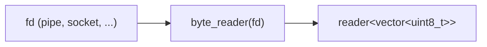

# byte_reader

Produces byte chunks from a non-blocking file descriptor. Each message contains
as much data as was available from a single `read()` call. Owns the fd and
closes it on exit.

## Signature

```cpp
auto byte_reader(int fd, size_t chunk_size = 4096);
// Returns: producer<std::vector<uint8_t>, ...>
```

## Topology



One internal microthread reads from the fd in a loop. Each successful `read()`
produces one channel message containing the bytes that were available.

## Semantics

- **fd ownership**: `byte_reader` takes ownership of `fd`. It sets the fd to
  non-blocking mode (`O_NONBLOCK`) and closes it when the microthread exits.
  The caller must not read from or close the fd after passing it.
- **Non-blocking I/O**: Uses `csp::io::read()`, which suspends the microthread
  on `EAGAIN`/`EWOULDBLOCK` (via `io::wait_readable`) and retries on `EINTR`.
  The processor is never blocked.
- **Chunk sizing**: The `chunk_size` parameter controls the read buffer size.
  Each message may contain fewer bytes than `chunk_size` (whatever the kernel
  returned). The default is 4096 bytes.
- **EOF**: When `read()` returns 0, the microthread closes the fd and exits,
  closing the output channel. Downstream readers see channel death.
- **Backpressure**: When the downstream consumer is slow, the channel write
  (`out << ...`) blocks the microthread. During this time, data accumulates
  in kernel buffers. If kernel buffers fill, the writing end of the pipe or
  socket will also block (or signal `EAGAIN` to its writer).
- **Error handling**: Any read error other than `EAGAIN`/`EINTR` causes the
  microthread to close the fd and exit.

## Example

```cpp
#include "csp.h"

using namespace csp;
using namespace csp::part;

int pipefd[2];
pipe(pipefd);

// byte_reader owns pipefd[0] and closes it on exit.
auto r = byte_reader(pipefd[0], 16).spawn();

csp::spawn([wfd = pipefd[1]] {
    const char* msg = "Hello, CSP!";
    ::write(wfd, msg, strlen(msg));
    ::close(wfd);
});

std::vector<uint8_t> all;
for (std::vector<uint8_t> chunk; r >> chunk;) {
    all.insert(all.end(), chunk.begin(), chunk.end());
}
// all contains "Hello, CSP!" as bytes
```

## See Also

- [byte_writer](byte_writer.md) -- write byte chunks to an fd
- [split_lines](split_lines.md) -- split byte stream into newline-delimited strings
- [fixed_frames](fixed_frames.md) -- split byte stream into fixed-size frames
