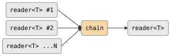

# chain

Concatenates multiple readers into a single sequential stream. Reads each
input to exhaustion in order, then moves to the next. The output closes when
all inputs are exhausted or the output reader is dropped.

## Signature

```cpp
template <typename T, typename R,
          typename = decltype(std::begin(std::declval<R>())->read())>
auto chain(R rr);
// Returns: producer<T, ...>
```

## Topology

<!-- csp-flow
reader<T> #1   ->
reader<T> #2   -> {chain} -> reader<T>
reader<T> ...N ->
-->


One internal imp reads each input reader to exhaustion in sequence,
writing every value to the single output.

## Semantics

- Output order is deterministic: all values from reader #1, then all values
  from reader #2, and so on.
- Each input is read to exhaustion (or until its writer closes) before the
  next input is started.
- Exits when all inputs are exhausted or when the output reader is dropped
  (output death terminates the chain early).
- Backpressure: the imp blocks on each write to the output, so a
  slow consumer throttles reading.
- Chaining zero inputs produces an immediately-closed output.
- Chains can be nested: a chain of chains produces a flat sequential stream.

## Example

```cpp
#include "csp.h"

using namespace csp;
using namespace csp::part;

// Concatenate two count streams sequentially.
std::vector<reader<int>> rs;
rs.push_back(count(0, 3).spawn());
rs.push_back(count(3, 6).spawn());
auto r = chain<int>(std::move(rs)).spawn();

// All 6 values arrive in order.
std::vector<int> got;
for (int n; r >> n;) got.push_back(n);
// got == {0, 1, 2, 3, 4, 5}
```

## See Also

- [merge](merge.md) -- non-deterministic concurrent merge
- [interleave](interleave.md) -- deterministic round-robin merge
- [flatten](flatten.md) -- unpack containers into individual elements
