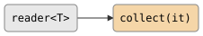

# csp::part::collect

Consume all values from a stream into an output iterator. Each received
value is assigned through the iterator (`*it++ = std::move(v)`), so any
output iterator works: `std::back_inserter`, a raw pointer into an array, an
ostream iterator, and so on.

**Header:** `<csp/part/collect.h>`

## Signature

```cpp
template <typename T, typename Iter>
auto collect(Iter it);
// Returns: consumer<T, ...>
```

## Parameters

| Parameter | Type | Description |
|---|---|---|
| `it` | `Iter` | Output iterator receiving each value via `*it++ = std::move(v)` |

## Topology

<!-- csp-flow
reader<T> -> {collect(it)}
-->


One internal imp reads every value from the input channel and writes it
through the iterator. The imp exits when the input closes.

## Semantics

- Reads until the input channel closes; values are assigned in arrival
  order.
- No output channel; `collect` is a consumer and composes as a pipeline
  tail.
- The destination behind the iterator must outlive the consumer's imp
  (e.g. a vector that outlives the `csp::run` scope).
- Backpressure: the imp blocks on each input read plus the iterator
  assignment, so a slow destination slows the producer.

## Example

```cpp
#include "csp.h"

using namespace csp;
using namespace csp::part;

std::vector<int> result;
csp::run([&]{
    auto pipeline = count(1, 4)
                  | collect<int>(std::back_inserter(result));
    csp::spawn(std::move(pipeline));
});
// result == {1, 2, 3}
```

## See Also

- [sink](sink.md) -- consume via a side-effect function
- [blackhole](blackhole.md) -- consume and discard
