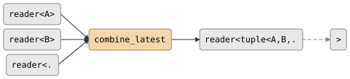

# csp::part::combine_latest

Emit a tuple of the latest values from N heterogeneous inputs whenever any
input updates. No output until every input has produced at least one value.
When an input closes, its last value is retained; output closes when all
inputs close. If any input closes before ever producing, output closes
immediately.

**Header:** `<csp/part/combine_latest.h>`

## Synopsis

```cpp
// Tuple output.
template <typename... Ts>
auto combine_latest(reader<Ts>... rs);

// Combining-function output (requires explicit type params).
template <typename... Ts, typename F>
auto combine_latest(reader<Ts>... rs, F&& f);
```

The tuple overload returns a `producer<std::tuple<Ts...>>`.
The function overload returns a `producer<std::invoke_result_t<F&, Ts&...>>`.

## Parameters

| Parameter | Type | Description |
|-----------|------|-------------|
| `rs...` | `reader<Ts>...` | Two or more input readers (heterogeneous types) |
| `f` | `F` | Optional combining function `(Ts&...) -> Out` |

## Topology

<!-- csp-flow
reader<A>   ->
reader<B>   -> {combine_latest} -> reader<tuple<A,B,...>>
reader<...> ->
-->


## Semantics

- Blocks until every input has produced at least one value before emitting.
- After priming, emits on every input update using the latest value from each.
- When an input closes, its last value is retained for future emissions.
- If an input closes before ever producing, output closes immediately.
- On output death, the imp exits.
- Uses dynamic `ChanOp` alt with dispatch tables (same approach as `mux`).

## Usage

### Tuple output

```cpp
using namespace csp::part;

auto out = combine_latest(sensor_a, sensor_b);
// out is reader<tuple<double, double>>
```

### Combining function

```cpp
using namespace csp::part;

auto sum = combine_latest<double, double>(
    sensor_a, sensor_b,
    [](double a, double b) { return a + b; });
// sum is reader<double>
```

## Example

```cpp
#include "csp.h"

using namespace csp::part;

// Fuse temperature and humidity readings.
auto fused = combine_latest<double, double>(
    temp_reader, humidity_reader,
    [](double t, double h) {
        return heat_index(t, h);
    });
```

## See also

- [zip](zip.md) -- element-wise pairing (lockstep, not latest)
- [merge](merge.md) -- non-deterministic merge of homogeneous inputs
- [mux](mux.md) -- heterogeneous merge into variant
