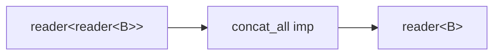

# concat_all

Flatten a stream of sub-streams by draining each sequentially.
`reader<reader<B>>` becomes `reader<B>`. Each sub-stream is fully consumed
before the next is read from input.

Compose with `map` for concat_map semantics:
`map<A, reader<B>>(f) | concat_all<B>`.

**Header:** `<csp/part/concat_all.h>`

## Synopsis

```cpp
template <typename B>
inline auto const concat_all = /* filter<reader<B>, B> */;
```

Returns a `filter<reader<B>, B>`. Used as `concat_all<int>` (variable
template, not a function call).

## Topology



## Semantics

- Reads a sub-stream from input, drains it completely, then reads the next.
- Output preserves sub-stream order and intra-stream order.
- On output death, the imp exits immediately.
- On input close, the imp drains the current sub-stream (if any) and exits.

## Usage

```cpp
using namespace csp::part;

// concat_map: map each value to a sub-stream, drain sequentially.
auto r = source.spawn()
       | map<int, reader<int>>([](int n) { return make_substream(n); })
       | concat_all<int>;
```

## See also

- [switch_all](switch_all.md) -- latest-wins cancellation
- [exhaust_all](exhaust_all.md) -- ignore new while draining
- [flat_map](flat_map.md) -- concurrent merge of sub-streams
- [flatten](flatten.md) -- flatten containers (not sub-streams)
