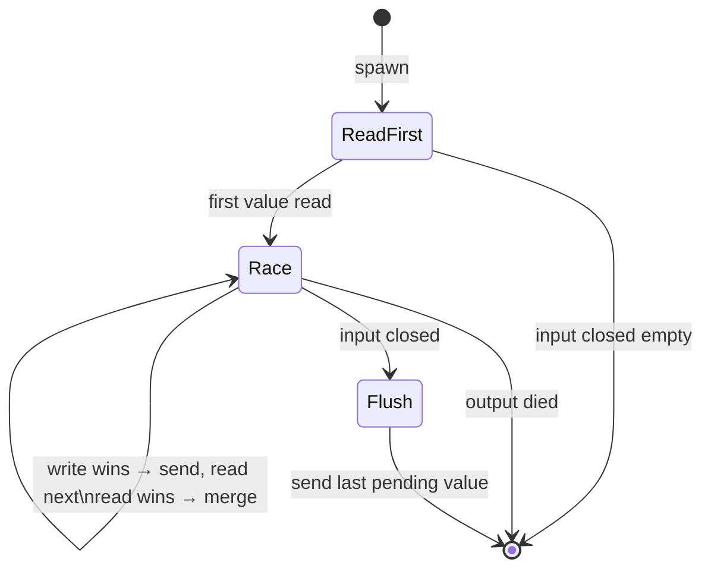

# conflate

When downstream is slow, merge pending upstream values via a combining function
instead of buffering or dropping. Each value passes through individually when
the consumer keeps up; when it falls behind, pending values are folded with
`f(accumulated, new_value)`.

## Signature

```cpp
template <typename T, typename F>
auto conflate(F&& f);
// Returns: filter<T, T, ...>
```

## Parameters

| Parameter | Type | Description |
|-----------|------|-------------|
| `f` | `F(T, T) -> T` | Combining function applied when a new value arrives while one is pending |

## Topology

<!-- csp-flow
reader<T> -> {conflate(f)} -> reader<T>
-->


One internal imp uses `alt` to race writing the pending value
downstream against reading the next value upstream.



## Semantics

- **Passthrough when consumer keeps up**: If the downstream write completes
  before a new upstream value arrives, each value passes through individually
  with no merging.
- **Merge when consumer is slow**: If a new upstream value arrives while the
  previous value is still pending (unsent), the two are combined via
  `f(pending, new_value)`. This can repeat, folding any number of arrivals
  into a single pending value.
- **No buffering, no dropping**: Unlike `buffer` (which queues) or `throttle`
  (which drops), conflate preserves all information through the combining
  function.
- **Flush on input close**: When the input channel dies, the last pending
  value is flushed to the output before the filter exits.
- **Output death**: If the output reader is dropped, the filter exits
  immediately.

## Example

```cpp
#include "csp.h"

using namespace csp;
using namespace csp::part;

// Sum-conflate: when the consumer is slow, pending values are added together.
auto cr = conflate<int>([](int a, int b) { return a + b; })
              .spawn(source.spawn());

for (int n; cr >> n;) {
    // n is either a single value (consumer kept up) or the sum
    // of multiple values (consumer was slow).
}
```

### String concatenation

```cpp
auto cr = conflate<std::string>([](std::string a, std::string b) {
    return a + "," + b;
}).spawn(source.spawn());
// When slow: "a,b,c" instead of three separate values.
```

### Pipeline composition

```cpp
auto pipeline = some_producer
              | conflate<int>([](int a, int b) { return a + b; })
              | map<int>([](int n) { return n * 2; });
auto r = pipeline.spawn();
```

## See Also

- [buffer](buffer.md) -- queue values when downstream is slow (preserves order and count)
- [latch](latch.md) -- hold the most recent value, silently overwriting intermediates
- [throttle](throttle.md) -- rate-limit by dropping excess values
- [debounce](debounce.md) -- suppress until a quiet period elapses
