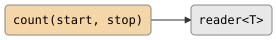

# count

Generate a sequence of arithmetic values as a stream. `count` produces a
bounded sequence; `count_forever` produces an unbounded one. Both are
producers: they take no input and write to a single output channel.

## Signature

```cpp
// Bounded: [start, start+step, ...) while < stop.
template <typename T>
auto count(T start, T stop, T step = 1, bool cyclic = false);

// Unbounded: [start, start+step, ...) forever.
template <typename T>
auto count_forever(T start, T step = 1);
```

**Header:** `#include "csp.h"`

Both return a `producer<T>`.

## Topology

<!-- csp-flow
{count(start, stop)} -> reader<T>
-->


No input channel. The producer spawns an imp that writes values to its
output.

## Semantics

- **Finite mode** (`count`): emits `start`, `start + step`, `start + 2*step`,
  ... for every value strictly less than `stop`, then the writer closes and the
  imp exits.
- **Cyclic mode** (`count` with `cyclic = true`): after reaching `stop` the
  sequence wraps back to `start` and repeats indefinitely. The stream never
  closes on its own.
- **Infinite mode** (`count_forever`): emits `start`, `start + step`, ... with
  no upper bound. The stream closes only when the downstream reader is
  destroyed.
- **Backpressure**: every write blocks until a reader is ready (synchronous
  channel semantics). No buffering.
- **Exit**: the imp exits when either the sequence is exhausted
  (finite, non-cyclic) or the downstream reader closes.
- `T` must support `<`, `+=`, and `-` (any arithmetic or iterator-like type).

## Example

```cpp
#include "csp.h"

using namespace csp::part;

// 2, 9, 16, 23, ... up to (but not including) 12345
auto r = count(2, 12345, 7).spawn();
for (int n; r >> n; ) {
    // process n
}

// 2, 13, 24, 35, ... forever (until reader closes)
auto r2 = count_forever(2, 11).spawn();
for (int i = 0; i < 100; ++i) {
    int n = r2.read();
}
```

## See Also

- [enumerate](enumerate.md) -- stream elements from a container
- [scan](scan.md) -- running fold over a stream
- [map](map.md) -- transform each element
