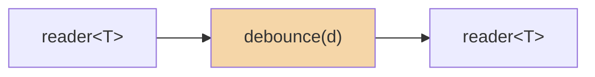

# debounce

Suppress rapid values; emit only after a quiet period elapses. Each incoming
value restarts the timer. Only the most recent value survives a burst.

**Header:** `<csp/part/debounce.h>`

## Synopsis

```cpp
template <typename T>
auto debounce(csp::clock::duration d);
```

Returns a `filter<T, T>`.

## Parameters

| Parameter | Type | Description |
|-----------|------|-------------|
| `d` | `csp::clock::duration` | Quiet period required before emitting |

## Diagram



### Timing

```
in:  ──1──2──3────────────────4──────────────
         ←d→  ←────d────→         ←───d───→
out: ─────────────────3──────────────────4───
```

Each incoming value replaces the pending value and restarts the timer. A value
is only emitted when no new value arrives for duration `d`.

## Semantics

- When a value arrives and no timer is running, the value is latched and a
  timer of duration `d` is started.
- When a value arrives while a timer is running, the pending value is replaced
  and the timer is restarted.
- When the timer fires without interruption, the pending value is emitted.
- **Values arrive faster than `d`:** only the last value in the burst is
  emitted. All intermediate values are silently replaced.
- **Values arrive slower than `d`:** every value is emitted (each has a quiet
  period longer than `d`).
- On input close with a pending value, the pending value is emitted
  immediately (no further wait).
- On output close, the filter returns immediately.

## Usage

### As a pipeline filter

```cpp
using namespace std::chrono_literals;

// Only emit after 50ms of quiet.
auto r = debounce<int>(50ms).spawn(source.spawn());
```

### Composed with `|`

```cpp
auto pipeline = count(1, 6) | debounce<int>(50ms);
auto r = pipeline.spawn();
// Rapid burst: only 5 emitted (last value before input closes).
```

### Standalone spawn

```cpp
auto ch = debounce<int>(50ms).spawn();
csp::spawn([w = std::move(ch.w)] {
    w << 1;
    csp::sleep(100ms);  // quiet > 50ms
    w << 2;
    csp::sleep(100ms);
    w << 3;
});
// All three values emitted (each has sufficient quiet time).
```

## Example

```cpp
#include "csp.h"

using namespace csp::part;
using namespace std::chrono_literals;

// count sends 1-5 instantly. Each replaces pending and restarts timer.
// Input closes -> pending (5) emitted immediately.
auto r = debounce<int>(50ms).spawn(count(1, 6).spawn());

CHECK_EQ(5, r.read());  // Only the last value survives.
```

## See also

- [throttle](throttle.md) -- rate-limit with a budget (drops excess, keeps first)
- [delay](delay.md) -- delay every value by a fixed duration (no dropping)
- [timeout](timeout.md) -- close if no value arrives in time
