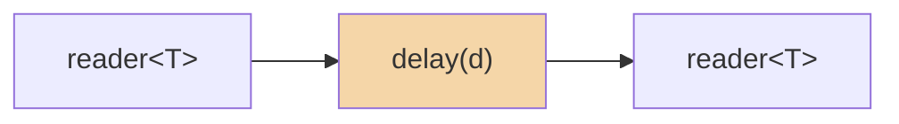

# delay

Delay each value by a fixed duration. Values are queued with absolute deadlines
and emitted in order. Multiple in-flight values are delayed independently (not
serialized).

**Header:** `<csp/part/delay.h>`

## Synopsis

```cpp
template <typename T>
auto delay(csp::duration d);
```

Returns a `filter<T, T>`.

## Parameters

| Parameter | Type | Description |
|-----------|------|-------------|
| `d` | `csp::duration` | Duration to delay each value |

## Diagram



## Semantics

- Each incoming value is enqueued with a deadline of `now() + d`.
- When the oldest deadline expires, the corresponding value is emitted.
- If multiple values arrive within one delay window, they queue up and are
  emitted in arrival order, each at its own deadline.
- **Values arrive faster than `d`:** they accumulate in an internal queue and
  are emitted one by one as their deadlines fire. No values are dropped.
- **Values arrive slower than `d`:** each value waits its full delay, then
  emits. The queue stays shallow (0 or 1 pending).
- On input close, remaining queued values are drained with their original
  delays preserved (each value sleeps until its deadline before emitting).
- On output close, the filter returns immediately.

## Usage

### As a pipeline filter

```cpp
using namespace std::chrono_literals;

// Delay every integer by 100ms.
auto r = delay<int>(100ms).spawn(source.spawn());
```

### Composed with `|`

```cpp
auto pipeline = count(1, 6) | delay<int>(50ms);
auto r = pipeline.spawn();
```

### Standalone spawn

```cpp
auto ch = delay<int>(200ms).spawn();
// ch.w is a writer<int>, ch.r is a reader<int>
csp::spawn([w = std::move(ch.w)] {
    w << 1;
    w << 2;
    w << 3;
});
// Values arrive at r after 200ms each (from their send time).
for (int v; ch.r >> v;) { /* ... */ }
```

## Example

```cpp
#include "csp.h"

using namespace csp::part;
using namespace std::chrono_literals;

auto r = delay<int>(50ms).spawn(count(1, 4).spawn());

auto start = csp::now();
while (int v; r >> v) {
    // Each value arrives ~50ms after it was sent.
}
auto elapsed = csp::now() - start;
// elapsed >= 50ms
```

## See also

- [debounce](debounce.md) -- suppress rapid values until a quiet period
- [throttle](throttle.md) -- rate-limit by dropping excess values
- [timeout](timeout.md) -- close if no value arrives in time
