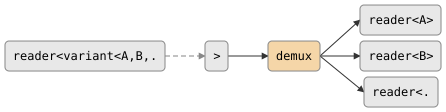

# csp::part::demux

Split a `variant<Ts...>` stream into N typed readers, one per alternative.
Each variant value is routed to the corresponding output channel by its
active index.

**Header:** `<csp/part/demux.h>`

## Synopsis

```cpp
template <typename... Ts>
auto demux(reader<std::variant<Ts...>> in);
```

Returns `std::tuple<reader<Ts>...>`.

## Parameters

| Parameter | Type | Description |
|-----------|------|-------------|
| `in` | `reader<std::variant<Ts...>>` | Input variant stream |

## Topology

<!-- csp-flow
                                  -> reader<A>
reader<variant<A,B,...>> -> {demux} -> reader<B>
                                  -> reader<...>
-->


## Semantics

- Each incoming variant is dispatched to the output channel matching its
  active alternative index.
- Output channels are synchronous: the demux imp blocks until the
  downstream reader accepts each value.
- When the input closes, the demux imp exits and all output writers are
  dropped (closing the output channels).

## Usage

```cpp
using namespace csp::part;

auto [keys, mice, timers] = demux(event_stream);
// keys   is reader<KeyEvent>
// mice   is reader<MouseEvent>
// timers is reader<TimerEvent>
```

## See also

- [mux](mux.md) -- merge heterogeneous readers into a variant stream
- [partition](partition.md) -- route homogeneous values by classifier
- [unzip](unzip.md) -- split a tuple stream into typed readers
