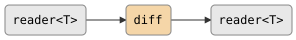

# csp::part::diff

Emits successive differences of a numeric stream. For each pair of adjacent
elements `(prev, curr)`, emits `curr - prev`. The first element is consumed
silently to establish the baseline; a stream with fewer than two elements
produces no output. Requires `operator-` on `T`.

## Signature

```cpp
template <typename T>
inline auto const diff = /* ... */;
// Returns: filter<T, T, ...>
```

## Parameters

| Parameter | Type | Description |
|---|---|---|
| *(none)* | — | Variable template; no runtime parameters |

## Topology

<!-- csp-flow
reader<T> -> {diff} -> reader<T>
-->


One internal imp reads each element, computes the delta from the previous
value, and writes the delta to the output.

## Semantics

- Reads the first element to establish `prev`. Produces no output for it.
- For each subsequent element `t`, emits `t - prev`, then sets `prev = t`.
- A stream of `n` elements produces `n - 1` deltas (`0` if `n < 2`).
- Empty input produces no output and closes the output immediately.
- Exits when the input is exhausted or the output reader is dropped.
- Backpressure: the imp blocks on each delta write, so a slow consumer
  throttles the pipeline.

## Example

```cpp
#include "csp.h"

using namespace csp;
using namespace csp::part;

// First differences of {1, 4, 6, 4, 1}.
auto r = diff<int>.spawn(enumerate<int>({1, 4, 6, 4, 1}).spawn());
// Emits: 3, 2, -2, -3
```

### Detecting monotonicity

```cpp
// Check whether a stream is non-decreasing.
auto is_nondec = diff<int>.spawn(source)
    | where<int>([](int d) { return d >= 0; });
```

## See Also

- [scan](scan.md) -- running accumulator (more general stateful transform)
- [pairwise](pairwise.md) -- emit each adjacent pair as `(prev, curr)` without combining
- [distinct](distinct.md) -- suppress consecutive duplicates (also inspects adjacent pairs)
