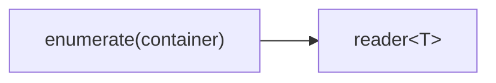

# enumerate

Stream the elements of a container or initializer list as channel values.
`enumerate` produces a bounded stream (or cyclic if requested); `cycle` is a
convenience wrapper that repeats the container forever.

## Signature

```cpp
// From a container (vector, array, ...).
template <typename T, typename C>
auto enumerate(C&& c, bool cyclic = false);

// From an initializer list.
template <typename T>
auto enumerate(std::initializer_list<T> c, bool cyclic = false);

// Repeat a container forever (shorthand for enumerate with cyclic=true).
template <typename T, typename C>
auto cycle(C&& c);

template <typename T>
auto cycle(std::initializer_list<T> c);
```

**Header:** `#include "csp.h"`

All overloads return a `producer<T>`.

## Topology



No input channel. The producer spawns a microthread that writes each element
to its output.

## Semantics

- **Finite mode** (default): iterates through the container once, writing each
  element, then the writer closes.
- **Cyclic mode** (`cyclic = true` or `cycle`): after the last element, wraps
  back to the first and repeats indefinitely.
- **Container ownership**: the container (or a copy of the initializer list
  contents) is captured by value into the producer. For the `C&&` overload,
  the container is forwarded (moved if an rvalue, copied if an lvalue).
  The initializer-list overload copies into a `std::vector<T>`.
- **Element copying**: elements are written to the channel via `const&`
  (copied, not moved). Each iteration through the container can therefore
  repeat without invalidating the source.
- **Backpressure**: every write blocks until a reader is ready (synchronous
  channel semantics). No buffering.
- **Exit**: the microthread exits when the container is exhausted (non-cyclic)
  or the downstream reader closes.

## Example

```cpp
#include "csp.h"

using namespace csp::part;

// Stream a fixed set of values.
auto r = enumerate<int>({10, 20, 30}).spawn();
// r.read() returns 10, 20, 30, then the channel closes.

// Stream from an existing vector.
std::vector<std::string> names = {"alice", "bob", "carol"};
auto r2 = enumerate<std::string>(names).spawn();

// Repeat forever (useful with take, killswitch, etc.).
auto r3 = cycle<int>({1, 2, 3}).spawn();
// r3.read() returns 1, 2, 3, 1, 2, 3, ... until reader closes.
```

## See Also

- [count](count.md) -- generate arithmetic sequences
- [map](map.md) -- transform each element
- [chain](chain.md) -- concatenate multiple readers sequentially
