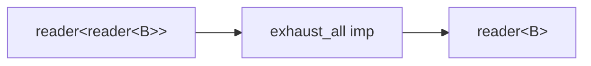

# exhaust_all

Flatten a stream of sub-streams, ignoring new arrivals while the current
sub-stream is active. `reader<reader<B>>` becomes `reader<B>`. Prevents
duplicate work by dropping inputs that arrive during processing.

Compose with `map` for exhaust_map semantics:
`map<A, reader<B>>(f) | exhaust_all<B>`.

**Header:** `<csp/part/exhaust_all.h>`

## Synopsis

```cpp
template <typename B>
inline auto const exhaust_all = /* filter<reader<B>, B> */;
```

Returns a `filter<reader<B>, B>`. Used as `exhaust_all<int>` (variable
template, not a function call).

## Topology



## Semantics

- Reads a sub-stream from input and begins forwarding its values.
- While the current sub-stream is active, new sub-streams from input are
  read and discarded.
- When the current sub-stream dies, the next sub-stream from input is
  accepted.
- Uses `prialt` with a vulture chanop (`~sub`) to detect sub-stream death
  deterministically before the alt matches a ready peer on input.
- When input closes, drains the remaining active sub-stream and exits.
- On output death, the imp exits immediately.

## Usage

```cpp
using namespace csp::part;

// exhaust_map: ignore new requests while processing current.
auto r = source.spawn()
       | map<int, reader<int>>([](int n) { return make_substream(n); })
       | exhaust_all<int>;
```

## See also

- [concat_all](concat_all.md) -- sequential drain (queues, doesn't drop)
- [switch_all](switch_all.md) -- latest-wins cancellation
- [flat_map](flat_map.md) -- concurrent merge of sub-streams
