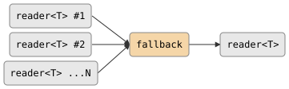

# fallback

Sequential failover across multiple readers. Tries each reader in order; the
first reader that produces at least one value is drained fully to the output.
If a reader closes without producing any values, the next reader is tried.

## Signature

```cpp
template <typename T>
auto fallback(std::vector<reader<T>> inputs);
// Returns: producer<T, ...>
```

## Topology

<!-- csp-flow
reader<T> #1   ->
reader<T> #2   -> {fallback} -> reader<T>
reader<T> ...N ->
-->


One internal imp tries each reader in sequence, forwarding values from
the first reader that produces output.

## Semantics

- Tries reader #1 first. If it produces at least one value, that reader is
  drained to the output and the remaining readers are dropped.
- If reader #1 closes without producing any values, reader #2 is tried, and so
  on.
- If all readers close without producing any values, the output closes empty.
- Readers are attempted in the order they appear in the vector.
  Only one reader is ever drained; the others are dropped unused or after
  failing to produce.
- Exits when the active reader is exhausted (after forwarding all its values)
  or when the output reader is dropped.
- Backpressure: the imp blocks on each write to the output, so a slow
  consumer throttles reading from the active source.
- An empty input vector produces an immediately-closed output.

## Example

```cpp
#include "csp.h"

using namespace csp;
using namespace csp::part;

// Primary source might be empty; fall back to secondary.
std::vector<reader<int>> rs;
rs.push_back(enumerate<int>({}).spawn());     // empty -- skipped
rs.push_back(count(1, 4).spawn());            // fallback source
auto r = fallback(std::move(rs)).spawn();
// Reads: 1, 2, 3
```

## See Also

- [chain](chain.md) -- sequential concatenation (drains all inputs, not just the first)
- [merge](merge.md) -- non-deterministic concurrent merge
- [first_wins](first_wins.md) -- race for a single value from multiple sources
