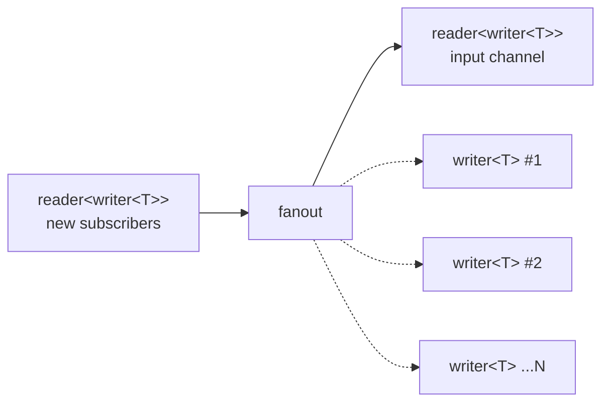

# fanout

Broadcasts each value from an input stream to a dynamic set of subscribers.
New subscribers register by sending their `writer<T>` endpoint via a control
channel. Dead subscribers are automatically removed.

## Signature

```cpp
template <typename T>
inline auto const fanout;
// Type: filter<writer<T>, writer<T>, ...>
```

`fanout` is a `const` variable template (not a function). It is a
`filter<writer<T>, writer<T>>` whose input and output are channels of
`writer<T>` endpoints -- a channel-of-channels pattern.

## Topology



The fanout imp manages a two-phase lifecycle:

1. **Registration phase**: Reads the first `writer<T>` from the subscriber
   channel (`new_out`), then creates a fresh `chan<T>` and sends its writer
   back via the `new_in` reader. This writer becomes the input stream.

2. **Steady-state loop**: Uses a dynamic `prialt` over:
   - The input stream (read values to broadcast)
   - The subscriber channel (accept new `writer<T>` endpoints)
   - Death watches on all current subscribers

## Semantics

- When a value arrives on the input, it is written to every live subscriber.
  If a subscriber's write fails (its reader was dropped), that subscriber is
  removed.
- New subscribers can join at any time by sending a `writer<T>` through the
  subscriber channel.
- When the subscriber channel closes and all subscribers die, the fanout
  imp exits.
- When the input stream dies, fanout re-enters the registration phase:
  it waits for the subscriber channel to deliver the next input writer,
  enabling wave-based operation.
- Backpressure: each broadcast blocks until all live subscribers have
  accepted the value. A single slow subscriber throttles the entire fanout.

## Example

```cpp
#include "csp.h"

using namespace csp;
using namespace csp::part;

// Create the subscriber control channel.
auto [new_out_w, new_out_r] = chan<writer<int>>{};

// Spawn fanout, getting back a reader for input-channel writers.
auto new_in = fanout<int>.spawn(std::move(new_out_r));

// Register a subscriber.
auto [out_w, out_r] = chan<int>{};
new_out_w << std::move(out_w);

// Obtain the input writer.
writer<int> in;
new_in >> in;
new_in = {};  // Done with registration reader.

// Write a value -- all subscribers receive it.
in << 42;
// out_r.read() == 42
```

## See Also

- [tee](tee.md) -- duplicate to a single fixed side channel
- [share](share.md) -- broadcast via latched subscription model
- [round_robin](round_robin.md) -- distribute values across outputs in rotation
