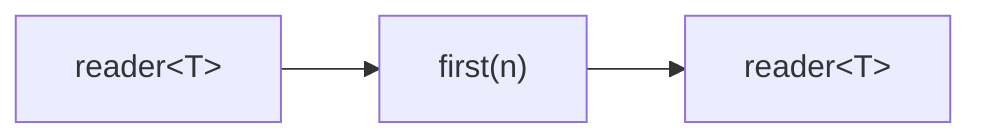
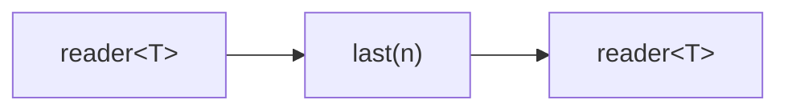
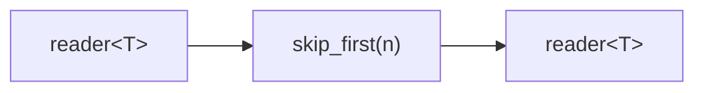
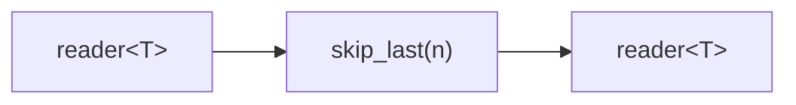

# first / last / skip_first / skip_last

Four position-based filtering combinators for selecting or skipping elements at
the beginning or end of a stream. All are defined in `<csp/part/first_last.h>`.

---

## first

Emits the first *n* elements, then closes the output.

### Signature

```cpp
template <typename T>
auto first(size_t n);
// Returns: filter<T, T, ...>
```

### Topology



### Semantics

- Reads and forwards up to *n* elements, then exits (closing the output).
- If the input has fewer than *n* elements, all are forwarded and the output
  closes when the input is exhausted.
- Values are moved into the output channel.

### Example

```cpp
#include "csp.h"

using namespace csp;
using namespace csp::part;

auto r = first<int>(3).spawn(count(1, 11).spawn());
// Reads: 1, 2, 3
```

---

## last

Emits the last *n* elements of the stream. The entire input must be consumed
before any output is produced, because the final elements are not known until
the input closes.

### Signature

```cpp
template <typename T>
auto last(size_t n);
// Returns: filter<T, T, ...>
```

### Topology



### Semantics

- Buffers up to *n* elements in a ring buffer. When input closes, the
  buffered elements are emitted in order.
- If the input has fewer than *n* elements, all are emitted.
- If *n* is 0, all input is consumed and discarded; the output closes
  immediately with no values.
- The output is delayed until the input is fully exhausted.
- Values are moved into the output channel.

### Example

```cpp
auto r = last<int>(3).spawn(count(1, 11).spawn());
// Reads: 8, 9, 10
```

---

## skip_first

Drops the first *n* elements, then forwards the rest.

### Signature

```cpp
template <typename T>
auto skip_first(size_t n);
// Returns: filter<T, T, ...>
```

### Topology



### Semantics

- Reads and discards the first *n* elements, then forwards all remaining
  elements.
- If the input has fewer than *n* elements, no output is produced.
- Values are moved into the output channel.

### Example

```cpp
auto r = skip_first<int>(3).spawn(count(1, 11).spawn());
// Reads: 4, 5, 6, 7, 8, 9, 10
```

---

## skip_last

Emits all but the last *n* elements. Output is delayed by *n* elements
because the combinator cannot know whether a value is in the "last *n*" until
*n* more values have arrived (or the input closes).

### Signature

```cpp
template <typename T>
auto skip_last(size_t n);
// Returns: filter<T, T, ...>
```

### Topology



### Semantics

- Buffers *n* elements in a ring buffer. Once the buffer is full, each new
  input value pushes the oldest buffered value to the output. The remaining
  buffered values are discarded when the input closes.
- If *n* is 0, behaves as identity (all values pass through).
- If the input has *n* or fewer elements, no output is produced.
- Values are moved into the output channel.

### Example

```cpp
auto r = skip_last<int>(3).spawn(count(1, 11).spawn());
// Reads: 1, 2, 3, 4, 5, 6, 7
// (8, 9, 10 are the last 3 and are discarded)
```

---

## See Also

- [take_while](take_while.md) -- take elements by predicate
- [skip_while](skip_while.md) -- skip elements by predicate
- [stride](stride.md) -- take every Nth element
