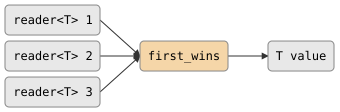

# first_wins

Reads from whichever source responds first and discards the rest. This is a
blocking synchronous call -- not a filter or producer -- that resolves a race
among multiple readers into a single value.

## Signature

```cpp
template <typename T>
T first_wins(std::vector<reader<T>> inputs);
// Throws: std::runtime_error if all readers close without producing a value.
```

## Topology

<!-- csp-flow
reader<T> 1 ->
reader<T> 2 -> {first_wins} -> T value
reader<T> 3 ->
-->


No imps are spawned. `first_wins` blocks the calling imp using
`alt` until one of the inputs produces a value. All remaining readers are
dropped when the function returns.

## Semantics

- **Blocking call**: `first_wins` suspends the calling imp until at
  least one input delivers a value.
- **First value wins**: The first reader to produce a value determines the
  result. All other readers are dropped (their channels close from the reader
  side).
- **Dead readers are skipped**: If a reader closes without producing a value, it
  is removed from the set. The call continues waiting on the remaining readers.
- **All dead**: If every reader closes without producing a value,
  `std::runtime_error` is thrown.
- **Order independence**: When multiple readers are simultaneously ready, `alt`
  randomizes the scan order, so the winner among tied readers is
  nondeterministic.

## Example

```cpp
#include "csp.h"

using namespace csp;
using namespace csp::part;

// Race three sources; take whichever responds first.
std::vector<reader<int>> rs;
rs.push_back(slow_source_1());
rs.push_back(slow_source_2());
rs.push_back(fast_source());    // Produces 42 immediately.

int winner = first_wins(std::move(rs));
// winner == 42 (assuming fast_source responds first)
```

## See Also

- [merge](merge.md) -- interleave all values from multiple sources (no discard)
- [join](join.md) -- block until all channels close (discard all values)
