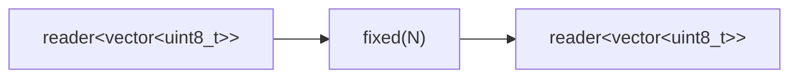

# fixed

Splits a byte stream into fixed-size frames. Discards any partial trailing
frame when the input closes.

## Signature

```cpp
auto fixed(size_t frame_size);
// Returns: filter<std::vector<uint8_t>, ...>
```

## Topology



One internal microthread reads byte chunks from the input, accumulates them
into frames of exactly `frame_size` bytes, and emits each complete frame.

## Semantics

- **Frame size**: Every output message is exactly `frame_size` bytes. Input
  chunks of any size are accepted and reassembled.
- **Chunk reassembly**: Frame boundaries may fall anywhere within or across
  input chunks. The filter maintains an internal frame buffer and fills it
  incrementally. A single input chunk may produce zero, one, or many output
  frames.
- **Partial trailing frame**: When the input channel closes, any partially
  filled frame is discarded. Unlike `lines()`, there is no flush of
  incomplete data.
- **Output close**: Uses `csp::alt(in >> chunk, ~out)` to detect downstream
  reader drop. If the output reader is dropped, the filter exits immediately
  without draining the input.
- **Backpressure**: The microthread blocks on each output write, so a slow
  consumer throttles the entire pipeline.
- **No I/O dependency**: `fixed()` operates purely on channels. It can be
  tested with synthetic `chan<std::vector<uint8_t>>` data or composed with
  `byte_reader` for real I/O.

## Example

### Standalone (synthetic data)

```cpp
#include <csp/csp.h>
#include <csp/part/io.h>

using namespace csp;
using namespace csp::part;

auto [w, r] = chan<std::vector<uint8_t>>{};
auto fr = fixed(4).spawn(std::move(r));

csp::spawn([w = std::move(w)] {
    // 10 bytes -> 2 full frames of 4, partial 2 discarded.
    std::string data = "AABBCCDDEE";
    w << std::vector<uint8_t>(data.begin(), data.end());
});

auto f1 = fr.read();  // {'A','A','B','B'}
auto f2 = fr.read();  // {'C','C','D','D'}
// "EE" is discarded (partial frame)
```

### Multi-chunk reassembly

```cpp
auto [w, r] = chan<std::vector<uint8_t>>{};
auto fr = fixed(4).spawn(std::move(r));

csp::spawn([w = std::move(w)] {
    // Frame boundary spans chunks.
    w << std::vector<uint8_t>{'A', 'B'};
    w << std::vector<uint8_t>{'C', 'D', 'E', 'F'};
});

auto f1 = fr.read();  // {'A','B','C','D'}
// "EF" is discarded (partial frame)
```

### Composed with byte_reader

```cpp
int pipefd[2];
pipe(pipefd);

// Compose: fd -> byte chunks -> fixed-size frames
auto fr = fixed(64).spawn(byte_reader(pipefd[0]).spawn());
```

## See Also

- [lines](lines.md) -- split byte stream into newline-delimited strings
- [byte_reader](byte_reader.md) -- produce byte chunks from a file descriptor
- [byte_writer](byte_writer.md) -- consume byte chunks to a file descriptor
