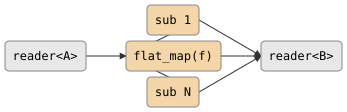

# csp::part::flat_map

Maps each input element to a sub-stream via a function, then merges all
sub-streams into a single output. Sub-streams are read concurrently, so output
order is non-deterministic.

## Signature

```cpp
template <typename A, typename B, typename F>
auto flat_map(F&& f);
// Returns: filter<A, B, ...>
// f signature: reader<B> f(A)
```

## Topology

<!-- csp-flow
                   -> {sub 1} ->
reader<A> -> {flat_map(f)}     -> reader<B>
                   -> {sub N} ->
-->


One internal imp manages the main loop. For each input element, `f`
returns a `reader<B>` sub-stream. All active sub-streams are polled
concurrently via `alt`, and their values are forwarded to the single output.

## Semantics

- `f` is called once per input element and must return a `reader<B>`.
- Sub-streams run concurrently. Output order depends on which sub-stream has
  data ready first -- it is **not** guaranteed to match input order.
- Exits when the input is exhausted **and** all sub-streams are drained, or
  when the output reader is dropped.
- Backpressure: the imp blocks on each output write. While blocked,
  no new sub-stream data is consumed, but sub-stream producers may continue
  buffering internally.
- `A` and `B` can be different types.

## Example

```cpp
#include "csp.h"

using namespace csp;
using namespace csp::part;

// Each int n produces a sub-stream [n*10, n*10+1, n*10+2].
auto r = flat_map<int, int>([](int n) {
             return count(n * 10, n * 10 + 3).spawn();
         })
             .spawn(count(1, 4).spawn());

// Reads (order may vary): 10, 11, 12, 20, 21, 22, 30, 31, 32
std::vector<int> got;
for (int n; r >> n;) got.push_back(n);
std::sort(got.begin(), got.end());
// got == {10, 11, 12, 20, 21, 22, 30, 31, 32}
```

## See Also

- [flatten](flatten.md) -- flatten a stream of containers into individual elements
- [map](map.md) -- one-to-one element transform
- [merge](../parts/merge.md) -- merge multiple readers into one (non-deterministic)
