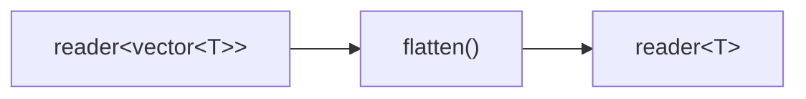

# flatten

Flattens a stream of containers into a stream of individual elements.
`reader<Container<T>>` becomes `reader<T>`.

## Signature

```cpp
template <typename T, typename C = std::vector<T>>
auto flatten();
// Returns: filter<C, T, ...>
```

## Topology



One internal microthread reads each container from the input, then iterates
over its elements and writes them individually to the output.

## Semantics

- Exits when the input is exhausted or the output reader is dropped.
- Empty containers are silently skipped (no output for that input).
- Elements within each container are emitted in iteration order.
- Backpressure: the microthread blocks on each element write. If the output
  consumer is slow, the producer is stalled mid-container.
- Elements are moved out of the container via `std::move`.
- The container type `C` defaults to `std::vector<T>` but can be any type
  supporting range-based `for`.

## Example

```cpp
#include "csp.h"

using namespace csp;
using namespace csp::part;

// batch produces vectors; flatten unpacks them back to individual ints.
auto r = flatten<int>().spawn(
             batch<int>(3).spawn(count(1, 8).spawn()));
// Reads: 1, 2, 3, 4, 5, 6, 7
```

## See Also

- [flat_map](flat_map.md) -- map each element to a sub-stream, then merge
- [batch](../parts/batch.md) -- the inverse operation: group elements into vectors
