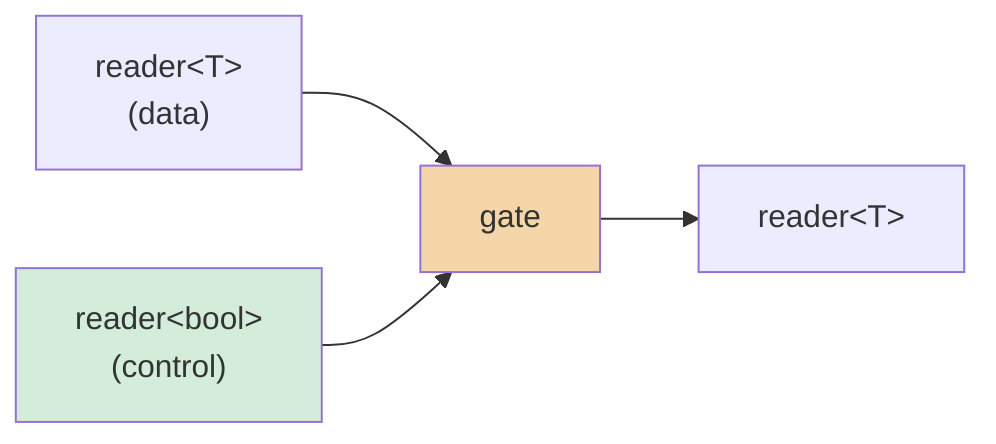
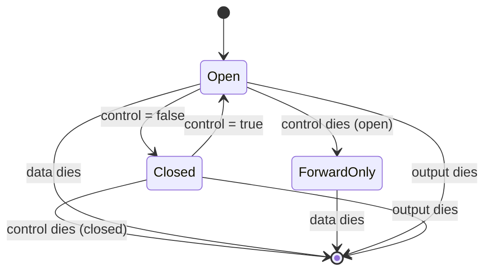

# gate

Pause and resume a stream via a boolean control channel. The gate starts
**open**. When the control sends `false`, data stops flowing (the synchronous
source channel backpressures naturally). When the control sends `true`,
forwarding resumes.

**Header:** `<csp/part/gate.h>`

## Synopsis

```cpp
template <typename T>
reader<T> gate(reader<T> data, reader<bool> control);
```

Returns a `reader<T>`.

## Parameters

| Parameter | Type | Description |
|-----------|------|-------------|
| `data` | `reader<T>` | The data stream to gate |
| `control` | `reader<bool>` | Control stream: `true` = open, `false` = close |

## Diagram



### State machine



## Semantics

- The gate starts in the **open** state.
- While open, values from `data` are forwarded to the output.
- While closed, the gate only listens on the control channel (data
  backpressures because the synchronous data channel has no reader).
- Sending `false` on `control` closes the gate; sending `true` reopens it.
- **Control dies while open:** the gate stays open and continues forwarding
  all remaining data values until data or output dies.
- **Control dies while closed:** the gate is permanently closed and the
  output is closed immediately.
- On data close, the output closes (regardless of gate state).
- On output close, the gate returns immediately.

## Usage

### Basic gating

```cpp
csp::chan<bool> ctrl;
auto r = gate(source, std::move(ctrl.r));

// Gate starts open -- values flow.
// Close the gate:
ctrl.w << false;
// Re-open:
ctrl.w << true;
// Drop control to finalize (stays in last state):
ctrl.w = {};
```

### Timer-based gating

```cpp
using namespace std::chrono_literals;

// Open the gate for 1 second, then close permanently.
csp::chan<bool> ctrl;
auto r = gate(source, std::move(ctrl.r));

csp::spawn([w = std::move(ctrl.w)] {
    csp::sleep(1s);
    w << false;
});
```

## Example

```cpp
#include <csp/csp.h>
#include <csp/part/gate.h>
#include <csp/part/count.h>

using namespace csp::part;

csp::schedule([] {
    csp::chan<bool> ctrl;
    auto r = gate(count(1, 100).spawn(), std::move(ctrl.r));

    csp::spawn([w = std::move(ctrl.w)] {
        csp::yield(); csp::yield(); csp::yield();
        w << false;           // Close the gate.
        csp::yield(); csp::yield();
        w << true;            // Re-open.
        csp::yield(); csp::yield(); csp::yield();
        // Drop control -- gate stays in last state (open).
    });

    std::vector<int> got;
    for (int n; r >> n;) got.push_back(n);
    // got[0] == 1 (gate starts open)
});
```

## Note

Unlike the filter-based timing parts, `gate` is a standalone function that
returns a `reader<T>` directly (it spawns its own microthread internally). It
does not use the `make_filter` / `make_producer` wrappers and cannot be
composed with `|`.

## See also

- [throttle](throttle.md) -- rate-limit by dropping excess values
- [timeout](timeout.md) -- close if no value arrives in time
- [sample](sample.md) -- emit latest value on trigger
