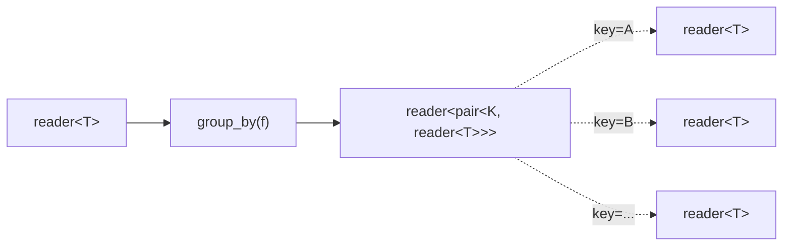

# group_by

Dynamically partitions a stream by key. Each unique key lazily spawns a new
sub-stream. A meta-channel emits `(key, reader<T>)` pairs as new groups
appear.

## Signature

```cpp
template <typename T, typename F,
          typename K = std::decay_t<std::invoke_result_t<F&, const T&>>>
reader<std::pair<K, reader<T>>> group_by(reader<T> input, F f);
// f: (const T&) -> K
// Returns: reader<pair<K, reader<T>>>
```

## Topology



One internal microthread reads input elements and evaluates `f` on each.
When a new key is seen, a fresh channel is created and a `(key, reader<T>)`
pair is emitted on the meta-channel. Subsequent values for that key are
forwarded to the existing sub-stream.

## Semantics

- Returns a `reader<std::pair<K, reader<T>>>` (the meta-channel).
- The key type `K` must be hashable (`std::unordered_map` is used internally).
- New groups are announced lazily: a sub-stream reader only appears when the
  first element with that key arrives.
- **Dropped sub-stream**: if a sub-stream reader is dropped, future writes for
  that key silently fail and the values are discarded. Other groups are
  unaffected.
- **Dropped meta-reader**: if the meta-channel reader is dropped, the entire
  group_by terminates.
- Backpressure: writing to a sub-stream blocks until the sub-stream consumer
  reads. Sub-stream readers must be drained concurrently (typically by
  spawning a microthread per group).
- Elements are moved into sub-stream channels.

## Example

```cpp
#include <csp/csp.h>
#include <csp/part/group_by.h>
#include <csp/part/count.h>

using namespace csp;
using namespace csp::part;

auto groups = group_by<int>(
    count(1, 7).spawn(),
    [](int n) { return n % 2; });  // key: 0=even, 1=odd

// Read group announcements and drain each sub-stream.
std::vector<int> evens, odds;
spawn([&, groups = std::move(groups)]() mutable {
    std::pair<int, reader<int>> g;
    while (groups >> g) {
        auto& dest = g.first == 0 ? evens : odds;
        spawn([&dest, r = std::move(g.second)]() mutable {
            for (int n; r >> n;) dest.push_back(n);
        });
    }
});
schedule();
// evens: 2, 4, 6
// odds:  1, 3, 5
```

## See Also

- [partition](partition.md) -- static N-way routing with a bounded index space
- [round_robin](round_robin.md) -- distribute by position, not content
