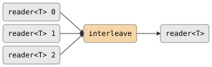

# csp::part::interleave

Merges N input streams into a single output in strict round-robin order. This
is the deterministic dual of [round_robin](round_robin.md).

## Signature

```cpp
template <typename T>
auto interleave(std::vector<reader<T>> inputs);
// Returns: producer<T, ...>
```

## Topology

<!-- csp-flow
reader<T> 0 ->
reader<T> 1 -> {interleave} -> reader<T>
reader<T> 2 ->
-->


One internal imp reads from each input in cyclic order and writes each
value to a single output channel.

## Semantics

- Returns a `producer<T>`. Call `.spawn()` to get a `reader<T>`.
- Reads from input 0, then input 1, ..., input N-1, then back to input 0, and
  so on.
- **Dead input handling**: when an input is exhausted, it is removed from the
  rotation and reading continues with the next live input.
- Exits when all inputs are exhausted or the output reader is dropped.
- Backpressure: each output write blocks until the downstream consumer reads,
  so a slow consumer throttles all input legs. Inputs that are not currently
  being read will block their upstream producers.
- **Uneven streams**: if inputs have different lengths, the shorter streams are
  removed as they close. The remaining streams continue interleaving.

## Example

```cpp
#include "csp.h"

using namespace csp;
using namespace csp::part;

std::vector<reader<int>> rs;
rs.push_back(count(10, 13).spawn());  // 10, 11, 12
rs.push_back(count(20, 23).spawn());  // 20, 21, 22
rs.push_back(count(30, 33).spawn());  // 30, 31, 32

auto r = interleave(std::move(rs)).spawn();
// Reads: 10, 20, 30, 11, 21, 31, 12, 22, 32
```

## See Also

- [round_robin](round_robin.md) -- deterministic dual: distribute one input across N outputs
- [merge](merge.md) -- non-deterministic fan-in (whichever input is ready first)
