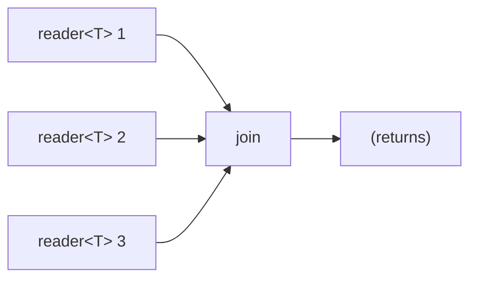

# join

Blocks the calling microthread until all input channels close. All values
received are drained and discarded. This is a synchronization barrier -- it
waits for a set of concurrent activities to finish.

## Signature

```cpp
template <typename T>
void join(std::vector<reader<T>> inputs);
```

## Topology



No microthreads are spawned. `join` blocks the calling microthread using `alt`,
draining and discarding all values until every reader is dead.

## Semantics

- **Blocking call**: `join` suspends the calling microthread until all input
  readers have closed.
- **Values discarded**: Any values produced by the inputs are read and
  immediately discarded. `join` is purely a synchronization primitive.
- **Dead reader removal**: As each reader closes, it is removed from the active
  set. When the set is empty, `join` returns.
- **Empty input**: If the input vector is empty, `join` returns immediately.
- **Order independence**: Readers may close in any order. `join` handles
  interleaved values and deaths from any combination of channels.

## Example

```cpp
#include "csp.h"

using namespace csp;
using namespace csp::part;

chan<int> a, b;
csp::spawn([w = std::move(a.w)]{ w << 1; w << 2; });
csp::spawn([w = std::move(b.w)]{ w << 10; w << 20; w << 30; });

std::vector<reader<int>> rs;
rs.push_back(std::move(a.r));
rs.push_back(std::move(b.r));

join(std::move(rs));
// All microthreads have finished; all values were drained.
```

## See Also

- [first_wins](first_wins.md) -- take the first value, discard the rest
- [merge](merge.md) -- interleave all values from multiple sources
- [blackhole](blackhole.md) -- consumer that discards all values
