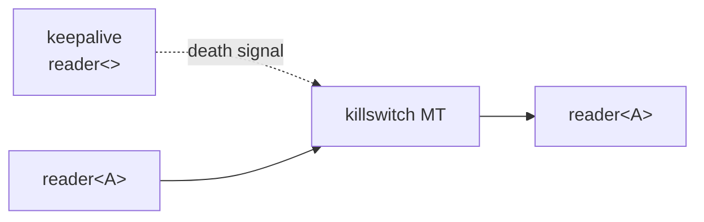

# killswitch

Forwards values from input to output until a keepalive channel dies. When the
keepalive reader closes, the filter shuts down immediately, closing both
endpoints.

## Signature

```cpp
template <typename A>
auto killswitch(reader<> keepalive);
// Returns: filter<A, A, ...>
```

The `keepalive` parameter is a `reader<>` (a signal channel that carries no
data). The returned filter forwards values of type `A` until the keepalive
closes.

## Topology



One internal microthread uses `prialt` to monitor three events simultaneously:
keepalive death, output reader death, and incoming data. A second `prialt`
monitors keepalive death and the outgoing write.

## Semantics

- **Keepalive controls lifetime**: The filter runs as long as the keepalive
  reader is alive. When the writer end of the keepalive channel is dropped (or
  the channel is otherwise closed), the killswitch terminates immediately.
- **Transparent forwarding**: While alive, values pass through unchanged with
  normal backpressure.
- **Immediate shutdown**: Keepalive death is checked on both the read side and
  the write side of each forwarded value. A keepalive death between reading a
  value and writing it will still abort.
- **Output death**: If the downstream reader drops, the killswitch also
  terminates (independently of the keepalive).
- **Input death**: If the upstream source closes, the killswitch terminates.
- **Composable**: As a `filter<A, A>`, killswitch composes with `|` and other
  parts.

## Example

```cpp
#include <csp/csp.h>
#include <csp/part/killswitch.h>
#include <csp/part/count.h>

using namespace csp;
using namespace csp::part;

auto [keepalive_w, keepalive_r] = chan<>{};
auto ks = killswitch<int>(std::move(keepalive_r)).spawn();

// Values flow through while keepalive is alive.
ks.w.copy() << 42;
int v = ks.r.copy().read();  // v == 42

// Kill the switch by dropping the keepalive writer.
keepalive_w = {};

// Channel is now dead.
// ks.w << 21  -> returns false
// ks.r >> v   -> returns false
```

## See Also

- [latch](latch.md) -- hold a value with post-death replay
- [gate](gate.md) -- pause/resume forwarding based on a control signal
- [timeout](timeout.md) -- terminate after a time limit
