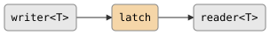
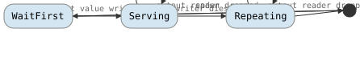

# latch

Holds and serves the most recent value. While the writer is alive, each read
returns the latest written value, with newer writes overwriting the pending
value. After the writer dies, the last value is served repeatedly to the
reader -- the latch never closes on its own.

## Signature

```cpp
template <typename T>
inline auto const latch;
// Type: filter<T, T, ...>
```

`latch` is a `const` variable template, not a function. Use it directly with
the pipe operator or call `.spawn()`.

## Topology

<!-- csp-flow
writer<T> -> {latch} -> reader<T>
-->


One internal imp holds the latest value. It uses `prialt` to
simultaneously accept new writes and serve reads, with writes taking priority.

<!-- csp-state
[*] -> WaitFirst: spawn
WaitFirst -> Serving: first value written
WaitFirst -> [*]: output reader dropped
Serving -> Serving: write overwrites / read serves
Serving -> Repeating: writer dies
Repeating -> Repeating: read serves last value
Repeating -> [*]: output reader dropped
-->


## Semantics

- **Latest-value semantics**: When the writer produces faster than the reader
  consumes, intermediate values are silently overwritten. The reader always sees
  the most recent value.
- **Writer priority**: `prialt` gives incoming writes priority over outgoing
  reads, so a burst of writes is absorbed before any reads are served.
- **Post-death replay**: After the writer closes, the latch continues serving
  the last value indefinitely. The output reader never sees channel death from
  the latch itself -- only dropping the reader terminates the latch.
- **Empty latch**: If the output reader is dropped before any value is written,
  or if the writer dies before writing, the latch terminates without producing
  anything.
- **Composable**: As a `filter<T, T>`, `latch` composes with the `|` operator
  and other parts.

## Example

```cpp
#include "csp.h"

using namespace csp;
using namespace csp::part;

auto lat = latch<int>.spawn();

csp::spawn([out = std::move(lat.w)]{
    for (int n = 1; n <= 5; ++n) {
        out << n;
    }
});

// After the writer finishes, reading returns the last value (5) repeatedly.
// lat.r.read() -> 5
// lat.r.read() -> 5
// lat.r.read() -> 5

// Inline with pipe:
auto r = count(1, 10).spawn() | latch<int>;
// r.read() returns the latest value available.
```

## See Also

- [quantize](quantize.md) -- sample the latest value at regular intervals
- [share](share.md) -- broadcast with per-subscriber latching
- [mute](mute.md) -- a reader that never produces values
