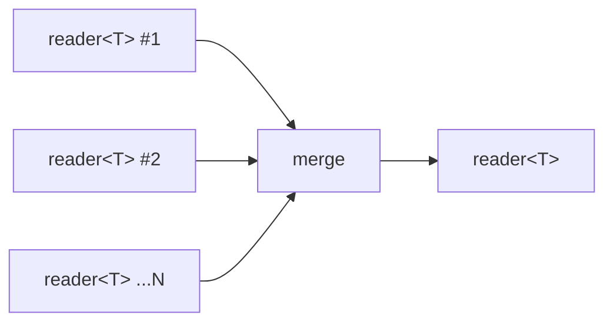

# merge

Non-deterministic merge of N input readers into a single output. Values are
forwarded from whichever input is ready first. When a reader dies it is
removed; the output closes when all inputs are exhausted or the output dies.

## Signature

```cpp
template <typename T>
auto merge(std::vector<reader<T>> inputs);
// Returns: producer<T, ...>
```

## Topology



One internal imp uses a dynamic `alt` to read from whichever input
is ready first, then writes the value to the single output.

## Semantics

- Output order is non-deterministic. Values arrive in whatever order the
  scheduler happens to make inputs ready. Use [interleave](interleave.md)
  if strict round-robin ordering is needed.
- When an input reader dies, it is removed from the alt set. The remaining
  inputs continue to be merged.
- Exits when all inputs are exhausted (output channel closes naturally)
  or when the output reader is dropped (output death terminates the merge).
- Backpressure: the imp blocks on each write to the output, so a
  slow consumer throttles all inputs.
- Merging zero inputs produces an immediately-closed output.

## Example

```cpp
#include "csp.h"

using namespace csp;
using namespace csp::part;

// Merge three count streams.
std::vector<reader<int>> rs;
rs.push_back(count(0, 5).spawn());
rs.push_back(count(10, 15).spawn());
rs.push_back(count(20, 25).spawn());
auto r = merge(std::move(rs)).spawn();

// All 15 values arrive (order is non-deterministic).
std::vector<int> got;
for (int n; r >> n;) got.push_back(n);
// got.size() == 15
```

## See Also

- [interleave](interleave.md) -- deterministic round-robin merge
- [chain](chain.md) -- sequential concatenation (not concurrent)
- [zip](zip.md) -- synchronous element-wise combination
- [first_wins](first_wins.md) -- take only the first value from N readers
