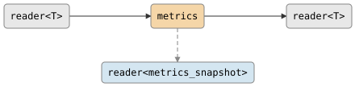

# csp::part::metrics

Transparent passthrough that reports throughput statistics on a side channel.
Data flows through unchanged; stats are pull-based and delivered on demand when
the stats reader is read.

## Signature

```cpp
struct metrics_snapshot {
    size_t count;
    csp::duration elapsed;
};

template <typename T>
std::pair<reader<T>, reader<metrics_snapshot>> metrics(reader<T> data);
```

Returns a pair: the first element is the forwarded data stream, the second is a
stats channel that delivers `metrics_snapshot` values on demand.

## Topology

<!-- csp-flow
reader<T> -> {metrics} -> reader<T>
                  |
    reader<metrics_snapshot>
-->


One internal imp uses `alt` to service three events: incoming data,
stats pull requests, and output reader death.

## Semantics

- **Transparent forwarding**: Data passes through unchanged with normal
  backpressure. The metrics imp increments a counter for each forwarded
  value.
- **Pull-based stats**: Stats are not pushed automatically. Reading from the
  stats reader triggers a snapshot containing the current count and elapsed time
  since the metrics imp started.
- **Stats reader dropped**: If the stats reader is dropped, data continues
  flowing. The imp falls back to a simple forward loop with no stats
  overhead.
- **Data reader dropped**: If the data reader is dropped, the imp
  terminates (even if the stats reader is still alive).
- **Source death**: When the source closes, the data output is closed. If the
  stats reader is still alive, the imp enters a terminal loop serving
  final stats (with the final count) until the stats reader is also dropped.
- **Both dropped**: If both readers are dropped, the imp terminates
  cleanly.

## Example

```cpp
#include "csp.h"

using namespace csp;
using namespace csp::part;

auto [data, stats] = metrics(count(1, 6).spawn());

// Drain all data.
std::vector<int> got;
for (int n; data >> n;) got.push_back(n);
// got == {1, 2, 3, 4, 5}

// Pull final stats.
auto snap = stats.read();
// snap.count == 5
// snap.elapsed > 0

// Mid-stream stats pull:
chan<int> in;
auto [data2, stats2] = metrics(std::move(in.r));
// ... write 3 values to in.w ...
auto mid = stats2.read();
// mid.count == 3
```

## See Also

- [tee](tee.md) -- duplicate a stream to a side channel
- [count](count.md) -- generate a sequence of integers
