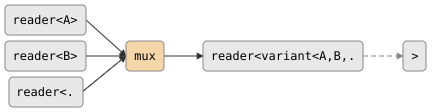

# csp::part::mux

Non-deterministic merge of N heterogeneous readers into a single
`variant<Ts...>` stream. Reads from whichever input is ready first. When an
input dies it is disabled; output closes when all inputs are exhausted or
output dies.

**Header:** `<csp/part/mux.h>`

## Synopsis

```cpp
template <typename... Ts>
auto mux(reader<Ts>... inputs);
```

Returns a `producer<std::variant<Ts...>>`.

## Parameters

| Parameter | Type | Description |
|-----------|------|-------------|
| `inputs...` | `reader<Ts>...` | Two or more heterogeneous input readers |

## Topology

<!-- csp-flow
reader<A>   ->
reader<B>   -> {mux} -> reader<variant<A,B,...>>
reader<...> ->
-->


## Semantics

- Non-deterministic: when multiple inputs are ready simultaneously, one is
  chosen at random (uses `alt`, not `prialt`).
- When an input dies, its slot is disabled (null chanop). Remaining inputs
  continue.
- Output closes when all inputs have died or when the output reader dies.
- Uses dynamic `ChanOp` dispatch tables for typed transfer and variant
  wrapping — no virtual calls or function pointers at runtime.

## Usage

```cpp
using namespace csp::part;

auto events = mux(key_events, mouse_events, timer_events);
// events is reader<variant<KeyEvent, MouseEvent, TimerEvent>>

for (auto& ev : events.spawn()) {
    std::visit(overloaded{
        [](KeyEvent& k)   { handle_key(k); },
        [](MouseEvent& m) { handle_mouse(m); },
        [](TimerEvent& t) { handle_timer(t); },
    }, ev);
}
```

## See also

- [demux](demux.md) -- split a variant stream back into typed readers
- [merge](merge.md) -- non-deterministic merge of homogeneous inputs
- [combine_latest](combine_latest.md) -- emit tuple of latest values on any update
