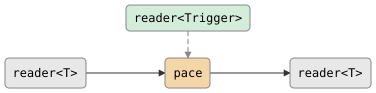

# pace

Rate-limited passthrough via an external trigger channel. All values are
preserved (backpressure, no drops). The first value passes immediately;
each subsequent value waits for a trigger before emission.

Use with `tick(d)` for periodic pacing: `pace<int>(tick(100ms))`.

**Header:** `<csp/part/pace.h>`

## Synopsis

```cpp
template <typename T, typename Trigger = poke_t>
auto pace(reader<Trigger> trigger);
```

Returns a `filter<T>`.

## Parameters

| Parameter | Type | Default | Description |
|-----------|------|---------|-------------|
| `trigger` | `reader<Trigger>` | | Trigger channel controlling emission rate |

## Topology

<!-- csp-flow
       reader<Trigger>
             |
reader<T> -> {pace} -> reader<T>
-->


## Semantics

- The first value passes through immediately without waiting for a trigger.
- Each subsequent value waits for a trigger before being emitted.
- Input is blocked (backpressure) while waiting for the trigger --
  no values are dropped.
- On trigger death, the imp exits (remaining input is not drained).
- On output death, the imp exits.
- On input close, the imp exits.

## Usage

```cpp
using namespace csp::part;

// Pace output to at most one value per 100ms.
auto r = source.spawn()
       | pace<int>(csp::tick(100ms));
```

## Example

```cpp
#include "csp.h"

using namespace csp::part;

// Throttle log lines to at most 10 per second, preserving all lines.
auto paced = log_reader
           | pace<std::string>(csp::tick(100ms));
```

## See also

- [throttle](throttle.md) -- rate-limit by dropping excess values
- [debounce](debounce.md) -- emit after a quiet period
- [gate](gate.md) -- pause/resume via boolean control channel
