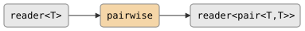

# csp::part::pairwise

Emits consecutive pairs from a stream. `pairwise<T>` produces a
`std::pair<T, T>` for each pair of adjacent elements: `(a,b)`, `(b,c)`,
`(c,d)`, and so on. This is the specialized two-element case of `nwise`.

If the input has fewer than two elements, no output is produced.

## Signature

```cpp
template <typename T>
inline auto const pairwise = /* ... */;
// Returns: filter<T, std::pair<T, T>, ...>
```

## Topology

<!-- csp-flow
reader<T> -> {pairwise} -> reader<pair<T,T>>
-->


One internal imp reads pairs of adjacent elements and writes each
pair to the output.

## Semantics

- Reads the first element, then for each subsequent element emits a pair
  of `(previous, current)`.
- An input stream of `n` elements produces `n - 1` pairs (`0` if
  `n < 2`).
- Exits when the input is exhausted or the output reader is dropped.
- Backpressure: the imp blocks on each pair write, so a slow
  consumer throttles the pipeline.

## Example

```cpp
#include "csp.h"

using namespace csp;
using namespace csp::part;

// Consecutive pairs from 1..5.
auto r = pairwise<int>.spawn(count(1, 6).spawn());

r.read(); // {1, 2}
r.read(); // {2, 3}
r.read(); // {3, 4}
r.read(); // {4, 5}
```

## See Also

- [nwise](nwise.md) -- generalized N-element sliding window as tuples
- [window](window.md) -- sliding window emitting variable-size vectors
- [scan](scan.md) -- running fold (when you need to combine adjacent values)
