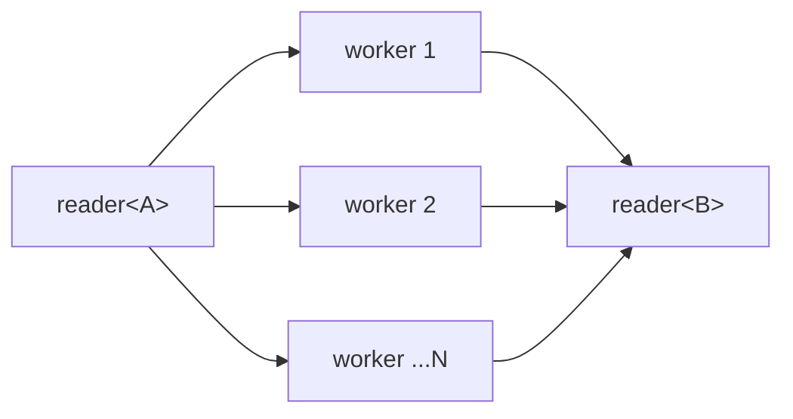
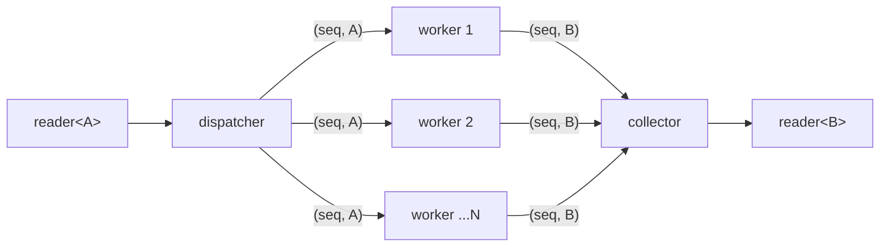

# parallel_map

Concurrent transform: fan out to N workers with demand-driven dispatch.
Whichever worker is free reads the next input item and applies the transform
function. In ordered mode, results are reassembled in input order via an
internal reorder buffer; in unordered mode (default), results are emitted as
they complete.

**Header:** `<csp/part/parallel_map.h>`

## Synopsis

```cpp
struct parallel_map_config {
    bool ordered = false;
};

template <typename A, typename B = A, typename F>
auto parallel_map(size_t n, F&& f, parallel_map_config cfg = {});
```

Returns a `filter<A, B>`.

## Parameters

| Parameter | Type | Default | Description |
|-----------|------|---------|-------------|
| `n` | `size_t` | | Number of worker imps |
| `f` | `F` | | Transform function `A → B` |
| `cfg` | `parallel_map_config` | `{}` | Configuration (see below) |

### Config fields

| Field | Type | Default | Description |
|-------|------|---------|-------------|
| `ordered` | `bool` | `false` | Reassemble output in input order |

## Topology

### Unordered (default)



Workers share the input reader (demand-driven). Each reads a value, applies
`f`, and writes to the shared output. Faster workers naturally process more
items.

### Ordered



A dispatcher imp assigns sequence numbers. Workers process items concurrently.
A collector imp buffers out-of-order results and emits in sequence.

## Semantics

- **Demand-driven dispatch**: workers compete for input items. This naturally
  load-balances variable-cost work — fast workers get more items.
- **Unordered mode**: results are emitted in completion order. Lower latency,
  no buffering overhead.
- **Ordered mode**: results are buffered and emitted in input order. Up to `n`
  items may be held in the reorder buffer.
- On input close, all workers drain remaining items and the output closes.
- On output death, workers detect it (via `alt` death-watch) and exit.
- The transform function `f` must be safe to call concurrently from multiple
  imps if M:N threading is enabled (`init_runtime(n)`).

## Usage

### Unordered (default)

```cpp
using namespace csp::part;

auto r = source.spawn()
       | parallel_map<int>(4, [](int n) { return expensive(n); });
```

### Ordered

```cpp
auto r = source.spawn()
       | parallel_map<int>(4, [](int n) { return expensive(n); },
                           {.ordered = true});
```

### Type-changing transform

```cpp
auto r = source.spawn()
       | parallel_map<int, std::string>(
             4, [](int n) { return std::to_string(n); },
             {.ordered = true});
```

## Example

```cpp
#include "csp.h"

using namespace csp::part;

// Parse JSON blobs in parallel, preserving input order.
auto parsed = byte_stream
            | parallel_map<std::string, Json>(
                  8, [](std::string s) { return Json::parse(s); },
                  {.ordered = true});
```

## See also

- [map](map.md) -- single-threaded transform
- [merge](merge.md) -- non-deterministic merge of N readers
- [round_robin](round_robin.md) -- deterministic distribution to N outputs
