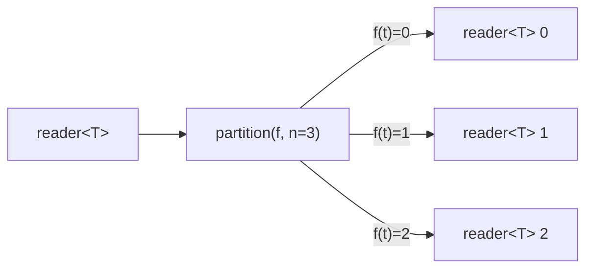

# partition

Routes each input element to one of N outputs based on a classifier function.
Available in two forms: N-way (with an explicit bucket count and classifier) and
binary (with a predicate).

## Signature

```cpp
// N-way: route by index.
template <typename T, typename F>
auto partition(reader<T> in, size_t n, F f);
// f: (const T&) -> size_t
// Returns: std::vector<reader<T>>

// Binary: route by predicate.
template <typename T, typename Pred>
auto partition(reader<T> in, Pred pred);
// pred: (const T&) -> bool
// Returns: std::vector<reader<T>> (size 2)
```

## Topology



One internal microthread reads each input element, evaluates the classifier,
and writes the element to the corresponding output channel.

## Semantics

- Returns a vector of `n` readers (2 for the binary overload).
- **N-way**: `f(t)` must return a `size_t` index. The element is sent to
  `outputs[f(t)]`. If the index is out of range (`>= n`), the element is
  silently dropped.
- **Binary**: `pred(t)` returning `true` sends the element to `outputs[1]`,
  `false` to `outputs[0]`.
- **Dead output handling**: writes to a dead output are skipped (the element is
  discarded). The partition continues running until all outputs are dead or the
  input is exhausted.
- Backpressure: writes block until the target output reader consumes the value.
  All output legs must be drained concurrently since channels are synchronous.
- Elements are moved into the output channel.

## Example

```cpp
#include <csp/csp.h>
#include <csp/part/partition.h>
#include <csp/part/count.h>

using namespace csp;
using namespace csp::part;

// N-way: classify 0..8 into 3 buckets by modulo.
auto outs = partition<int>(count(0, 9).spawn(), 3,
    [](const int& n) -> size_t { return n % 3; });
// outs[0] reads: 0, 3, 6
// outs[1] reads: 1, 4, 7
// outs[2] reads: 2, 5, 8

// Binary: split into even/odd.
auto eo = partition<int>(count(1, 7).spawn(),
    [](const int& n) { return n % 2 != 0; });
// eo[0] (false/even) reads: 2, 4, 6
// eo[1] (true/odd)  reads: 1, 3, 5
```

## See Also

- [round_robin](round_robin.md) -- distribute by position instead of content
- [group_by](group_by.md) -- dynamic partitioning with unbounded key space
- [where](where.md) -- filter to a single stream (discard non-matching elements)
