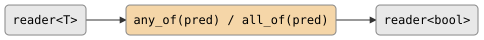

# csp::part::quantify (csp::part::any_of / csp::part::all_of)

Short-circuiting stream quantifiers. `any_of` emits `true` as soon as any
element satisfies the predicate; `all_of` emits `false` as soon as any element
fails. Both consume only as many elements as needed and emit a single `bool`.

## Signature

```cpp
template <typename T, typename Pred>
auto any_of(Pred&& pred);
// Returns: filter<T, bool, ...>

template <typename T, typename Pred>
auto all_of(Pred&& pred);
// Returns: filter<T, bool, ...>
```

## Topology

<!-- csp-flow
reader<T> -> {any_of(pred) / all_of(pred)} -> reader<bool>
-->


One internal imp reads from the input, tests each element, and emits a
single `bool` to the output.

## Semantics

### any_of

- Emits `true` and closes as soon as `pred(value)` returns true.
- If the input is exhausted without any match, emits `false`.
- Short-circuits: remaining input elements are not consumed after the first
  match.

### all_of

- Emits `false` and closes as soon as `pred(value)` returns false.
- If the input is exhausted with every element passing, emits `true`.
- Short-circuits: remaining input elements are not consumed after the first
  failure.

### Common

- Both emit exactly one `bool` value.
- On an empty input, `any_of` emits `false` and `all_of` emits `true`
  (consistent with standard logical quantifier conventions).
- Use `.spawn().single()` for terminal extraction of the result.
- Exits early if the output reader is dropped.

## Example

```cpp
#include "csp.h"

using namespace csp;
using namespace csp::part;

// Does any value exceed 3?
bool has_big = (count(1, 6) | any_of<int>([](int n) { return n > 3; }))
                   .spawn().single();
// has_big == true (short-circuits at 4)

// Are all values positive?
bool all_pos = (count(1, 6) | all_of<int>([](int n) { return n > 0; }))
                   .spawn().single();
// all_pos == true (consumes entire stream)
```

## See Also

- [reduce](reduce.md) -- general fold to a single value
- [where](where.md) -- filter elements by predicate (does not reduce)
