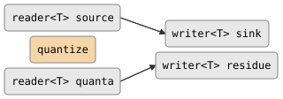

# csp::part::quantize

Batches an incoming stream of additive values into variable-size quanta.
Accumulates values from a source until enough has been collected to fill the
next quantum, then emits it. Any residue left after the source or quanta
stream closes is reported on a separate channel.

Two variants are provided: a **dynamic-quantum** form where quanta are read
from a channel, and a **fixed-quantum** form where every emitted value
equals a constant.

## Signature

```cpp
// Dynamic quanta: each quantum is read from a channel.
template <typename T>
auto quantize(reader<T> source,
              reader<T> quanta,
              writer<T> sink,
              writer<T> residue = writer<T>::dead());
// Returns: callable (not a filter -- wired directly)

// Fixed quantum: every emitted value equals `quantum`.
template <typename T>
auto quantize(reader<T> source,
              T quantum,
              writer<T> sink,
              writer<T> residue = writer<T>::dead());
// Returns: callable

// Spawn helpers (create channels automatically):
template <typename T>
writer<T> spawn_quantize(reader<T> quanta, writer<T> sink,
                         writer<T> residue = writer<T>::dead());

template <typename T>
reader<T> spawn_quantize(reader<T> source, T quantum,
                         writer<T> residue = writer<T>::dead());

template <typename T>
writer<double> spawn_quantize(T quantum, writer<T> sink,
                              writer<T> residue = writer<T>::dead());
```

## Topology

<!-- csp-flow
reader<T> source ->                -> writer<T> sink
                    {quantize}
reader<T> quanta ->                -> writer<T> residue
-->


One imp manages all four channels using `alt` to multiplex reads
and writes.

## Semantics

- **Accumulation**: values read from `source` are summed into an
  accumulator (`acc += t`).
- **Emission**: when `acc >= quantum`, the quantum value is written to
  `sink` and subtracted from `acc`.
- **Dynamic quanta**: the next quantum is read from the `quanta` channel
  after each emission. A zero-quantum is delivered immediately without
  waiting for accumulation.
- **Residue**: when the callable returns (source or quanta exhausted, or
  sink dropped), the remaining accumulator value is written to `residue`.
  If no residue writer is provided, it defaults to a dead writer (value is
  discarded).
- **Conservation**: `source_total == delivered_total + residue` always
  holds.
- The dynamic variant handles source death gracefully: if enough has
  accumulated for the current quantum, it is delivered before exiting.
- The dynamic variant handles quanta death by draining the source until
  the current quantum can be delivered.
- `T` must support `+=`, `-=`, `<`, `<=`, comparison with zero, and
  default construction.

## Example

```cpp
#include "csp.h"

using namespace csp;
using namespace csp::part;

// Fixed quantum: emit 7 at a time.
reader<int> residue;
auto r = spawn_quantize<int>(source_reader, 7, ++residue);
// Each r.read() returns 7.
// After source closes, residue.read() returns the leftover.

// Dynamic quanta: quantum sizes come from a channel.
writer<int> in, quanta;
reader<int> out, res;
spawn(quantize(--in, --quanta, ++out, ++res));

quanta << 5; quanta = {};  // request quantum of 5
in << 7;     in = {};      // supply 7
out.read();                // 5
res.read();                // 2 (residue)
```

## See Also

- [batch](batch.md) -- group elements by count (not by value sum)
- [scan](scan.md) -- running accumulator without emission threshold
