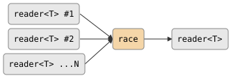

# csp::part::race

Multiplexes N input readers with priority bias toward the fastest source.
Values are forwarded from whichever source produces first; when multiple
sources are simultaneously ready, the lower-indexed source wins (prialt
semantics). Dead sources are removed from the race; the output closes when all
sources are exhausted or the output reader is dropped.

> **Design note.** `race` is a continuous biased merge, not a one-shot
> "first wins" combinator. It reads all values from all sources for as long as
> any remain, but consistently favours earlier sources when values arrive
> simultaneously. For a strictly non-deterministic fair merge use
> [`merge`](merge.md); for a one-shot "take only the first value" use
> [`first_wins`](first_wins.md).

## Signature

```cpp
template <typename T>
reader<T> race(std::vector<reader<T>> sources);
```

## Parameters

| Parameter | Type | Description |
|---|---|---|
| `sources` | `std::vector<reader<T>>` | Input readers; may be empty |

## Topology

<!-- csp-flow
reader<T> #1   ->
reader<T> #2   -> {race} -> reader<T>
reader<T> ...N ->
-->


One internal imp uses a dynamic `prialt` over all live source readers plus an
output death-watch. When a source dies it is removed from the prialt set.

## Semantics

- Runs `prialt` over all live sources on each iteration; earlier sources
  in the vector have higher priority when values arrive simultaneously.
- A value received from source `k` is forwarded to the output immediately.
- When source `k` dies (`~k` fires from prialt), it is removed from the set
  and the remaining sources continue.
- Exits when all sources are dead (output closes naturally) or when the output
  reader is dropped.
- An empty `sources` vector produces an immediately-closed output.
- Backpressure: the imp blocks on each output write, so a slow consumer
  throttles all sources.

## Example

```cpp
#include "csp.h"

using namespace csp;
using namespace csp::part;

// Forward from whichever source is fastest; prefer source A on ties.
std::vector<reader<int>> srcs;
srcs.push_back(std::move(a));
srcs.push_back(std::move(b));
auto r = race(std::move(srcs));

for (int v; r >> v;) handle(v);
```

## See Also

- [merge](merge.md) -- non-deterministic fair merge (no priority bias)
- [first_wins](first_wins.md) -- single-shot: take only the first value from N sources
- [interleave](interleave.md) -- strict round-robin merge (deterministic)
- [sort_merge](sort_merge.md) -- merge N pre-sorted streams into one sorted output
